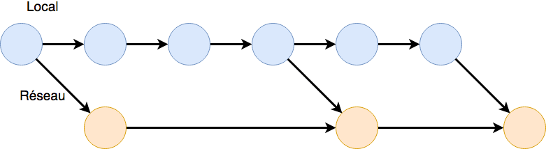

# (PART) SDD I: visualisation {.unnumbered}

# Introduction & visualisation I {#introvisu}

```{r setup, include=FALSE, echo=FALSE, message=FALSE, results='hide'}
SciViews::R
```

##### Objectifs {.unnumbered}

-   Se familiariser avec les outils logiciels de base pour la science des données (SciViews Box, RStudio, logiciel R](<https://www.r-project.org>) [@R-base], GitHub, Git).

-   Réaliser son premier document écrit en Quarto/R Markdown [@R-rmarkdown] (entête YAML, zones Markdown et chunks de code).

-   Être capable de réaliser différentes variantes d'un graphique en nuage de points dans R avec la fonction `chart()`

-   Intégrer ensuite des graphiques dans un rapport et y décrire ce que vous observez

```{block, type='note'}

Les liens cliquables qui vous sont proposés dans ce cours ont été spécialement sélectionné pour vous. La section **Prérequis** vous permet de vous assurer que vous avez toutes les connaissances nécessaires pour aborder le module dans les meilleures conditions possibles.

**Cliquez sur ces liens**

```

##### Prérequis {.unnumbered}

La partie suivante est repliée. Il s'agit d'une partie optionnelle, mais néanmoins indispensable pour réaliser les exercices de ce cours qui vont être effectués sur ordinateur.

Si vous considérez que vous maîtrisez les éléments de base d'un ordinateur, le clavier, que vous êtes capables de trouver toute une série de caractères, dont des caractères spéciaux et des raccourcis clavier, vous pouvez sauter cette partie repliée et continuer votre lecture. En cas d'hésitation, dépliez la partie afin d'approfondir vos connaissances.

<br>

<details>

<summary>Élément de base d'un ordinateur et des navigateurs web</summary>

Un [ordinateur](https://www.coursinfo.fr/decouverte/ordinateur/) peut sembler être un outil simple et familier. Il est pourtant bien plus complexe qu'il n'y parait.

-   Gestion des comptes sur votre ordinateur

Il n'est pas rare d'avoir un ordinateur qui soit utilisé par plusieurs personnes. Pour que chaque utilisateur puisse avoir un espace personnel dédié, vous allez devoir créer plusieurs comptes. Vous retrouvez la procédure pour [Windows](https://support.microsoft.com/fr-fr/windows/ajouter-ou-supprimer-des-comptes-sur-votre-pc-104dc19f-6430-4b49-6a2b-e4dbd1dcdf32) et pour [macOS](https://support.apple.com/fr-be/guide/mac-help/mtusr001/mac). Chaque type de compte ne se vaut pas. Le compte administrateur est le compte qui a le plus de droits sur un ordinateur. Il faut, par exemple, avoir les droits d'un compte administrateur pour pouvoir installer la plupart des logiciels. **Si plusieurs étudiants utilisent un même ordinateur, vous devez obligatoirement créer des comptes séparés, sans quoi l'activité des différents utilisateurs ne pourra pas être discriminée et votre progression ne sera pas enregistrée correctement !**

-   Organisation des fichiers sur un ordinateur

Votre ordinateur contient un ou plusieurs disques durs. Une [arborescence de dossiers](https://www.coursinfo.fr/decouverte/windows/quest-ce-quun-dossier-un-fichier-et-une-arborescence-de-dossiers/) va être mise en place pour ranger les fichiers dans chaque disque dur. On peut se représenter chaque disque comme une armoire avec des tiroirs. Les principaux dossiers sont le dossier `bureau` (*desktop*), `documents` (*documents*) ou encore `téléchargements` (*downloads*). **Vous devez comprendre les bases de l'organisation des dossiers et des fichiers dans votre ordinateur, ainsi que leur manipulation à l'aide de l'explorateur de fichiers (Windows) ou du Finder (macOS) avant d'aborder le présent module.**

-   Terminologie de base

Lorsque vous travaillez sur un ordinateur, vous interagissez avec un certain nombre d'éléments dont il est important de connaitre le nom. Si vous n'êtes pas familier avec cette terminologie, voyez [les éléments qui composent un ordinateur](https://cours-informatique-gratuit.fr/cours/composition-de-base-ordinateur-unite-centrale/) et les pages suivantes qui sont proposées si nécessaire. Imprégnez-vous aussi du [vocabulaire de base](https://blog.liberetonordi.com/index.php?pages/lexique) ou encore [ici](https://www.epn-nivelles.org/ressources/lexique-informatique.html).

-   Raccourcis clavier

Les raccourcis clavier vous permettent d'optimiser votre productivité. Prenez un peu de temps pour vérifier que vous en connaissez les principaux via ces pages : pour [Windows](https://www.lecotentin.fr/raccourcis-clavier), pour [macOS](https://www.journaldunet.com/solutions/dsi/1194040-raccourci-clavier-mac/) ou encore pour [Linux Ubuntu](https://www.clubic.com/tutoriels/article-862426-1-raccourcis-clavier-ubuntu-indispensables.html). **Les raccourcis clavier ne sont pas indispensables, mais ils vous feront gagner du temps lors des exercices, cela peut être très utile lorsque le temps est limité.**

-   Captures d'écran

Lorsque vous rencontrez un problème avec votre ordinateur ou un de ses logiciels, une capture d'écran bien réalisée permet souvent d'illustrer utilement votre question sur un forum et peut remplacer une longue explication textuelle. Vous pouvez retrouver des tutoriels pour réaliser une capture d'écran dans [Windows](https://www.commentcamarche.net/informatique/windows/149-faire-des-captures-d-ecran-avec-windows-10/) ou dans [macOS](https://www.commentcamarche.net/informatique/macos/737-faire-des-captures-d-ecran-sur-mac/). Le plus important est de cibler la zone à capturer. Il est donc bien souvent inutile de sélectionner tout le bureau de l'ordinateur, voire toute la fenêtre de l'application. **Dans les cours de science des données, vous serez amené à poser des questions et à illustrer vos propos à l'aide de copies d'écran. Vous êtes supposé capable de le faire. Les photos d'écran prises à l'aide d'un smartphone ne sont pas acceptables, car elles sont toujours bien moins lisibles que la copie directe de l'écran avec les outils ad hoc.**

*Rappel : lorsque vous voyez le petit logo "H5P" comme ci-dessous, cela signifie que vous avez maintenant un exercice interactif. Cet exercice peut prendre différentes formes (quiz, présentation ou vidéo contenant des questions, vrais ou faux, cliquer sur une image...).*

`r h5p(140, height = 270, toc = NULL)`

-   Navigateurs Web

Un [navigateur Web](https://www.1min30.com/dictionnaire-du-web/navigateur-web-browser) est un logiciel qui permet d'accéder au Web. Le Web n'est pas un synonyme d'Internet comme vous pouvez le lire dans la formation [comprendre le Web](https://openclassrooms.com/fr/courses/1946386-comprendre-le-web/6874966-distinguez-le-web-et-internet) d'[Open Classroom](https://openclassrooms.com/fr/). Les navigateurs Web principaux sont Google Chrome, Microsoft Edge, Mozilla Firefox ou encore Safari sous macOS. **Pour ce cours en ligne, vous allez devoir naviguer sur le Web et utiliser divers outils comme RStudio Server qui sont accessibles depuis une page Web. Par conséquent, vous devez être capable d'utiliser un navigateur Web pour afficher des pages, effectuer une recherche, créer une liste de "bookmarks", etc. Chaque navigateur Web a ses particularités et les pages que vous utiliserez ne fonctionnent pas forcément toutes avec ces différents navigateurs. Nous ne pouvons pas les tester avec toutes les options possibles (type de navigateur, version et système Windows, macOS ou Linux, cela fait énormément de combinaisons possibles). Par conséquent, nous sommes obligés de restreindre la liste des navigateurs Web utilisables pour le cours à la version la plus récente de Google Chrome (tous systèmes), Edge (Windows), Safari (macOS) ou Chromium (Linux). Les autres (Firefox, Opera, Brave, Vivaldi, Internet Explorer, etc.) sont à éviter, car non testés ou incompatibles. Firefox en particulier, ne fonctionne pas avec différentes pages du cours, et de GitHub, entre autres.**

</details>

<br>

L'objectif principal de ce module est de réaliser des graphiques en nuage de points. Il est de ce fait important de maîtriser des éléments de géométrie (origine, abscisse, ordonnée, coordonnées d'un point dans un plan) mais également des fonctions mathématiques comme les puissances et les logarithmes. Vous trouverez une nouvelle partie repliée juste après l'exercice ci-dessous pour vous rafraîchir la mémoire concernant ces notions.

##### À vous de jouer ! {.unnumbered}

Le graphique ci-dessous présente la variation de la hauteur du test en fonction de la masse d'oursins (n'hésitez à faire des petites recherches par vous-même, si vous ne savez pas ce qu'est le "test" d'un oursin).

`r h5p(154, height = 270, toc = NULL)`

<br>

<details>

<summary>Notions élémentaires de géométrie et de fonctions mathématiques</summary>

Les [éléments de base de la géométrie](https://mathix.org/cours_interactif/index.php?l=fr&n=3e&c=Rep%C3%A9rage) suivants sont indispensables pour ce cours : origine, abscisse, ordonnée, coordonnées d'un point dans un plan...

Vous devez maîtriser les notions suivantes : [les puissances](https://fr.khanacademy.org/math/algebra-basics/alg-basics-expressions-with-exponents), [les logarithmes, dont le logarithme népérien et les exponentielles](https://fr.khanacademy.org/math/algebra2/exponential-and-logarithmic-functions).

</details>

<br>

Le préambule de ce cours vous a également permis d'en apprendre davantage sur le matériel pédagogique, l'approche pédagogique ou encore la méthode d'évaluation. Vérifiez votre compréhension des notions vues avec l'exercice suivant.

##### À vous de jouer ! {.unnumbered}

`r h5p(135, height = 270, toc = NULL)`

##### À vous de jouer ! {.unnumbered}

*Note : les tutoriels learnrs vous permettent d'autoévaluer l'acquis de connaissances et de compétences. Dans le cours, ils sont marqués d'une icône en forme de toque verte. Ils s'exécutent directement dans RStudio à l'intérieur de la SciViews Box (dans [SaturnCloud](https://saturncloud.io)). Vous copiez l'instruction `BioDataScience1::run("A00La_discovery")` et la collez dans l'onglet Console de RStudio. Ensuite, vous validez la commande en cliquant sur la touche \<entrée\> et le tutoriel doit se lancer. Vous pouvez ouvrir ensuite le tutoriel dans sa propre fenêtre plus spacieuse en cliquant sur le second bouton de la barre d'outils en forme de petite fenêtre avec une flèche blanche.*

`r learnr("A00La_discovery", title = "Découverte de learnr", toc = "Découverte des tutoriels de type learnr")`

Vous pouvez aussi voir (ou revoir) [les dias de la présentation](https://github.com/BioDataScience-Course/sdd_lessons/raw/2024-2025/A00/presentations/A00Pa_intro.pdf) qui vous est faite en séance introductive.

```{=html}
<!--
## Le monde depuis 30 ans {#donnees}


Il y a 30 ans, pas d'Internet (ou un embryon d'Internet disponible uniquement pour quelques privilégiés dans les universités et l'armée américaine), pas de smartphone. Essayez d'imaginer ce que serait votre vie aujourd'hui si ces outils qui font partie de votre quotidien n'existaient pas. L'évolution technologique est en marche, à un rythme toujours plus rapide.

-   Les révolutions industrielles :

    -   1770 (1756) révolution 1 : mécanisation
    -   1870 révolution 2 : maîtrise de l'énergie
    -   1970 (1979) révolution 3 : informatique
    -   1990 révolution 4 : Internet (1990 Web, 1992 ISOC = Internet society, 1993 = premier navigateur Web)
    -   2000 révolution 5 : numérique. GAFA = Google - Apple - Facebook - Amazon + Microsoft = GAFAM aux USA et BATX en Chine = Baidu - Alibaba - Tencent - Xiaomi. Aussi NATU = Netflix - Airbnb - Tesla - Uber.
    -   2010 révolution 6 : NBIC = nanotechnologies - biotechnologies - informatique - sciences cognitives.
    -   2020  : l'ordinateur est toujours plus puissant, l'intelligence artificielle toujours plus présente. Les métiers changent parce que les machines remplacent l'homme pour différentes tâches ("ubérisation").
    -   2030 = transhumanisme ? Ordinateur plus puissant que l'homme et le remplacera probablement dans de nombreuses tâches.

-   Valeur estimée des données et informations mises à disposition par les utilisateurs d'Internet : 1000 milliards de dollars par an (écrivez ce nombre en chiffres pour vous donner une meilleure idée de ce que cela représente) !

-   En 2020, quantité d'information ajoutée sur Internet : 1000 milliards de milliards par semaine (écrivez ce nombre en chiffres également).

-   Comparaison de puissance de traitement du cerveau humain *versus* un ordinateur : 89 milliards de neurones et travail en multitâche d'un côté, contre 2 milliards de transistors pour un travail essentiellement monotâche pour le petit carré de silicium. Il faut bien avouer que c'est difficile à comparer (combien de transistors équivalent à un neurone ?). Une étude a montré en 2017 que l'un des cinq ordinateurs les plus puissants du moment a été capable de simuler le fonctionnement d'environ 1% du cerveau humain en une seconde. Il lui a fallu 40 minutes de calcul pour y arriver. Intel (l'un des principaux constructeurs de processeurs) estimait il y a à peine quelques années que l'évolution permettrait d'égaler le cerveau humain en termes de vitesse de traitement vers 2020... On a dépassé cette date, l'intelligence artificielle est partout autour de nous, mais ne nous remplace pas encore (heureusement !). De plus, la consommation électrique d'un supercalculateur se mesure en mégawatts, alors que le cerveau humain consomme 12-13W seulement, soit un ordre de grandeur d'un million de fois moins !

-   Aujourd'hui et encore plus à l'avenir, le cerveau humain et le (super)-ordinateur constitué par une constellation de machines mondialement interconnectées se complètement merveilleusement bien. La quantité d'information disponible est telle que sans l'ordinateur, nous ne pouvons pas la valoriser... mais le cerveau humain est et reste le chef d'orchestre qui décide, qui dirige la façon dont ces données sont valorisées. Ce chef d'orchestre a un nom : le **scientifique des données**.

Ce petit rappel historique et ces quelques informations concernant les données vous donnent d'une part un aperçu de **la vitesse à laquelle notre monde change**, et d'autre part ils vous montrent que le monde dans lequel nous vivons est **de plus en plus inondé d'information**. Vous pouvez maintenant imaginer l'importance d'avoir des outils performants afin d'appréhender les données dont le nombre croît de manière exponentielle. Nous consacrerons la majeure partie de ce premier module à découvrir les outils informatiques qui vont nous permettre d'analyser nos données biologiques.
-->
```

## Découverte des outils {#outils}

L'information est partout et en quantité inimaginable. Pour ne citer qu'une valeur, en 2020, la quantité d'information ajoutée chaque semaine sur Internet était de 1000 milliards de milliards de bits (unité de base en informatique représentée par des 0 ou des 1). Pour traiter même une toute petite partie de ces données en lien avec la biologie, vous devrez être un scientifique des données capable d'employer toute une série d'outils (logiciels).

À la fin de ce premier module, vous aurez réalisé votre première analyse complète en biologie, et vous la réaliserez avec des outils professionnels que vous utiliserez durant toutes vos études et même après dans votre profession en lien avec la biologie.

La science des données requiert d'employer des outils performants que nous avons sélectionnés pour vous parmi la multitude de logiciels disponibles, car nous faisons le pari que ce seront les outils qui vous seront les plus utiles dans les 30 prochaines années, c'est-à-dire pendant une bonne partie de votre carrière.


### SciViews Box

Dans ce cours, nous utilisons différents logiciels qui nécessitent une installation et une configuration en plusieurs étapes. Pour vous économiser ces étapes fastidieuses, nous employons un système complètement préconfiguré : la **SciViews Box** pour laquelle une nouvelle version est préparée avant chaque nouvelle année académique. Il s'agit d'une **machine virtuelle**, un ordinateur complet, mais dématérialisé en quelque sorte. Nous utilisons un système fonctionnant sur le Cloud et nommé [**SaturnCloud**](https://saturncloud.io). SaturnCloud ne nécessite pas un ordinateur puissant pour y accéder, mais il faut par contre, une bonne connexion Internet. Il faut aussi que le serveur distant soit disponible et offre les ressources suffisantes pour travailler.

Depuis le cours en ligne, on accède facilement à la SciViews Box.


Le bouton RStudio vous conduit vers une page qui vous permet d'accéder à votre machine virtuelle hébergée sur Saturn Cloud dans l'organisation "EcoNum". Vous observez qu'il n'est pas inscrit SciViews Box mais RStudio sur le bouton. Il s'agit du logiciel qui va nous permettre de réaliser vos rapports d'analyse.


Cette page contient également toutes les instructions indispensables pour :

-   installer et configurer la SciViews Box, composée entre autres des logiciels R et RStudio nécessaires pour ce cours
-   allumer, éteindre, valider votre configuration.


```{=html}
<!--G.E. : je place ceci en commentaire vu que nous n'utilisons pas de système local pour le moment. 
Nous utilisons l'une de ces deux formes :

-   un système fonctionnant sur le Cloud et nommé [**SaturnCloud**](https://saturncloud.io),

-   un système local installé sur votre ordinateur et utilisant [**Docker**](https://www.docker.com) ou [**Pacman**](https://archlinux.org/pacman/).

SaturnCloud ne nécessite pas un ordinateur puissant pour fonctionner, mais il faut une bonne connexion Internet. Il faut aussi que le serveur distant soit disponible et offre les ressources suffisantes pour travailler. La version locale avec Docker ou Pacman ne sera utilisée que si nous rencontrons des problèmes avec SaturnCloud. Elle nécessite, en effet, un ordinateur plus puissant et beaucoup plus de place sur le disque pour l'installer.
-->
```

### RStudio

RStudio permet la rédaction des rapports dans les meilleures conditions et d'y intégrer des graphiques, des tableaux ou encore des analyses statistiques. Des éditeurs de texte classiques comme [Google Docs](https://www.google.com/intl/fr_be/docs/about/) ou [Microsoft Word](https://www.microsoft.com/fr-fr/microsoft-365/word) ne sont pas orientés vers la production de documents techniques ou scientifiques. Nous utiliserons donc un logiciel complet et optimisé pour produire de tels documents : [RStudio](https://posit.co/products/open-source/rstudio/). Celui-ci s'appuie lui-même sur [R](http://www.r-project.org) qui est un langage taillé pour traiter des données, produire des graphiques et des tableaux et réaliser des analyses statistiques.

L'interface de RStudio se présente en quatre sous-fenêtres (on dit aussi des "panneaux" ou *panes* en anglais) que vous pouvez découvrir ci-dessous.

##### À vous de jouer ! {.unnumbered}

*Cliquez sur les symboles + pour découvrir le rôle de chaque sous-fenêtre de RStudio.*

`r h5p(148, height = 270, toc = "L'environnement de RStudio")`

Des explications détaillées se trouvent dans l'annexe \@ref(rs) qui présente les bases de l'utilisation de RStudio. Vous avez également à votre disposition un aide-mémoire pour appréhender cette interface [RStudio IDE Cheat Sheet](https://raw.githubusercontent.com/rstudio/cheatsheets/main/rstudio-ide.pdf).

##### Pour en savoir plus {.unnumbered}

-   [RStudio](https://posit.co/products/open-source/rstudio/). Site Web de RStudio qui rassemble un ensemble de ressources en anglais

-   [RStudio, un environnement de développement pour R](https://quanti.hypotheses.org/488/). Brève explication de RStudio en français.

-   [RStudio : sa vie, son œuvre, ses ressources](https://elementr.hypotheses.org/237). Une autre courte page en français qui présente RStudio.

### R, les éléments de base

Dans la section précédente, vous avez pu découvrir que le logiciel **R** allait être un outil central dans cette formation en science des données.


[R](https://www.r-project.org/about.html) est un logiciel **open source** (c'est-à-dire que son code source est disponible ; un logiciel est constitué de la **compilation** d'un code source qui peut être rendu public comme ici, ou non) spécialisé dans l'analyse de données. Le langage de programmation R qu'il implémente est mature et développé depuis 1993. Il prend ses sources dans le langage S (spécialement conçu pour les statistiques dans les années 1970). R permet, entre autres, la manipulation et la visualisation de données, ainsi que les calculs statistiques. C'est l'un des logiciels les plus utilisés et les plus puissants pour l'analyse des données, avec Python, Julia et Matlab. Donc, étudier R sera un **investissement clé** pour votre future carrière de biologiste, car des données, vous en aurez tous à en analyser !

##### À vous de jouer ! {.unnumbered}

Au tout début de ce premier module, vous avez lancé votre premier tutoriel intitulé "A00La_discovery" qui traitait de la découverte des learnr. Il était composé de questions à choix multiples et de zones de code R. Vous l'avez utilisé comme une calculatrice. Cependant, R est bien plus puissant qu'une calculatrice. Les tutoriels servent aussi à vous entraîner à écrire des instructions en R. Avant de vous lancer dans ces exercices, consultez l'Appendice \@ref(learnr) pour apprendre à utiliser correctement ces tutoriels "learnrs" pour les questions relatives à du code R.

`r learnr("A01La_base", title = "Les bases de R", toc = "Notions de base de R")`

Vous venez de découvrir les assignations, les fonctions, le chaînage d'instructions... Lancez-vous à présent dans une première analyse concrète de données biologiques qui sera l'occasion de découvrir comment on crée des graphiques avec R.

## Nuage de points {#nuagedepoints}

Dès que vous commencez à maîtriser les principes de base de R, vous allez pouvoir réaliser assez rapidement de beaux graphiques. Par exemple, si vous souhaitez représenter une variable numérique en fonction d'une autre variable numérique, vous pouvez exprimer cela sous la forme d'une **formule**[^01-introduction-visualisation-i-1]

[^01-introduction-visualisation-i-1]: Dans R, une **formule** permet de spécifier les variables avec lesquelles on souhaite travailler, et leur rôle. Par exemple ici, la variable *x* sur l'axe des abscisses et la variable *y* sur l'axe des ordonnées.

$$y \sim x$$

que l'on peut lire "y en fonction de x". Pour les deux variables numériques *x* et *y*, la représentation graphique la plus classique est le **nuage de points** (voir Fig. \@ref(fig:first-scatterplot) pour un exemple).

```{r first-scatterplot, echo=FALSE, results='hide', message=FALSE, fig.cap="Exemple de graphique en nuage de points. Des éléments essentiels sont ici mis en évidence en couleurs (voir texte). \\label{np_intro}"}
chart(data = data.frame(x = rnorm(50), y = rnorm(50)), x ~  y) + 
  geom_point(col = "gray50") +
  labs(x = "Label de l'axe x [unité]", 
       y = "Label de l'axe y [unité]") +
  theme(axis.text.x  = element_text(colour = "#a80039", size = 15), 
        axis.title.x = element_text(colour = "#029687", size = 15), 
        axis.text.y  = element_text(colour = "#a80039", size = 15), 
        axis.title.y = element_text(colour = "#029687", size = 15),
        axis.line.x  = element_line(colour = "#a80039"),
        axis.line.y  = element_line(colour = "#a80039")
  )
```

Les éléments indispensables à la compréhension d'un graphique en nuage de points sont mis en évidence à la Fig. \@ref(fig:first-scatterplot) :

-   Les axes avec les graduations (en rouge),
-   Les labels et les unités des axes (en bleu).
-   Les points représentant les différentes observations (en gris).

Les instructions dans R pour produire un tel graphique en nuage de points sont les suivantes :

-   Préparation de l'environnement, importation et visualisation des données sous forme de tableau synthétique pour commencer.

```{r, warning=FALSE, message=FALSE}
# Chargement de SciViews::R
SciViews::R
# Importation du jeu de données
urchin <- read("urchin_bio", package = "data.io", lang = "fr")
# Visualisation des premières et dernières lignes du jeu de données
tabularise$headtail(urchin, auto.labs = FALSE)
```

-   Réalisation du graphique en nuage de points proprement dit.

```{r, fig.cap="Taille (hauteur du test) d'oursins en fonction de leur masse."}
chart(data = urchin, height ~ weight) +
  geom_point()
```

La fonction `chart()` n'est pas accessible dans R de base, mais l'extension chargée grâce à l'instruction `SciViews::R` rend cette fonction disponible. Elle requiert comme argument le jeu de donnée (`data = urchin`, c'est un objet qui s'appelle un **"data frame"** dans le langage de R), ainsi que la formule à employer dans laquelle vous avez indiqué le nom des variables que vous voulez sur l'axe des ordonnées à gauche et des abscisses à droite de la formule, les deux parties étant séparées par un "tilde" (`~`). Vous voyez que le jeu de données contient beaucoup de variables (les titres des colonnes du tableau en sortie). Parmi toutes ces variables, nous avons choisi ici de représenter `height` en fonction de `weight`, la hauteur en fonction de la masse des oursins. Jusqu'ici, nous avons spécifié *ce que* nous voulons représenter, mais pas encore *comment* (sous quelle apparence), nous voulons les matérialiser sur le graphique. Pour un nuage de points, nous voulons les représenter sous forme de ... points ! Donc, nous devons ajouter la fonction `geom_point()` pour indiquer cela.

##### À vous de jouer ! {.unnumbered}

*Note : la vidéo ci-dessous vous expliquant la création du nuage de points dans R sur le jeu de données `urchin` est affublée du signe "H5P", ce qui signifie qu'elle contient également des questions auxquelles vous devez répondre dans le cadre de votre progression dans la matière.*

`r h5p(157, height = 270, toc = "Vidéo d'introduction au graphique en nuage de points")`

```{r, echo=FALSE}
#vembedr::embed_youtube("-QzG3Xr202w", width = 770, height = 433)
```

*Autoévaluez maintenant vos acquis avec le tutoriel learnr suivant.*

`r learnr("A01Lb_scatterplot", title = "Nuage de points", toc = "Graphiques en nuages de points")`

`r h5p(155, height = 270, toc = "Les fonctions chart() et geom_point()")`

### Échelles de graphiques

Vous devez être particulièrement vigilant lors de la réalisation d'un graphique en nuage de point sur l'étendue des valeurs présentées sur vos axes. Vous devez utiliser votre expertise de biologiste pour vous poser les deux questions suivantes :

-   Est-ce que l'axe représente des valeurs plausibles de hauteurs et de masses de ces oursins (sachant que l'espèce est *Paracentrotus lividus* vous pouvez faire une recherche pour vérifier les tailles et masses de ces animaux) ?

-   Quelle est la précision des mesures ?

Par défaut, `chart()` va calculer l'étendue des axes en tenant compte de la plus petite et de la plus grande valeur observée. Dans certains cas, lorsqu'une ou plusieurs observations s'éloignent très fort du nuage de points (par exemple, une valeur mal encodée avec un zéro de trop à la fin du nombre), le graphique va compresser le nuage de points à cause de la présence de ces valeurs aberrantes. Ce n'est pas le cas ici, mais nous pouvons le simuler en distendant artificiellement soit l'axe X, soit l'axe Y, soit les deux :

```{r, echo=FALSE, fig.cap="Piège du nuage de points. A) Graphique initial montrant la variation de la hauteur [mm] en fonction de la masse [g]. B) Graphique A avec la modification de l'échelle de l'axe X. C) Graphique A avec une seconde modification de l'axe X. D) Graphique A avec modification simultanée des deux axes."}
a <- chart(data = urchin, height ~  weight) + 
  geom_point() +
  theme(text = element_text(size = 10)) # Réduction des labels
# Modification des échelles
b <- a + scale_x_continuous(limits = c(0, 500))
c <- a + scale_x_continuous(limits = c(-100, 120))
d <- a + scale_x_continuous(limits = c(-400, 400)) +
         scale_y_continuous(limits = c(-400, 400))
# Assemblage des graphiques
combine_charts(list(a, b, c, d))
```

Vous voyez que l'effet peut éventuellement être assez catastrophique. Faites donc bien attention à la façon dont les points se répartissent et remplissent ou non le graphique pour éviter de tomber dans ce piège !

##### À vous de jouer ! {.unnumbered}

*Note : l'exercice suivant est une **application Shiny**. Il s'agit d'un petit programme écrit en R et qui vise à expérimenter un concept de manière interactive. Vous pouvez lancer cet exercice directement dans cette page. Vérifiez d'être bien enregistré (message à l'ouverture de l'application) et n'oubliez pas de cliquer sur le bouton `Submit` pour tester votre choix, mais également sur le bouton `Save & Quit` pour valider définitivement votre réponse pour la prendre en compte dans votre rapport de progression.*

`r launch_shiny("https://sdd.umons.ac.be/A01Sa_limits/", height = 500, delay = 10, toc = "Étendue des axes d'un graphique")`

### Transformation des données

Vous avez la possibilité d'appliquer une transformation à vos données (il est même conseillé de le faire) pour qu'elles soient plus facilement analysables ensuite. Par exemple, il est possible d'utiliser des fonctions de puissance, racines, logarithmes, exponentielles[^01-introduction-visualisation-i-2] pour modifier l'apparence du nuage de points dans le but de le rendre plus linéaire. Il est, en effet, plus facile d'analyser statistiquement des données qui s'alignent le long d'une droite.

[^01-introduction-visualisation-i-2]: Pour les proportions (`prop`) ou les pourcentages (`perc`) (valeurs bornées entre 0 et 1 ou 0 et 100%) la transformation arc-sinus est souvent utilisée dans la littérature $prop′ = \arcsin \sqrt{prop}$ ou $perc′ = \arcsin \sqrt{perc / 100}$. Son usage est cependant soumis à la critique et tous les statisticiens ne sont pas d'accord au sujet de cette transformation.

##### À vous de jouer ! {.unnumbered}

`r launch_shiny("https://sdd.umons.ac.be/A01Sb_transformation/", height = 500, delay = 10, toc = "Transformation des axes d'un graphique")`

#### Pièges et astuces {.unnumbered}

RStudio permet de récupérer rapidement des instructions à partir d'une banque de solutions toutes prêtes. Cela s'appelle des **snippets**. Vous avez une série de snippets disponibles dans la SciViews Box. Celui qui vous permet de réaliser un graphique en nuage de points s'appelle `.cbxy` (pour **c**hart -\> **b**ivariate -\> **xy**-plot). Entrez ce code et appuyez ensuite sur la tabulation dans un document de type script R, et vous verrez le code remplacé par ceci dans la fenêtre d'édition :

```
chart(data = DF, YNUM ~ XNUM) +
  geom_point()
```

Vous avez à votre disposition un ensemble de snippets que vous pouvez retrouver dans l'aide-mémoire consacré à [**SciViews**](https://github.com/BioDataScience-Course/sdd_cheatsheets/raw/master/SciViews/sciviews.pdf). Vous avez également à votre disposition l'aide-mémoire sur la visualisation des données ([**Data Visualization Cheat Sheet**](https://rstudio.github.io/cheatsheets/html/data-visualization.html)) qui utilise la fonction `ggplot()` plutôt que `chart()` et une interface légèrement différente pour spécifier les variables à utiliser pour réaliser le graphique (`aes(x = ..., y = ...)`).

Prêtez une attention toute particulière à l'organisation d'un script R. En plus des instructions R, il contient aussi sous forme de commentaires, un titre, la date de la dernière mise à jour, le nom de l'auteur, et des sections qui organisent de façon claire le contenu du script. À ce sujet, vous trouverez des explications détaillées concernant l'utilisation des scripts R dans l'annexe \@ref(script).

## Premier projet {#premier-projet}

Passons maintenant à la pratique. Lisez la suite de ce module lorsque vous le préparez d'avance chez vous. Cependant, nous réaliserons le projet suivant sur le nuage de points ensemble en présentiel.

### GitHub Classroom {#classroom}

[**GitHub Classroom**](https://classroom.github.com) est une extension de GitHub. Rappelez-vous, l'une des premières étapes que vous avez réalisées dans le cadre de ce cours a été de créer votre compte GitHub. Grâce à GitHub, vous allez pouvoir sauvegarder vos travaux dans le Cloud, les partager et collaborer.

GitHub Classroom facilite le travail dans le contexte d'exercices de niveau 3 ou de niveau 4 (les projets individuels et en groupes) à réaliser dans le cadre du cours. Vous serez donc amenés à créer et éditer des projets issus de GitHub Classroom pour réaliser vos exercices. **Vos projets seront privés**. Seuls vous-mêmes et vos enseignants aurez accès à ces projets, mais vous pourrez aussi les rendre publics, si vous voulez *valoriser votre travail* de manière plus large.

L'illustration ci-dessous vous montre la boîte d'information qui vous permet d'initier votre projet. Cette boîte se trouve à la fin de ce module 1. Soyez vigilant quant à la date limite pour terminer le projet.


Attention, si vous n’êtes pas reconnu, vous ne pourrez pas initier votre projet et vous serez renvoyé vers une page comme celle ci-dessous. Vous devrez alors vérifier votre identification dans le site du cours (page d'accueil accessible à partir de l'entrée de menu "Home" en haut de page) avant de pouvoir accéder à votre projet.


### GitHub

GitHub est un réseau social permettant de sauvegarder vos projets dans le "Cloud", les partager et collaborer avec d'autres personnes. Les utilisateurs peuvent se regrouper sous une organisation afin de faciliter la collaboration. Ce réseau social a la particularité d'être centré sur les projets et utilise un gestionnaire de version de projet nommé [Git](https://git-scm.com/) (nous aborderons Git plus loin dans ce module). Ce nom provient de l'association "Git", le gestionnaire de version et "Hub" relatif au réseau.

Découvrons un projet qui s'intéresse à la manipulation de tableau de données (filtrer des lignes spécifiques, calculer de nouvelles colonnes, trier le tableau en fonction d'une colonne spécifique...). Nous utiliserons ce projet dans le cours. Le projet [dplyr](https://github.com/tidyverse/dplyr) est partagé par l'organisation [tidyverse](https://github.com/tidyverse). Il va nous permettre d'aborder quelques aspects de GitHub. Nous nous attardons uniquement sur les éléments clés dans le cadre du cours.

##### À vous de jouer ! {.unnumbered}

*Cliquez sur les symboles **+** pour découvrir les parties importantes de la page principale d'un projet GitHub*

`r h5p(141, height = 270, toc = "Le projet dplyr dans GitHub")`

Ce projet héberge une multitude de fichiers que vous ne devez pas comprendre pour le moment ;). 7112 "commits" y ont été réalisés (au moment où la capture d'écran a été faite : le projet a évolué depuis et les nombres cités ne sont certainement plus d'actualité par rapport au site aujourd'hui). Pour le moment, retenez qu'un "commit" est un état de sauvegarde du projet. Ce projet traite de la manipulation de données. Un site Web lui est associé [dplyr.tidyverse.org](https://dplyr.tidyverse.org) pour en expliquer le contenu. Un grand nombre de contributeurs ont participé à ce projet (plus de 240). Un fichier `README.md` sert de page de présentation.

En haut de la page, on a les différentes sections du site : `Code`, `Issues`, `Pull requests`, `Actions`, `Security` et `Insights` (elles ne seront pas toutes détaillées ici).


Lors d'un travail en équipe, vous allez vous poser des questions et avoir envie d'échanger vos idées. GitHub met à votre disposition un espace dédié à la discussion et à la collaboration. Il s'agit des `Issues`. La section `Issues` permet de mettre en avant un problème ou une idée dans le but d'améliorer ce projet. Une issue est un espace de discussion et de collaboration centré autour d'une question. Par exemple, le projet dplyr a 70 issues ouvertes et 4281 issues fermées. On peut en déduire que 70 idées ou bogues sont en cours de correction ou de réflexion et que 4281 sont considérés comme terminés. Ce projet est assez dynamique.

**Quand vous aurez un problème ou une idée, utilisez donc les issues pour discuter avec vos encadrants ou vos collaborateurs. Vous y accédez à partir de bandeau rouge au-dessus de chaque page du cours.**

##### À vous de jouer ! {.unnumbered}

Testez vos nouvelles connaissances en répondant à la question ci-dessous.

`r h5p(137, height = 270, toc = "Exploration d'un dépôt GitHub")`

GitHub n'est pas le seul réseau social centré sur Git. D'autres réseaux équivalents existent comme [Gitlab](https://about.gitlab.com) ou [Bitbucket](https://bitbucket.org). Cependant, nous utiliserons GitHub ensemble, sachant que les notions apprises ici seront réutilisables ailleurs.

### Projet RStudio

Démarrez votre SciViews box dans Saturn Cloud et affichez la fenêtre de RStudio maintenant (si vous ne l'avez pas encore installée, cliquez sur le bouton bleu **RStudio** en haut à droite de cette page pour voir les explications d'installation). RStudio permet de cloner (faire une copie locale sur votre ordinateur) directement un projet disponible sur GitHub en quelques étapes comme ci-dessous.

`r img("sdd1_01/clone2.gif")`

Des explications détaillées se trouvent dans l'annexe \@ref(github-clone) qui présente deux méthodes différentes pour cloner votre projet GitHub dans RStudio. Vous allez terminer ce module en réalisant votre premier projet individuel en science des données.

RStudio permet de gérer des projets efficacement. Un projet va regrouper l'ensemble des jeux de données, des blocs-notes, des rapports, des présentations, des scripts d'une analyse généralement en relation avec une ou plusieurs expériences ou observations réalisées sur le terrain ou en laboratoire. Il est normal que tous les éléments d'un projet ne vous soient pas encore familiers. Nous allons découvrir cela tout au long du cours de science des données.

##### À vous de jouer ! {.unnumbered}

Observez les deux images et tentez de repérer chaque différence entre les deux interfaces, l'une hors projet, et l'autre dans un projet nommé `Z01Ia_24M_scatterplot-arthurpeeters`. Tentez de trouver les *quatre différences* avant de lire la section suivante.

*Déplacez le curseur de gauche à droite pour comparer l'interface de RStudio hors projet (à gauche) et avec un projet ouvert (à droite).*

`r h5p(260, height = 270, toc = "Les projets dans RStudio")`

1.  Dans la barre d'outils supérieure, on passe de `Projet (Aucun)` vers `Z01Ia_24M_scatterplot-arthurpeeters`. On peut donc facilement repérer si l'on est dans un projet ou non, et si oui, quel est son nom.

2.  Le panneau en haut à droite change et de nouveaux onglets sont présents, dont un nommé `Git` qui vient s'ajouter, mais uniquement si les versions du projet sont gérées par Git (que nous découvrirons dans la suite de ce module).

3.  Le panneau en bas à droite contenant l'onglet `Fichiers` change de dossier pour afficher le dossier de base du projet. Dans ce dossier, nous retrouvons obligatoirement un fichier à l'extension `.Rproj` ainsi qu'éventuellement un second, `.gitignore`. D'autres fichiers sont présents que nous découvrirons par la suite.

-   `Z01Ia_24M_scatterplot-arthurpeeters.Rproj` : À la base d'un projet RStudio, on retrouve un fichier à l'extension `.Rproj`. Ce fichier est placé automatiquement par RStudio. Il contient les paramètres de configuration de votre projet. Il ne faut pas le modifier soi-même. Il est utile aussi pour repérer tout de suite que l'on se trouve dans un dossier de base d'un projet RStudio.
-   `.gitignore` : Ce fichier permet de spécifier les fichiers que l'on souhaite exclure du gestionnaire de version, par exemple, les gros fichiers de jeux de données ou bien des documents.

### Gestionnaire de version

Nous nous sommes intéressés à la partie collaborative de GitHub. Nous avons exploré la structure d'un projet et les outils de discussions que sont les issues. Nous allons maintenant nous intéresser à Git, le gestionnaire de version de projet utilisé par GitHub et par RStudio.

Lors de la rédaction d'un court document ou de travaux un petit peu conséquents, comme un travail de fin d'études, une publication scientifique ou un rapport volumineux, on se retrouve rapidement avec plusieurs fichiers correspondants à des états d'avancements du travail :

-   TFE_final
-   TFE_final1
-   TFE_final2
-   TFE_final3
-   TFE_final...
-   TFE_final99

On aura tendance à tout garder dans différents fichiers afin de ne rien perdre d'important. Cette pratique, bien que très courante, comporte le gros désavantage de prendre énormément de place sur le disque de votre ordinateur et de n'être pas pratique. Les questions suivantes peuvent se poser :

Que se cache-t-il dans la version TFE_finalX ? Après un mois sans travailler sur le fichier, seriez-vous encore capable de faire facilement la différence entre TFE_final2 et TFE_final3 ?

Un logiciel comme Git vous offre une solution professionnelle pour gérer vos fichiers au sein d'un projet. Pour que vous vous fassiez une idée plus précise, observez le gif animé juste en dessous. Un fichier `urchin_notebook.qmd` est ouvert dans la zone d'édition (en haut à gauche) à partir de l'onglet `Fichiers` (en bas à droite). Le nom de l'auteur est ensuite inséré dans le document. Une fois le document sauvegardé en cliquant l'icône bleue dans la barre d'outils d'édition, on retrouve dans l'onglet Git le nom du fichier modifié. Le gestionnaire de version va suivre toutes les modifications apportées aux fichiers au sein du projet (matérialisé par un dossier dans votre machine). Ce dossier se nomme un dépôt (*repository* en anglais).

`r img("sdd1_01/git1.gif")`

Si vous sélectionnez l'onglet Git, vous verrez une barre d'outils en haut du panneau correspondant. Chaque bouton de cette barre d'outils donne accès à des fonctionnalités de Git ou de GitHub. Nous allons en découvrir une partie à présent.

{width="50%"}

Les deux premiers boutons, `Diff` et `Commit`, ouvrent la même nouvelle fenêtre destinée à l'utilisation de Git/GitHub.


En bas de cette fenêtre, nous allons suivre les modifications apportées à nos documents. Dans notre exemple, il n'y en a qu'un seul : le nom d'auteur en ligne 3 de `urchin_notebook.qmd` (en vert pour les parties de texte ajoutées) à la place de trois tirets (en rouge pour les éléments supprimés ou remplacés). La liste des fichiers modifiés se trouve en haut à gauche de la fenêtre (un seul également). Comme vous pouvez vous en rendre compte, Git permet de suivre finement chaque modification d'un document.

Le logiciel Git permet de faire des points de sauvegarde de votre projet. Cela s'appelle réaliser un **commit**. Pour ce faire, vous devez indexer les fichiers que vous souhaitez sauvegarder. Cette étape se réalise en sélectionnant le fichier `urchin_notebook.qmd` dans notre exemple. Vous devez écrire aussi un court message de validation qui fournit une description des modifications apportées dans ce commit.


Il ne reste plus qu'à cliquer sur le bouton "Commit" pour finaliser ce point de sauvegarde. Vous pouvez observer ce qui se passe dans le gif animé juste en dessous. Une fois l'opération terminée, des informations sont affichées, comme le nombre de fichiers modifiés inclus dans ce commit.

`r img("sdd1_01/git_commit.gif")`

Une version de notre dépôt est également présente en ligne dans GitHub. À présent, il va falloir synchroniser les deux versions. Pour ce faire, nous vous conseillons de toujours commencer par rapatrier localement les changements réalisés dans le dépôt GitHub distant. Cette étape se nomme un **pull**. Vous pouvez cliquer sur tirer (une flèche bleue vers le bas). Elle sera cruciale lors d'un travail à plusieurs. Sur l'illustration suivante, vous pouvez observer que vous êtes à jour (le message "Already up to date" apparaît).

`r img("sdd1_01/git_pull.gif")`

Enfin, vous allez envoyer vos changements locaux vers la version sur GitHub. Cette étape se nomme un **push**. Il s'agit de la flèche verte vers le haut "Poussez". Plusieurs **commits** peuvent être envoyés avec un seul **push**. Lisez *toujours* le message qui s'affiche à la fin de l'opération pour vous assurer que l'envoi a pu être réalisé sans erreurs.

`r img("sdd1_01/git_push.gif")`

En cliquant sur "Historique", vous pouvez suivre la progression des commits au cours du temps. Sur le gif animé suivant, on observe trois commits successifs.

`r img("sdd1_01/git_history.gif")`

Le logiciel Git remplace les nombreuses copies d’un même fichier par différents états de votre document ou dossier, que l’on peut représenter schématiquement comme ci-dessous (chaque boule bleue représente une version enregistrée dans le système et les flèches indiquent d’où provient chaque version et où elle est utilisée ensuite) :


Sur ce schéma, le flux est linéaire. Pour enregistrer une nouvelle version de votre document, vous effectuez un **commit** accompagné d'un message expliquant les modifications apportées.

Le gestionnaire Git peut être couplé à un hébergement sur le Cloud, soit pour simplement faire un backup de nos projets, soit pour pouvoir échanger et collaborer. Nous utilisons GitHub à cette fin dans le cours. Lorsque l'on travaille seul avec GitHub, l'évolution de notre projet ressemblera au schéma ci-dessous :



En bleu, les différentes versions locales de notre projet. En orange, les états modifiés de la version du projet sur GitHub. Les flèches indiquent le sens de la synchronisation.

```{block, type='note'}

Vous venez d'apprendre le B-A-BA de la terminologie nécessaire à la bonne compréhension de Git et GitHub :

- **dépôt** ou **repository** : espace de stockage sous gestion de version Git.

- **commit** : enregistrer une version du projet.

- **clone** : créer un double local d'un dépôt GitHub.

- **push** : envoyer ses modifications locales vers le dépôt GitHub.

- **pull** : rapatrier les modifications que les autres utilisateurs ont réalisé dans le dépôt GitHub vers sa propre version locale.

```

Ceci n'est qu'une explication très succincte. Vous trouverez plus de détails dans les liens ci-dessous et dans les modules suivants.

##### Pour en savoir plus {.unnumbered}

-   [Gérez vos codes sources avec Git](https://openclassrooms.com/fr/courses/1233741-gerez-vos-codes-source-avec-git). Explication en français sur l'utilisation de Git.

-   [Quel logiciel de gestion de versions devriez-vous utiliser ?](https://www.codebuilder.fr/blog/developpement-collaboratif-logiciels-gestion-versions/). Explication en français sur l'utilisation des logiciels de gestion de versions.

<!-- lien inaccessible:
-   [Git : comprendre la gestion de versions](https://blog.axopen.com/2017/02/git-comprendre-la-gestion-de-versions/). Explication en français sur ce qu'est Git et comment cela s'utilise en pratique. -->

-   [Happy Git and GitHub for the useR](http://happygitwithr.com). Complet, mais un peu technique et en anglais.

-   [Git](https://git-scm.com/). Site en anglais rassemblant toute la documentation de Git.

-   [GitHub pour les nuls : pas de panique, lancez-vous !](https://www.christopheducamp.com/2013/12/15/github-pour-nuls-partie-1/). En français.

### Quarto/R Markdown

Le fichier édité dans la section précédente était un fichier [Quarto](https://quarto.org) qui a une extension `.qmd`[^01-introduction-visualisation-i-3]. Un fichier R Markdown est caractérisé par l'extension `.Rmd`. Ces deux formats sont très similaires, Quarto étant la version plus récente de R Markdown. Tous deux sont développés et maintenus par la même société ([Posit](https://posit.co)). À partir d'ici, nous indiquerons Quarto/R Markdown lorsque la phrase s'applique indifféremment aux deux formats. Donc, Quarto/R Markdown permet de combiner le langage Markdown avec du code R, voire du code dans d'autres langages comme Python, Julia, SQL... Ces zones contenant du code exécutable en R ou autre s'appellent des **chunks**, ou **morceaux** dans l'interface RStudio en français (mais nous utiliserons préférentiellement le terme anglais dans cet ouvrage).

[^01-introduction-visualisation-i-3]: L'**extension d'un fichier** est un indicateur de son format à la fin de son nom. Il se présente sous forme d'un point (.) suivi d'un sigle de quelques lettres. Par exemple `.txt` caractérise un fichier texte, alors que `.png` indique qu'il s'agit d'une image au format PNG. Attention que les extensions sont parfois cachées (c'est systématique dans l'explorateur de fichiers de Windows avec la configuration par défaut, et c'est selon le fichier dans le Finder de macOS. Sous Linux, et donc dans votre machine Saturn Cloud, l'extension est *toujours* affichée heureusement.

`r img("sdd1_01/quarto.gif")`

Lorsqu'on rédige un document, on perd beaucoup de temps à décider de l'interligne, de choisir la taille et la police... bref au niveau de la mise en page. On peut diviser la rédaction d'un document en deux grandes étapes : le fond et la forme. Nous vous proposons un outil pour booster votre **productivité** (et donc pour gagner du temps) avec Markdown. Dans un premier temps, nous allons nous intéresser uniquement au fond. Ensuite, nous déterminerons comment le document sera mis en forme.

Des **"balises"** spéciales Quarto/R Markdown vont marquer les différentes parties de texte lors de l'écriture du fond qui seront rendus différemment lors de la mise en page (la forme). Par exemple, une ligne qui commence par un ou plusieurs dièses (`#` encore appelé "hashtag") sert à indiquer un titre de niveau équivalent au nombre de dièses.

Donc, un document R Markdown/Quarto est constitué d'une succession de zones de texte Markdown et de chunks contenant du code. Le passage de zone Markdown à zone de code et inversement se fait avec des balises particulières :

-   en entrée de chunk R : ```` ```{r} ```` seul sur une ligne. Il est aussi possible de rajouter un label, par exemple, ```` ```{r graphique1} ```` et/ou des options, par exemple, ```` ```{r, echo=FALSE, results='hide'} ```` pour cacher et le code et le résultat dans le rapport),

-   en sortie de chunk R : ```` ``` ```` seul sur une ligne.

En mode éditeur visuel, les trois apostrophes inverses ```` ``` ```` en début et fin de chunk sont cachées. Mais tant en mode visuel qu'en mode source, le fond du texte est représenté dans une couleur différente pour les chunks et pour le texte Markdown, afin de bien les différencier.

Vous devez bien entendu avoir autant de balises d'entrée que de balises de sortie. Des explications plus détaillées se trouvent dans l'annexe \@ref(Rmd) dédiée au R Markdown. De plus, l'écriture d'un texte scientifique doit respecter certaines conventions. Vous trouverez des explications à ce sujet dans l'annexe \@ref(redaction-scientifique).

```{block, type='note'}
Il vous est toujours possible d'exécuter les instructions d'un chunk ligne après ligne dans la fenêtre **Console** pour les tester tout comme à partir d'un script R.
```

Markdown est relativement simple et intuitif à l'usage, même si un petit effort est nécessaire au début. L'apparence finale du texte sera, quant à elle, définie dans une feuille de style séparée. Par défaut, dans RStudio, un mode visuel est proposé, c'est-à-dire qu'on a la possibilité d'employer des boutons pour mettre en gras, en italique, etc. Bien que ce mode soit utile, nous vous recommandons de faire l'effort d'apprendre les principales balises du Markdown.

##### À vous de jouer ! {.unnumbered}

*Déplacez de droite à gauche le curseur sur l'image ci-dessous pour découvrir la forme finale que pourra prendre ce court paragraphe rédigé en Markdown (fond noir : vue dans l'éditeur, fond blanc : forme finale dans un navigateur Web).*

`r h5p(142, height = 200, toc = "Le fond versus la forme")`

En partant du document Markdown ci-dessus, on peut également obtenir des présentations et différents formats finaux. Ci-dessous, deux feuilles de style différentes ont été appliquées sur ce même document. La présentation diffère (police de caractères, couleurs, taille du texte...)


Le langage Markdown est également utilisé dans les issues de GitHub, dans des forums comme [Reddit](https://www.reddit.com) ou encore pour la rédaction de document avec divers éditeurs de textes.

Consultez les liens [Syntaxe de base pour l'écriture et la mise en forme de GitHub](https://docs.github.com/fr/get-started/writing-on-github/getting-started-with-writing-and-formatting-on-github/basic-writing-and-formatting-syntax) et la première section de [R Markdown Reference Guide](https://www.rstudio.com/wp-content/uploads/2015/03/rmarkdown-reference.pdf) afin d'en apprendre plus sur la syntaxe de Markdown.

##### À vous de jouer ! {.unnumbered}

*Cet exercice H5P reprend plusieurs questions. Assurez-vous de les passer toutes en revue l'une après l'autre.*

`r h5p(145, height = 200, toc = "Premiers exercices relatifs à Markdown")`

##### Pour en savoir plus {.unnumbered}

Pour plus d'informations sur Quarto/R Markdown, vous pouvez consulter les liens suivants :

-   [Quarto](https://quarto.org), site contenant tout ce qu'il faut savoir sur Quarto (en anglais).

-   [Communicating results with R Markdown](https://rviews.rstudio.com/2018/11/01/r-markdown-a-better-approach/) explique de manière succincte l'intérêt de R Markdown par rapport à Microsoft Office (en anglais).

-   [What is R Markdown?](https://rmarkdown.rstudio.com/lesson-1.html). Vidéo en anglais et site présentant les différentes possibilités, par les concepteurs de R Markdown (RStudio).

-   [Introduction to R Markdown](https://rmarkdown.rstudio.com/articles_intro.html). Tutoriel en anglais, par RStudio.

-   [R Markdown: the definitive guide](https://bookdown.org/yihui/rmarkdown/) est **le** manuel par excellence pour R Markdown (en anglais uniquement, malheureusement).

-   Aide-mémoire R Markdown, dans les menus de RStudio : `Aide -> Cheat Sheets -> Aide-mémoire R Markdown`

-   Référence rapide à Markdown, dans les menus RStudio : `Aide -> Référence rapide Markdown`

<!-- Beaucoup trop de refs, et qui n'apportent rien de plus que ce qui est déjà cité plus haut -> en commentaire
-   [Introduction à R Markdown](https://rstudio-pubs-static.s3.amazonaws.com/32239_0956f02cef24443abd9525551368ef12.html#6). Présentation en français par Agrocampus Ouest, Rennes.

-   [Le langage R Markdown](https://www.fun-mooc.fr/c4x/UPSUD/42001S02/asset/RMarkdown.pdf). Introduction en français concise, mais relativement complète.

-   [Why I love R Notebooks](https://rviews.rstudio.com/2017/03/15/why-i-love-r-notebooks/) explique (en anglais) pourquoi le format R Notebook, une variante du R Markdown, est particulièrement bien adapté à la science des données.

-   [Le Markdown comme langage d'écriture universel ?](https://blog.genma.fr/?Le-Markdown-comme-langage-d-ecriture-universel)

-   [Markdown Cheat Sheet : A quick reference to the Markdown syntax](https://www.markdownguide.org/cheat-sheet/). Les bases de la syntaxe en Markdown.

-   [Markdown](https://daringfireball.net/projects/markdown/). Explication en anglais de l'intérêt d'employer Markdown ainsi que la syntaxe à employer.

-   [Comment écrire confortablement et professionnellement ? Le Markdown !](https://dolys.fr/forums/topic/comment-ecrire-confortablement-professionnellement-markdown/). Utilisation de Markdown afin de revenir à l'essence de la rédaction.

-->

##### À vous de jouer ! {.unnumbered}

Vous allez maintenant manipuler un document **Quarto** pour réaliser par vous-même des graphiques en nuage de points.

```{r assign_A01Ia_scatterplot, echo=FALSE, results='asis'}
if (exists("assignment"))
  assignment("A01Ia_scatterplot", part = NULL,
    url = "https://github.com/BioDataScience-Course/A01Ia_scatterplot",
    course.ids = c(
      'S-BIOG-006' = !"A01Ia_{YY}M_scatterplot"),
    course.urls = c(
      'S-BIOG-006' = "https://classroom.github.com/a/pKTg66IX"),
    course.starts = c(
      'S-BIOG-006' = !"{W[3]+1} 13:00:00"),
    course.ends = c(
      'S-BIOG-006' = !"{W[4]+3} 23:59:59"),
    term = "Q1", level = 3,
    toc = "Graphiques avec `urchin_bio`")
```

### Rechercher d'aide

Dans le cadre de ce cours, vous allez vous poser de nombreuses questions. Ces questions pourront porter sur l'utilisation des logiciels, sur la théorie statistique derrière un concept ou encore sur l'utilisation d'une fonction particulière du langage R. Cette section va vous donner des pistes pour trouver de l'aide par vous-mêmes ou en faisant appel à la communauté. Il est indispensable d'apprendre à rechercher l'information pour répondre à vos questions. C'est seulement comme cela que vous progresserez efficacement.

#### Pages d'aide

Des pages d'aide sont associées à chacune des fonctions dans R. Pour y accéder, utilisez l'opérateur `?` suivi du nom de la fonction. Dans RStudio, la page d'aide apparaît dans l'onglet **Aide**. Dans RStudio, il est encore bien plus facile de placer le curseur sur le nom de la fonction dans le code et d'appuyer sur la touche `F1` pour faire apparaître sa page d'aide.

```{r, eval=FALSE, echo=TRUE}
?mean
```

Voici le début de la page d'aide proposée concernant la fonction mean()

{width="50%"}

Une page d'aide est en anglais et bien souvent technique. Dans certain cas, la page d'aide ne va pas être suffisante afin de vous permettre de répondre à votre interrogation. Si `?<topic>` ne fonctionne pas, essayez `??<topic>` en doublant le point d'interrogation pour une recherche approfondie dans les pages d'aide, ou encore en utilisant `.?<topic>` (point - point d'interrogation) dans SciViews-R pour encore plus de détails dans les recherches.


Vous pouvez aussi placer le curseur ou sélectionner le nom d'une fonction dans l'éditeur de texte de Rstudio et ensuite faire appel à l'addin **Help** pour rechercher la page d'aide qui vous intéresse. Pour certaines fonctions dites **génériques**, il existe plusieures variantes (dites **méthodes**) que l'addin **Help** vous listera.

#### Chatbot SciViews

Le chatbot SciViews est un grand modèle de langage, plus connu sous sa dénomination anglaise de LLM ou encore de *large language model*. Derrière ChatGPT, Perplexity, Copilot et Gemini se cachent des LLM. Le chatbot est disponible dans votre RStudio au travers ud même addin **Help** cité un peu plus haut. Il vous est mis à disposition dans le cadre de ce cours. Il répond aux questions qui traitent du langage R, des statistiques et de la science des données.

Il peut vous préparer une page d'aide simplifiée, en anglais, mais aussi en français, sur les fonctions R. Il peut aussi servir à expliquer quelques lignes de code R, un message d'erreur renvoyé par R. Il peut aussi définir et expliquer un terme (statistique, par exemple). Enfin, vous pouvez lui poser n'importe quelle question (mais vous comprendrez très vite qu'il se borne essentiellement à répondre à tout ce qui a un rapport avec R, la statistique ou la science des données).


Les réponses du chatbot SciViews apparaîtront comme une page d'aide dans RStudio.

{width="50%"}

```{block, type='warning'}
Attention, les LLM peuvent halluciner. Une hallucination est une réponse qui semble plausible, mais qui est en réalité incorrecte. Cela peut se produire lorsqu'il y a des lacunes dans les données d'entraînement du modèle ou qu'une question posée est ambiguë.

**Soyez toujours critique face à l'information proposée par ce chatbot, ainsi que n'importe quel LLM. Vérifiez toujours les informations fournies par une autre voie.**
```

#### Recherche sur internet

Sur Internet, il est possible de trouver des centaines, voire des milliers d'articles de blog, des tutoriels, des aide-mémoires et des manuels en ligne en lien avec R et tout ce qui l'entoure. Les ressources sont principalement en anglais, mais on peut en trouver en français. Il est impératif de bien utiliser les moteurs de recherche pour trouver rapidement une information de qualité. Cela nécessite de poser la bonne question. Une recherche sur Internet est un excellent complément à la réponse d'un chatbot afin de valider l'information.

Voici quelques propositions :

-   Un blog en ligne : <https://www.r-bloggers.com/>
-   Des aide-mémoires : <https://rstudio.github.io/cheatsheets/>
-   Sites web :
    -   Une documentation collaborative sur R : <https://book.utilitr.org/>
    -   STHDA : <http://www.sthda.com/french/wiki/wiki.php>
-   Des ouvrages en ligne :
    -   R for Data Science : <https://r4ds.hadley.nz/>
    -   Introduction à R et au tidyverse: <https://juba.github.io/tidyverse/>

Le manuel suivant propose une section détaillée sur comment trouver de l'aide : <https://larmarange.github.io/analyse-R/ou-trouver-de-l-aide.html>

L'addin **Help** dan RStudio vous permet de rechercher de l'aide dans les pages d'aide de R, mais aussi sur Internet avec le moteur **Rseek** spécialisé dans la recherche de document sur le langage R, **StackOverflow** (un forum dédié à la programmation) ou encore **Google**, **Bing** ou **DuckDukGo**.

```{block, type='note'}
Généralement, les informations que vous allez retrouver devront être modifiées afin de s'adapter à votre problématique ou à la consigne de l'exercice auquel vous répondez.
```

#### Appel à la communauté

Néanmoins, si vous ne trouvez pas la réponse à votre question malgré une recherche à l'aide des différents outils présentés ci-dessus, il vous reste la possibilité de faire appel à la communauté.

Pour tous les étudiants du cours de Sciences des données I, un espace d'échange est disponible pour poser des questions entre les membres du cours de Science des données I, vous pouvez y accéder également à partir des addins de RStudio. Vous posez facilement votre question en trois étapes.

1.  Depuis RStudio, cliquez sur l'addin qui se trouve dans le menu déroulant `Addins`
2.  Une fenêtre s'ouvre pour vous rediriger vers l'espace de discussion.
3.  Vous posez votre question.


Vous pouvez également accéder à cet espace de discussion depuis n'importe quelle page de site de ce cours.


Il est possible de faire appel à une communauté bien plus grande, mais nous en resterons là pour ce premier module.

## Récapitulatif des exercices

Bravo ! Vous arrivez au bout de votre premier module. Cette dernière section vous permet de vérifier que vous avez bien réalisé tous les exercices et de contrôler votre progression telle qu'enregistrée dans notre base de données (étudiants UMONS uniquement). Vous aviez à réaliser les exercices suivants :

`r show_ex_toc()`

##### Progression {.unnumbered}

`r launch_report("01", height = 800)`
