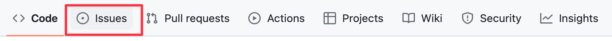
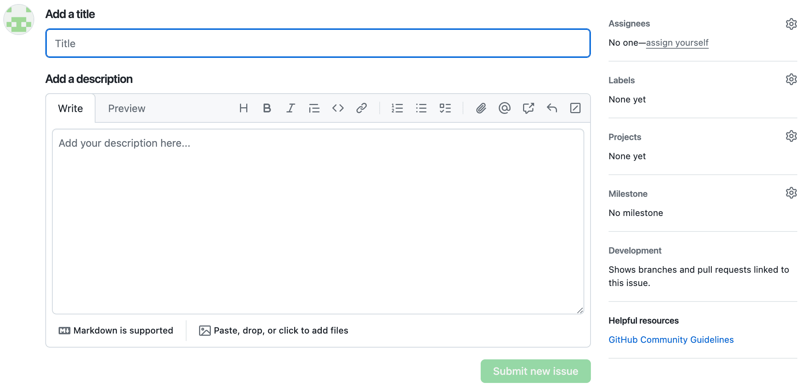
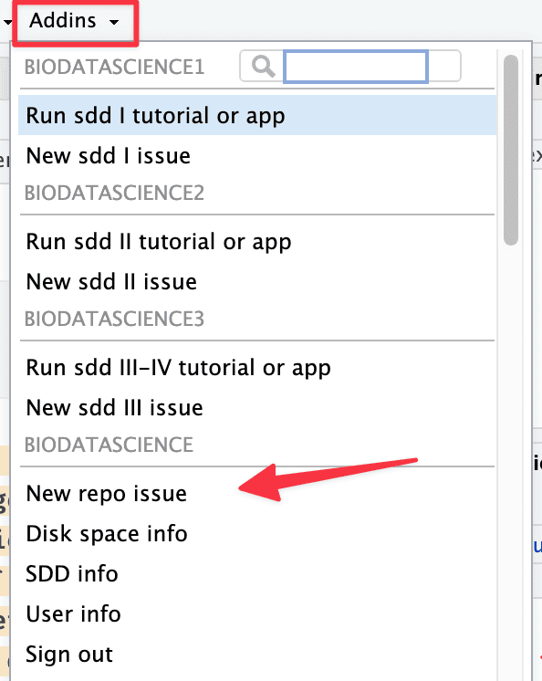
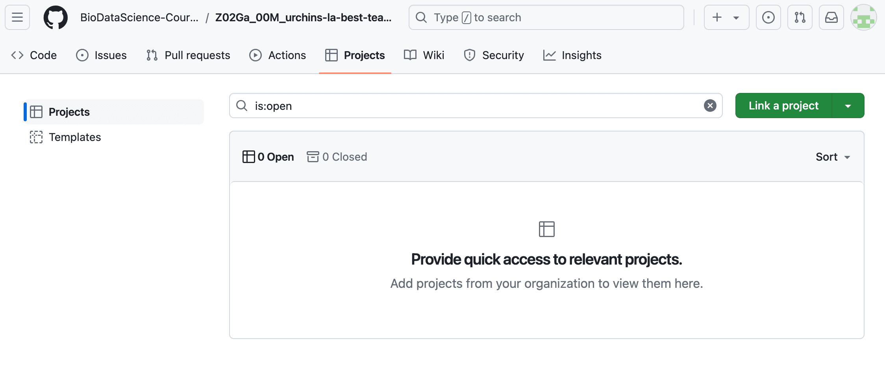
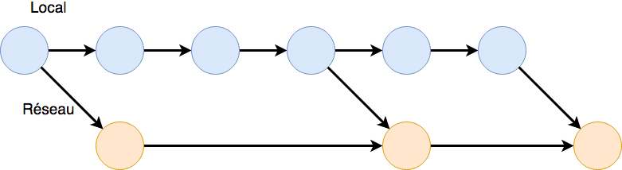
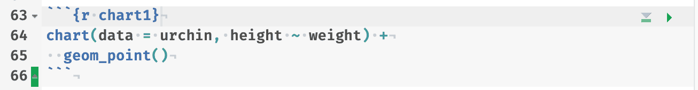
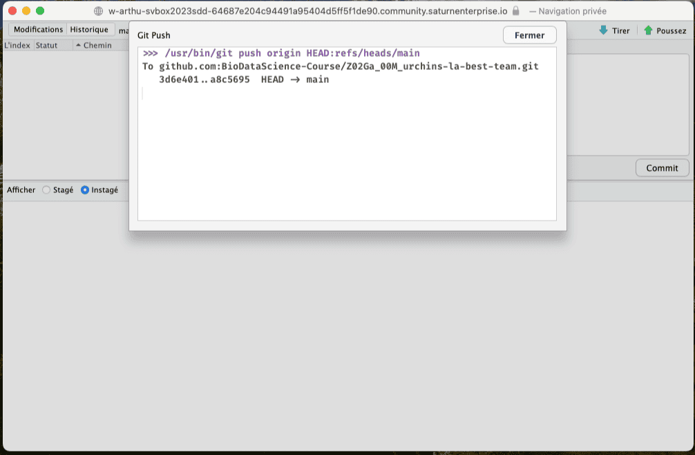

# Visualisation II {#visu2}

```{r setup, include=FALSE, echo=FALSE, message=FALSE, results='hide'}
SciViews::R(lang = "fr")
```

##### Objectifs {.unnumbered}

-   Être capable de réaliser différentes variantes de graphiques visant à montrer *comment les données se distribuent* telles que les histogrammes, les graphiques de densité ou encore les diagrammes en violon dans R avec la fonction `chart()`

-   Intégrer des graphiques dans un rapport et y décrire ce que vous observez

-   Gérer des conflits dans GitHub

##### Prérequis {.unnumbered}

Le premier module de ce cours vous a permis de découvrir de nouveaux outils logiciels comme GitHub, Git, R Markdown/Quarto ou encore RStudio. Ces outils vont être employés tout au long de votre formation en science des données (et donc de ce cours). Il est indispensable de les maîtriser.

##### À vous de jouer ! {.unnumbered}

`r h5p(139, height = 270, toc = NULL)`

Ce module va vous permettre de découvrir de nouveaux graphiques à réaliser avec R. Vous devez donc maîtriser les instructions R qui permettent de réaliser un graphique.

##### À vous de jouer ! {.unnumbered}

`r h5p(178, height = 270, toc = NULL)`

Ces graphiques vont être réalisés dans des scripts R et dans des documents R Markdown/Quarto. Il est dès lors indispensable de bien comprendre les différences entre ces deux approches.

##### À vous de jouer ! {.unnumbered}

`r h5p(179, height = 270, toc = NULL)`

La fin de ce module va traiter de la gestion des conflits dans GitHub. Vous devez maîtriser GitHub et Git pour apprendre ensuite à gérer ces conflits (nous vous expliquerons bien entendu de quoi il s'agit exactement).

##### À vous de jouer ! {.unnumbered}

`r h5p(256, height = 270, toc = NULL)`

## Langage R

Avant de découvrir de nouveaux types de graphiques, réalisez une analyse concrète de données biologiques dans un tutoriel learnr, prétexte pour en apprendre un peu plus sur le langage R.

##### À vous de jouer ! {.unnumbered}

`r learnr("A02La_progression", title = "Progression R", toc = "Progression en R")`

([BioDataScience1](https://github.com/BioDataScience-Course/BioDataScience1) est un package R spécialement développé pour ce cours et qui est préinstallé dans votre SciViews Box).

`r h5p(156, height = 270, toc = "Sélection de la fonction adéquate")`


## Histogramme

Vous souhaitez visualiser l'étalement de vos données sur un axe (on parle de **distribution**[^02-visualisation-ii-1] en statistique) pour l'une des variables étudiées. L'histogramme est l'un des graphiques qui vous apportent cette information de manière visuelle. Il représente sous forme de barres un découpage en plusieurs **classes**[^02-visualisation-ii-2] d'une variable numérique.

[^02-visualisation-ii-1]: La **distribution** des données en statistique se réfère à la fréquence avec laquelle les différentes valeurs d'une variable s'observent.

[^02-visualisation-ii-2]: Une variable numérique est **découpée en classes** en spécifiant différents intervalles, et ensuite en dénombrant le nombre de fois que les observations rentrent dans ces intervalles.

```{r histo-dist, fig.cap="Exemple d'histogramme montrant la distribution de la taille dans un échantillon de zooplancton. Des couleurs sont utilisées pour mettre en évidence différentes parties du graphique (en pratique, les axes et leurs labels seront noirs).", echo=FALSE, message=FALSE, warning=FALSE}
zooplankton <- read("zooplankton", package = "data.io", lang = "FR")
chart(data = zooplankton, ~ size) +
  geom_histogram(bins = 50) +
  ylab("Effectifs") +
  theme(axis.text.x  = element_text(colour = "#a80039", size = 15), 
        axis.title.x = element_text(colour = "#029687", size = 15), 
        axis.text.y  = element_text(colour = "#a80039", size  = 15), 
        axis.title.y = element_text(colour = "#029687", size = 15),
        axis.line.x  = element_line(colour = "#a80039"),
        axis.line.y  = element_line(colour = "#a80039"))
```

Outre l'histogramme lui-même, représenté par des barres noires de hauteur équivalente au nombre d'observations dans les différentes classes, les éléments suivants sont également indispensables à la compréhension du graphique (ici mis en évidence en couleur) :

-   Les axes avec les graduations (en rouge). Sur l'axe des abscisses, la variable numérique étudiée (ici la taille en mm), et sur l'axe des ordonnées, les effectifs
-   les labels des axes et les unités (pour l'axe des abscisses uniquement ici) (en bleu)

Partons d'un jeu de données sur le zooplancton.

```{r, warning=FALSE}
# Importation du jeu de données
zooplankton <- read("zooplankton", package = "data.io", lang = "FR")
# Affichage des premières et dernières lignes du jeu de données
tabularise$headtail(zooplankton)
```

Les instructions dans R pour produire un histogramme similaire à celui présenté plus haut à l'aide de la fonction `chart()` sont :

```{r histo-dist2, fig.cap="Distribution des tailles au sein d'un échantillon de zooplancton"}
chart(data = zooplankton, ~ size) +
  geom_histogram(bins = 50) + # bins = nombre de classes souhaitées
  ylab("Effectifs")
```

La fonction `chart()` requiert comme argument le jeu de donnée (`data = zooplankton`), ainsi que la formule à employer dans laquelle vous avez indiqué le nom de la variable que vous voulez sur l'axe des abscisses à droite, après le tilde `~`. Parmi toutes les variables du jeu de données, nous avons choisi ici de représenter `size`. Jusqu'ici, nous avons spécifié *ce que* nous voulons représenter, mais pas encore *comment* (sous quelle apparence), nous voulons matérialiser cela sur le graphique. Avec les graphiques de type `ggplot()` que nous réalisons ici à l'aide de `chart()`, nous **ajoutons** des couches au graphique à l'aide de l'opérateur `+`. Pour un histogramme, nous devons ajouter une couche `geom_histogram()`, tout comme pour le nuage de points, nous utilisions `geom_point()`. L'argument `bins=` dans cette fonction permet de préciser le nombre de classes souhaitées.

```{block, type='note'}
Le **découpage en classes**, ici de la variable `size` se fait automatiquement. Elle consiste à diviser l'intervalle des valeurs prises par la variable en *n* classes et à comptabiliser le nombre d'observations qui se situent dans chaque classe. Ce nombre d'observations est ensuite représenté par une barre verticale dont la hauteur est proportionnelle à ce nombre dans l'histogramme.

Prenons un exemple concret simple : des observations d'une variable *X* qui sont 3.1, 2.6, 5.4, 5.3, 2.4, 4.2, 5.3. Vous désirez découper en quatre classes allant de 2 à 3 (classe A), 3 à 4 (classe B), 4 à 5 (classe C) et 5 à 6 (classe D). Vous devez naturellement décider comment les bornes des classes sont définies. Par exemple, 3 est-il dans la classe A ou dans la B ? Si vous décidez que la classe inclut la borne inférieure mais pas la supérieure, c'est à dire, A = [2, 3[ et B = [3, 4[ en écriture mathématique, alors 3 appartient à la classe B. Dans ce cas, vous avez 2 observations dans la classe A, 1 dans la B, 1 dans la C et 3 dans la D. L'histogramme correspondant aura donc des barres de hauteur 2, 1, 1 et 3, respectivement.
```

##### À vous de jouer ! {.unnumbered}

`r h5p(172, height = 270, toc = "Les fonctions chart() et geom_histogram()")`

Vous pouvez interpréter votre histogramme sur base des **modes**[^02-visualisation-ii-3] et de la **symétrie**[^02-visualisation-ii-4] de ces derniers. Un histogramme peut être **unimodal** (un seul mode), **bimodal** (deux modes) ou **multimodal** (plus de deux modes). En général, s'il y a plus d'un mode, nous pouvons suspecter que des sous-populations distinctes existent dans les données (par exemple des différences morphométriques entre mâles et femelles pour une espèce au dimorphisme sexuel marqué). En effet, l'allure d'un histogramme qui représente une population homogène est pratiquement toujours unimodal.

[^02-visualisation-ii-3]: Les **modes** d'un histogramme correspondent à des classes plus abondantes localement, c'est-à-dire que les classes à gauche et à droite du mode comptent moins d'occurrences que lui.

[^02-visualisation-ii-4]: Un histogramme est dit **symétrique** lorsque son profil à gauche est identique ou très similaire à son profil à droite autour d'un mode.

```{r histo-mode, fig.cap = "Histogrammes montrant les modes et symétries : A. histogramme unimodal et symétrique, B. histogramme bimodal et asymétrique, C. histogramme unimodal et asymétrique, D. histogramme multimodal et symétrique.", echo=FALSE, message=FALSE, warning=FALSE}
set.seed(1000)
df1 <- dtx(x = rnorm(5000, 35, 5))
g1 <- chart(data = df1, ~ x) +
  geom_histogram() +
  labs(x = "Unimodal & symétrique", y = "Effectifs")

df2 <- rbind(df1, dtx(x = rnorm(7000, 60, 5)))
g2 <- chart(data = df2, ~ x) +
  geom_histogram() +
  labs(x = "Bimodal & symétrique", y = "Effectifs")

df3 <- dtx(x = rlnorm(3000, 0, 0.6))
g3 <- chart(data = df3, ~ x) +
  geom_histogram() +
  labs(x = "Unimodal & asymétrique", y = "Effectifs")

df4 <- rbind(df2, dtx(x = rnorm(3000, 80, 5)))
g4 <- chart(data = df4, ~ x) +
  geom_histogram() +
  labs(x = "Multimodal & symétrique", y = "Effectifs")

combine_charts(list(g1, g2, g3, g4))
rm(g1, g2, g3, g4, df1, df2, df3, df4)
```

##### À vous de jouer ! {.unnumbered}

`r h5p(171, height = 270, toc = "Modes et symétries")`

### Nombre de classes

Vous devez être particulièrement vigilant lors de la réalisation d'un histogramme aux classes définies pour ce dernier.

```{r histo-classes, fig.cap = "Choix des classes. A. histogramme initial montrant la répartition des tailles au sein d'organismes planctoniques. B., C., D. Même histogramme que A, mais en modifiant le nombre de classes."}
# Réalisation du graphique précédent
a <- chart(data = zooplankton, ~ size) +
  geom_histogram(bins = 50) +
  ylab("Effectifs")

# Modification du nombre de classes
b <- chart(data = zooplankton, ~ size) +
  geom_histogram(bins = 20) +
  ylab("Effectifs")

c <- chart(data = zooplankton, ~ size) +
  geom_histogram(bins = 10) +
  ylab("Effectifs")

d <- chart(data = zooplankton, ~ size) +
  geom_histogram(bins = 5) +
  ylab("Effectifs")

# Assemblage des graphiques
combine_charts(list(a, b, c, d))
```

Comme vous pouvez le voir à la Fig. \@ref(fig:histo-classes), le changement du nombre de classes peut modifier complètement la perception des données au travers de l'histogramme (notez au passage l'utilisation de la fonction `combine_charts()` pour réaliser une figure composite, nous étudierons cette fonction plus en détail dans le prochain module). Le choix idéal est un compromis entre plus de classes (donc plus de détails), et un découpage raisonnable en fonction de la quantité de données disponibles. Si l'intervalle des classes est trop petit, l'histogramme sera illisible. Si l'intervalle des classes est trop grand, il sera impossible de visualiser correctement les différents modes. Dans la figure en exemple, les variantes A et B sont acceptables, mais les C et D manquent de détails.

##### À vous de jouer ! {.unnumbered}

`r launch_shiny("https://sdd.umons.ac.be/A02Sa_histogram/", height = 500, delay = 10, toc = "Nombre de classes d'un histogramme")`

##### Pièges et astuces {.unnumbered}

La SciViews Box propose un **snippet RStudio** pour réaliser un histogramme. Il s'appelle `.cuhist` (pour **c**hart -\> **u**nivariate -\> **hist**ogram). Entrez ce code dans une zone d'édition R et appuyez ensuite sur la tabulation, et vous verrez le code remplacé par ceci :

```         
chart(data = DF, ~VARNUM) +
  geom_histogram(binwidth = 30)
```

L'argument `binwidth=` permet de préciser la largeur des classes. C'est une autre façon de spécifier le découpage en classes, mais vous pouvez naturellement le remplacer par l'argument `bins=` comme nous l'avons fait plus haut, si vous préférez.

Vous avez à votre disposition un ensemble de snippets que vous pouvez retrouver dans l'aide-mémoire sur [**SciViews**](https://github.com/BioDataScience-Course/sdd_cheatsheets/raw/master/SciViews/sciviews.pdf). N'oubliez pas que vous avez également à votre disposition l'aide-mémoire sur la visualisation des données ([**Data Visualization Cheat Sheet**](https://rstudio.github.io/cheatsheets/html/data-visualization.html)), avec la fonction `ggplot()` à laquelle vous pouvez simplement substituer `chart()`.

### Histogramme par facteur

Lors de l'analyse de jeux de données, vous serez amené à réaliser un histogramme par facteur (c'est-à-dire, en fonction de différents niveaux d'une variable qualitative qui divise le jeu de données en sous-groupes).

```{block, type='note'}
Une **variable qualitative** ou **variable facteur** est une variable qui représente des *catégories*. Par exemple, une couleur, le genre, une classe taxonomique... Les différentes catégories possibles pour la variable sont appelées **niveaux** ou **modalités** (*levels* en anglais). Pour le genre, par exemple, nous aurons deux niveaux (principaux) : "homme" ou "femme".

Les variables facteurs peuvent aussi représenter un petit nombre de classes différentes. Une variable sera considérée comme qualitative ou facteur si elle possède moins d'une dizaine de niveaux pour fixer les idées, mais il n'existe pas de limite stricte entre une variable numérique quantitative et facteur qualitatif, en réalité. C'est à votre appréciation, mais aussi en fonction du contexte. Une telle variable s'obtient par découpage d'une **variable numérique**. Par exemple, si au lieu de reprendre la taille d'un animal, nous nous contentons de déterminer s'il est "petit", "moyen" ou "grand". Dans ce cas, il existe un ordre logique entre les niveaux : petit < moyen < grand. La variable sera alors dite "qualitative ordonnée" et sera représentée par un objet **ordered** dans R. Sinon, la variable sera **qualitative non ordonnée** et sera un objet **factor** dans R.

Les variables numériques sont représentées par des nombres, donc **numeric** (des nombre décimaux à virgule flottante) ou **integer** (des entiers) dans R. 

Attention que les variables facteur peuvent très bien être importées comme chaînes de caractères (objet **character**), et il faudra peut-être les convertir à l'aide des fonctions `factor()` ou `ordered()` avant de les utiliser.
```

Par exemple, dans un jeu de données sur des fleurs d'iris, la variable `species`[^02-visualisation-ii-5] représente l'espèce d'iris étudiée (trois espèces différentes : *I. setosa*, *I. versicolor* et *I. virginica*).

[^02-visualisation-ii-5]: Attention : le jeu de donnée `iris` est un grand classique dans R, mais lorsqu'il est chargé à l'aide de la fonction `read()` du package {data.io}, le nom de ses variables est modifié pour suivre la convention "snake_case" qui veut que seules des lettres minuscules soient utilisées et que les mots soient séparés par un trait souligné `_`. Ainsi, dans le jeu de données d'origine, les variables sont nommées `Petal.Length` ou `Species`. Ici, ces mêmes variables se nomment `petal_length` et `species`.

```{r, warning=FALSE, fig.cap= "Distribution de la longueur des sépales de trois espèces d'iris."}
# Importation du jeu de données
iris <- read("iris", package = "datasets", lang = "fr")
tabularise$headtail(iris)
# Réalisation de l'histogramme par facteur
chart(data = iris, ~ sepal_length %fill=% species) +
  geom_histogram(bins = 25) +
  ylab("Effectifs") +
  scale_fill_viridis_d() # palette de couleur harmonieuse
```

Ici, nous avons tracé un histogramme unique, mais en prenant soin de colorier les barres en fonction de l'espèce. La formule fait toujours intervenir la variable numérique à découper en classes à la droite du tilde `~`, ici `sepal_length`, mais nous y avons ajouté une directive supplémentaire pour indiquer que le remplissage des barres (`%fill=%`) doit se faire en fonction du contenu de la variable `species`.

Nous avons ici un bon exemple d'histogramme multimodal lié à la présence de trois sous-populations (les trois espèces différentes) au sein d'un jeu de données unique. Le rendu du graphique n'est pas optimal. Voici deux astuces pour l'améliorer. La première consiste à représenter trois histogrammes séparés, mais rassemblés dans une même figure. Pour cela, nous utilisons des **facettes** (`facets`) au lieu de l'argument `%fill=%`. Dans `chart()`, les facettes peuvent être spécifiées en utilisant l'opérateur `|` dans la formule. À ce moment-là, le terme qui définit les facettes doit obligatoirement être le tout dernier (par exemple, si vous utilisez aussi `%col=%`, `%fill=%`, etc.)

```{r histo-facettes, fig.cap= "Distribution de la longueur des sépales de trois espèces d'iris (en employant les facettes pour séparer les espèces)."}
iris <- read("iris", package = "datasets")
chart(data = iris, ~ sepal_length | species) +
  geom_histogram(bins = 25) +
  ylab("Effectifs")
```

L'histogramme est maintenant séparé en trois en fonction des niveaux de la variable facteur `species`. Cela rend la lecture plus aisée. Une seconde solution combine les facettes avec `|` et l'argument `%fill=%`[^02-visualisation-ii-6]. Il faut ensuite ajouter par-derrière un histogramme grisé de l'ensemble des données.

[^02-visualisation-ii-6]: Astuce proposée [ici](https://drsimonj.svbtle.com/plotting-background-data-for-groups-with-ggplot2).

```{r histo-facteurs-facettes, fig.cap= "Distribution des longueurs de sépales de trois espèces d'iris (avec facettes et histogrammes complets grisés en arrière-plans)."}
nbins <- 25
chart(data = iris, ~ sepal_length %fill=% species | species) +
  # histogramme d'arrière-plan en gris de toutes les données
  geom_histogram(data = sselect(iris, -species),
    fill = "grey", bins = nbins) + 
  # histogrammes par espèce
  geom_histogram(show.legend = FALSE, bins = nbins) +
  ylab("Effectifs") +
  scale_fill_viridis_d()
```

Vous découvrez sans doute que les graphiques réalisables avec R sont modulables à souhait en ajoutant une série d'instructions successives qui créent autant de couches superposées dans le graphique. Cette approche permet de réaliser quasiment une infinité de graphiques différents en combinant quelques dizaines d'instructions. Pour s'y retrouver, les fonctions qui ajoutent des couches commencent toutes par `geom_`, et celles qui manipulent les couleurs par `scale_`, par exemple. Vous découvrirez encore d'autres fonctions graphiques plus loin.

##### À vous de jouer ! {.unnumbered}

**Note :** Ce tutoriel couvre l'ensemble de la matière de ce module. N'hésitez pas à le réaliser en parallèle de votre lecture.

`r learnr("A02Lb_univariate", title = "Graphiques univariés", toc = "Graphiques univariés")`

## Graphique de densité

L'histogramme n'est pas le seul outil à votre disposition. Vous pouvez également utiliser le **graphique de densité** qui se présente un peu comme un histogramme lissé. Le passage d'un histogramme vers un graphe de densité se base sur une **estimation par noyau gaussien**[^02-visualisation-ii-7]

[^02-visualisation-ii-7]: L'opération effectuée pour passer d'un histogramme à une courbe de densité consiste effectivement à lisser les pics plus ou moins fortement dans l'histogramme de départ.

```{r histo-densite, fig.cap= "A. Histogramme et B. graphique de densité montrant la distribution de la taille de zooplancton étudié par analyse d'image. Les couleurs pour les axes et les labels servent à les mettre en évidence, mais en pratique ils seront noirs.", echo=FALSE, message=FALSE}
a <- chart(data = zooplankton, ~ size) +
  geom_histogram(bins = 30) +
  ylab("Effectifs") +
  theme(axis.text.x = element_text(colour = "#a80039", size = 15), 
        axis.title.x = element_text(colour = "#029687", size = 15), 
        axis.text.y = element_text(colour = "#a80039", size  = 15), 
        axis.title.y = element_text(colour = "#029687", size = 15),
        axis.line.x = element_line(colour = "#a80039"),
        axis.line.y = element_line(colour = "#a80039"))

b <- chart(data = zooplankton, ~ size) +
  geom_density() +
  ylab("Densité") +
  theme(axis.text.x = element_text(colour = "#a80039", size = 15), 
        axis.title.x = element_text(colour = "#029687", size = 15), 
        axis.text.y = element_text(colour = "#a80039", size  = 15), 
        axis.title.y = element_text(colour = "#029687", size = 15),
        axis.line.x = element_line(colour = "#a80039"),
        axis.line.y = element_line(colour = "#a80039"))

combine_charts(list(a, b))
rm(a, b)
```

Comme pour les autres graphiques, veillez à soigner les indications qui permettent d'interpréter le graphique. Outre la courbe de densité ici en noir, il faut :

-   Les axes avec les graduations (en rouge)
-   les labels des axes, et les unités pour l'axe des abscisses (en bleu)

Les instructions en R pour produire un graphique de densité avec la fonction `chart()` sont :

```{r densite, fig.cap="Distribution des tailles dans l'échantillon de zooplancton."}
chart(data = zooplankton, ~ size) +
  geom_density() +
  ylab("Densité")
```

Ici, nous utilisons donc la fonction `geom_density()`.

##### À vous de jouer ! {.unnumbered}

`r h5p(173, height = 270, toc = "La fonction chart() et geom_density()")`

```{r assign_A02Ia_distributions, echo=FALSE, results='asis'}
if (exists("assignment"))
  assignment("A02Ia_distributions", part = NULL,
    url = "https://github.com/BioDataScience-Course/A02Ia_distributions",
    course.ids = c(
      'S-BIOG-006' = !"A02Ia_{YY}M_distributions"),
    course.urls = c(
      'S-BIOG-006' = "https://classroom.github.com/a/HSj-nDoy"),
    course.starts = c(
      'S-BIOG-006' = !"{W[5]+1} 13:00:00"),
    course.ends = c(
      'S-BIOG-006' = !"{W[6]+1} 23:59:59"),
    term = "Q1", level = 3,
    toc = "Graphiques de distribution des données")
```

## Diagramme en violon

Le graphique en violon ou diagramme en violon est constitué de deux graphiques de densité en miroir. Le résultat fait penser un peu à la silhouette d'un violon pour une distribution bimodale. Cette représentation est visuellement très convaincante lorsque la variable étudiée contient suffisamment d'observations pour permettre de déterminer précisément sa distribution (plusieurs dizaines ou centaines d'individus mesurés).

```{r violin-plot, fig.cap="Graphe en violon de la distribution de la taille en fonction des groupes taxonomiques dans un échantillon de zooplancton. Les couleurs pour les axes servent à mettre des éléments en évidence. En pratique, les axes seront noirs.", echo=FALSE, message=FALSE, warning=FALSE}

zooplankton %>.%
  sfilter(., class %in% c("Annélide", "Calanoïde", "Cyclopoïde", "Décapode")) %>.%
  chart(data = ., size ~ class %fill=% class) +
    geom_violin(show.legend = FALSE)  +
    theme(axis.text.x  = element_text(colour = "#a80039", size = 15), 
          axis.title.x = element_text(colour = "#029687", size = 15), 
          axis.text.y  = element_text(colour = "#a80039", size  = 15), 
          axis.title.y = element_text(colour = "#029687", size = 15),
          axis.line.x  = element_line(colour = "#a80039"),
          axis.line.y  = element_line(colour = "#a80039"))
```

Les instructions en R pour produire un diagramme en violon à l'aide de la fonction `chart()` sont présentées ci-dessous. Comme le jeu de données `zooplankton` contient 17 classes différentes, nous décidons ici d'en extraire un sous-tableau ne contenant que les quatre classes de crustacés copépodes à l'aide d'une fonction `sfilter()`. Pour l'instant, retenez simplement que ce genre de remaniement de tableau est possible. Nous étudierons ces fonctions plus en détail dans les modules 4 et 5. Notre tableau réduit à quatre classes se nomme `zooplankton_sub` et c'est à partir de lui que nous réalisons notre graphique.

```{r violin-plot2, fig.cap="Distribution des tailles pour quatre groupes taxonomiques de zooplancton."}
# Importation du jeu de données
zooplankton <- read("zooplankton", package = "data.io", lang = "FR")
# Réduction du jeu de données 
zooplankton_sub <- sfilter(zooplankton,
  class %in% c("Annélide", "Calanoïde", "Cyclopoïde", "Décapode"))
# Réalisation du graphique
chart(data = zooplankton_sub, size ~ class) +
  geom_violin()
```

Ici, la formule fournie à `chart()` indique la variable numérique à représenter par un graphe de densité *dans le terme de gauche*, et la variable facteur qui découpe l'échantillon en classes *à droite* : `YNUM (size) ~ XFACT (class)`. Pour réaliser un graphique en violon, vous devez ensuite ajouter la fonction `geom_violin()`. Vous pouvez aussi utiliser `%fill=%` pour colorer vos différents graphes en fonction de la variable facteur également, comme dans la Fig. \@ref(fig:violin-plot).

##### À vous de jouer ! {.unnumbered}

`r h5p(174, height = 270, toc = "La fonction chart() et geom_violin()")`

##### Pièges et astuces {.unnumbered}

Parfois, les labels sur l'axe des abscisses d'un diagramme en violon apparaissent trop rapprochés et se chevauchent, comme ci-dessous.

```{r violin-plot-abscisses, fig.cap="Distribution de tailles des 17 classes d'organismes planctoniques (diagramme en violon)."}
chart(data = zooplankton, size ~ class) +
  geom_violin() 
```

La fonction `coord_flip()` permute les axes. Ainsi les libellés ne se chevauchent plus sur l'axe des ordonnées.

```{r violin-plot-ordonnees, fig.cap="Distribution de tailles des 17 classes d'organismes planctoniques (diagramme en violon avec l'ajout de la fonction `coord_flip()`)."}
chart(data = zooplankton, size ~ class) +
  geom_violin() +
  coord_flip()
```

La fonction `geom_violin()` a aussi un argument `orientation=` qui est plus pratique pour inverser les axes directement (à utiliser préférentiellement, mais attention à bien penser d'inverser les variables dans la formule également `class ~ size` au lieu de `size ~ class`) :

```{r violin-plot-ordonnees2, fig.cap="Distribution de tailles des 17 classes d'organismes planctoniques (diagramme en violon avec `orientation = \"y\"`)."}
chart(data = zooplankton, class ~ size) +
  geom_violin(orientation = "y")
```

Le package [{ggridges}](https://cran.r-project.org/web/packages/ggridges/vignettes/introduction.html) offre une seconde solution basée sur le principe de graphique de densité avec la fonction `geom_density_ridges()` qui crée un graphique en lignes de crêtes. **Attention : remarquez que la notation est ici inverse du diagramme en violon vertical, soit `XFACT (class) ~ YNUM (size)` !**

```{r density-ridges, fig.cap="Distribution des tailles des 17 classes d'organismes planctoniques (sous forme de graphique en lignes de crêtes).", message=FALSE}
chart(data = zooplankton, class ~ size) +
  ggridges::geom_density_ridges()
```

## Visualiser des distributions

En pratique, vous ne représenterez pas systématiquement tous ces types de graphiques pour toutes les variables. Il faudra choisir le graphique le plus adapté à la situation. La plupart du temps, cela se fait de manière *itérative* : vous essayez diverses variantes, vous les comparez, et vous gardez celle(s) qui visualisent le mieux les données dans le cas particulier de votre étude.

##### Pour en savoir plus {.unnumbered}

-   Si vous avez encore du mal avec la compréhension de l'histogramme, voyez [cette vidéo](https://www.youtube.com/watch?v=lNfeCYGa07Y) qui vous montre comment le construire à la main.

-   Dans la section "How to build a histogram" de [cette page](https://tinlizzie.org/histograms/), vous verrez une animation qui visualise étape par étape la construction d'un histogramme (en anglais).

-   Les [histogrammes à classes de largeurs variables](https://www.youtube.com/watch?v=IWyaMBV76EE).

## Travail collaboratif

Dans le module précédent, vous avez travaillé seul sur un projet en utilisant **git** et **GitHub**. Vous avez commencé par créer une copie locale du projet, appelée **clone**. Ensuite, vous avez effectué des sauvegardes de vos fichiers au sein d'un dépôt, appelées **commit**. Pour finir, vous avez synchronisé votre dépôt local avec votre dépôt distant (sur GitHub) via un **pull** suivi d'un **push**.

Bien que GitHub et git permettent de travailler seul sur ses dépôts, ils sont conçus pour la collaboration. En tant qu'étudiant et futur scientifique, vous allez devoir collaborer abondamment à l'avenir. Il est donc indispensable de savoir utiliser des outils professionnels de collaboration.

La répartition réfléchie des différentes tâches d'un projet est un élément clé dans un travail collaboratif. Vous pourriez être tenté de diviser le travail via des échanges de mails ou encore via tout autre système de discussion instantanée, grand public ou professionnel. Le risque est de ne plus retrouver ces échanges. GitHub a la solution pour vous avec les **issues**. Ces dernières sont liées au dépôt sur lequel vous travaillez. Il est donc simple de retrouver les échanges importants sur un projet.

### Issues

Une issue est une zone de discussion attachée à votre dépôt GitHub **pour y discuter de questions techniques et scientifiques strictement en relation avec ce dépôt**. Les issues sont accessibles dans l'entête des dépôts comme le montre l'image ci-dessous.



Rédiger correctement une issue nécessite une réflexion et prend du temps. Une question claire permet une réponse précise de la part des collaborateurs, ce qui représente un gain de temps important. Il ne s'agit pas d'un système de chat comme Discord ou Messenger... Vos "memes" et autres gifs animés pour exprimer vos émotions n'y ont pas leur place. De même, des échanges du genre : "tu es là ?", "oui... tu travailles sur quoi ?", "sur le premier graphique, mais sinon, je me cure les ongles, kiss kiss" n'ont absolument pas leur place dans les issues ! Vous avez un dépôt GitHub à disposition qui regroupe toutes les bonnes pratiques pour rédiger une issue : [sdd_issues](https://github.com/BioDataScience-Course/sdd_issues)

La rédaction d'une question sous la forme d'une Issue se décompose en quatre étapes :

1.  Choix d'un titre court qui résume la question
2.  Rédaction de la question en respectant la syntaxe Markdown
3.  Ajout de labels, de personnes assignées...
4.  Soumission de l'issue via le bouton "Submit new issue"

Consultez le document suivant pour tout connaitre de la création d'une [issue](https://github.com/BioDataScience-Course/sdd_issues/blob/main/docs/new_issue.md)



Rappelez-vous qu'une issue doit être **fermée** lorsque le sujet de cette dernière a été débattu et le problème résolu. Ouvrez une issue différente pour *chaque* problème.

Pour accéder encore plus facilement aux issues dans vos projets de groupes, utilisez l'addins dédié :



*GitHub met à votre disposition plusieurs outils pour améliorer l'efficacité d'un travail en équipe. Dans les issues vous pouvez ajouter des labels à vos questions par exemple. Il existe également dans la section Projects un outil de planification de projets, très utile, bien que nous ne l'utiliserons pas dans le cadre du cours.*



### Git

**Git** est un outil puissant, mais complexe. Dans le premier module, nous étions arrivés à la vision schématique suivante. (chaque boule bleue représente un **commit** soit une version enregistrée dans le système et les flèches indiquent d’où provient chaque version et où elle est utilisée ensuite) :

Ce gestionnaire Git peut être couplé à un hébergement sur le cloud, soit pour simplement faire un backup de nos projets, soit pour pouvoir échanger et collaborer. Nous utiliserons GitHub à cette fin dans le cours. Lorsque l'on travaille seul avec GitHub, l'évolution de notre projet ressemblera au schéma ci-dessous :



On réalise un envoi (**push**) lorsque l'on souhaite synchroniser nos changements locaux avec la version sur le "cloud". Plusieurs **commits** peuvent être envoyés avec un seul **push** sur le réseau, et c'est d'ailleurs généralement comme cela que l'on procède. L'inverse (rapatrier localement les changements que d'autres collaborateurs ont envoyés sur la version réseau de notre projet) s'appelle faire un **pull**. Par conséquent, synchroniser complètement notre dépôt GitHub avec la version locale consiste à faire les trois actions dans l'ordre : d'abord un **commit** pour créer un nouveau point d'enregistrement de l'état du système et y inclure tous les fichiers qui ont été modifiés, ensuite faire un **pull** pour rapatrier localement les changements qui ont été réalisés par d'autres ou par GitHub lui-même, et enfin, faire un **push** pour envoyer nos propres modifications dans notre projet GitHub. Les autres utilisateurs feront aussi **commit-pull-push** de leur côté.

##### À vous de jouer ! {.unnumbered}

*Note : l'image suivante est interactive. Il vous est maintenant demandé de cliquer dessus pour indiquer quelles flèches représentent une action particulière dans le schéma présenté.*

`r h5p(146, height = 270, toc = "GitHub : repérer les pushs")`

L'avantage principal de **GitHub** ne réside pas vraiment dans la possibilité de réaliser une sauvegarde en ligne, mais plutôt dans la possibilité de collaborer avec d'autres personnes présentes sur ce réseau comme l'illustre la figure ci-dessous. Deux scientifiques (les versions locales sur leurs ordinateurs respectifs sont indiquées en bleu pour l'un et en vert pour l'autre) collaborent sur un même projet que l'on appelle un **dépôt** (**repository** en anglais) lorsqu'il est en ligne. Le premier chercheur (boules bleues) initie le dépôt et réalise un **push** pour rendre son travail accessible sur le réseau (les versions GitHub sont représentées par des boules orange). Son collaborateur (boules vertes) **clone** ensuite le dépôt sur son ordinateur afin de pouvoir y travailler. Après avoir fait des changements, il réalise également un **push** sur le réseau. Le premier scientifique, avant de travailler à nouveau sur le projet, devra donc réaliser un **pull** pour obtenir en local l'ensemble des modifications fournies par son ou ses collaborateurs. Après ses propres modifications, il devra ensuite effectuer à nouveau un **push**.

##### À vous de jouer ! {.unnumbered}

*Pour être certain que vous ayez bien compris, encore une image interactive à cliquer...*

`r h5p(147, height = 270, toc = "GitHub : repérer les pulls")`

##### À vous de jouer ! {.unnumbered}

`r learnr("A02Lc_git", title = "Gestion de versions avec git", toc = "Autoévaluation sur git")`

### Gestion de conflit

Malgré la répartition des tâches, la collaboration entre plusieurs personnes sur un projet commun mène à des conflits. C'est-à-dire les mêmes parties de documents au sein d'un projet qui sont modifiées par deux membres du groupe. Ne redoutez pas les conflits (dans le contexte de GitHub, du moins). Leur gestion appropriée est une compétence que nous allons développer ici.

Prenons un cas concret entre des collaborateurs qui étudient deux populations de *Paracentrotus lividus* (Lamarck, 1816). Les collaborateurs sont [oliviaMaes](https://github.com/oliviamaes), [arthurpeeters](https://github.com/arthurpeeters) et [GuyliannEngels](https://github.com/GuyliannEngels). Le projet est disponible. Consultez-y par exemple les différents commits afin de suivre l'évolution du projet.

Arthur et Olivia ont édité la même section d'un document.

`r h5p(257, height = 270, toc = "Deux versions d'un même fichier")`

Que va-t-il se passer selon vous ? Lequel des deux collaborateurs va avoir le droit d’écraser le contenu de l’autre ? GitHub n’est pas capable de décider quelle version est la meilleure. Il va donc demander au dernier collaborateur qui souhaite ajouter ces modifications avec le suite d'instruction, **commit -\> pull -\> push**, de gérer ce conflit lui-même.

`r img("sdd1_02/gestion_conflit.gif")`

Cette animation montre l'importance de toujours bien lire le message renvoyé par git. Lors du pull, il précise qu'il y a un conflit à gérer dans le fichier `urchin_notebook.qmd`.

`r h5p(258, height = 270, toc = "Résolution d'un conflit")`

Vous pouvez ensuite vous rendre dans chaque fichier problématique pour retrouver la ou les zones de conflit (utiliser l'outil de recherche avec l'icône loupe dans l'éditeur RStudio et recherchez par exemple `<<<<<`). En fait, GitHub va placer les deux versions de la même section entre des balises spéciales pour vous permettre de les repérer : une série de signes "plus petit que" indique le début de la première version (`<<<<<<<<<<<<<<<<<<<<<<<<`). Ensuite, une série de signes "égaux" indique le passage à la seconde version (`=======================`). Enfin, une série de signes "plus grand que" indique la fin de la seconde version (`>>>>>>>>>>>>>>>>>>>>>>>>`). Un numéro de commit est aussi indiqué. Dans l'onglet "Git", tous les fichiers qui ont des conflits non résolus apparaissent avec une petite icône orange marquée d'un "U", pour "unresolved conflict". Cela vous aide pour déterminer dans quel(s) fichier(s) se trouve(nt) le(s) conflit(s). Ouvrez chacun de ces fichiers. Ensuite, l'outil de recherche dans l'éditeur vous positionne au début du conflit. Notez bien qu'il peut y avoir **plusieurs zones de conflit dans un même document**. Répétez la recherche jusqu'à ce que RStudio vous dise qu'il ne trouve plus `<<<<<`. Éditez ces zones pour ne garder que la bonne version et éliminez les balises. Ensuite, sauvegardez le document et passez éventuellement au suivant.

`r h5p(259, height = 270, toc = "Résolution d'un conflit (suite)")`

La résolution d'un conflit se fait donc en éditant le fichier concerné. Vous devez choisir la partie qui vous semble la plus pertinente et effacer tout le reste, y compris les balises ajoutées par GitHub. Terminez l'opération en enregistrant votre fichier.



La gestion du conflit se termine par la réalisation d'un "commit" avec un message qui indique la résolution du ou des conflits, suivi par un "pull" pour vérifier qu'il n'y a plus de problèmes, et enfin un "push" qui synchronise votre version locale avec GitHub.



Votre ou vos collaborateurs doivent ensuite faire un "pull" de leur côté pour se synchroniser à leur tour. Nous vous conseillons à chaque fois que vous ouvrez un projet pour y contribuer de réaliser un pull afin de récupérer toutes les modifications réalisées par les autres membres du groupe.

`r img("sdd1_02/gestion_conflit2.gif")`

```{block, type='note'}
Lorsque vous vous lancez dans un projet ou revenez vers lui, il faut toujours faire un "pull" avant de commencer à travailler pour vous assurer que votre copie locale du projet est bien synchronisée avec la dernière version en ligne sur GitHub. C'est d'autant plus important lorsque le dépôt a plusieurs collaborateurs, car il faut traiter immédiatement les conflits et ne surtout pas les laisser s'accumuler.

Lorsque vous avez terminé de travailler dans un projet. Il est conseillé de faire toujours un "commit", suivi d'un "pull" en vérifiant bien si des modifications sont réalisées qu'il n'y a pas de conflits (sinon, on les règle directement comme expliqué plus haut) et enfin un "push". **Ne laissez jamais traîner un conflit ! C'est une situation transitoire normale de votre dépôt, mais qui nécessite une intervention rapide pour l'éliminer avant que d'autres "commits" ne viennent rendre la situation encore plus complexe.**
```

##### À vous de jouer ! {.unnumbered}

Complétez votre projet de groupe en y ajoutant des graphiques de distribution et en les interprétant.

```{r assign_A02Ga_analysis_I, echo=FALSE, results='asis'}
if (exists("assignment2"))
  assignment2("A02Ga_analysis", part = "I",
    url = "https://github.com/BioDataScience-Course/A02Ga_analysis",
    course.ids = c(
      'S-BIOG-006' = !"A02Ga_{YY}M_analysis"),
    course.urls = c(
      'S-BIOG-006' = "https://classroom.github.com/a/oDqM6on_"),
    course.starts = c(
      'S-BIOG-006' = !"{W[5]+5} 09:00:00"),
    course.ends = c(
      'S-BIOG-006' = !"{W[15]+2} 23:59:59"),
    term = "Q1", level = 4, n = 4,
    toc = "Analyse de données (partie I, par groupe de 4)")
```

## Récapitulatif des exercices

Ce module 2 vous a permis de réaliser différents graphiques uni- et bivariés afin de visualiser la *distribution* de variables quantitatives seules ou en fonction des niveaux d'une variable qualitative (facteur). Pour évaluer votre compréhension de cette matière, vous aviez les exercices suivants à réaliser :

`r show_ex_toc()`

##### Progression {.unnumbered}

`r launch_report("02", height = 800)`
