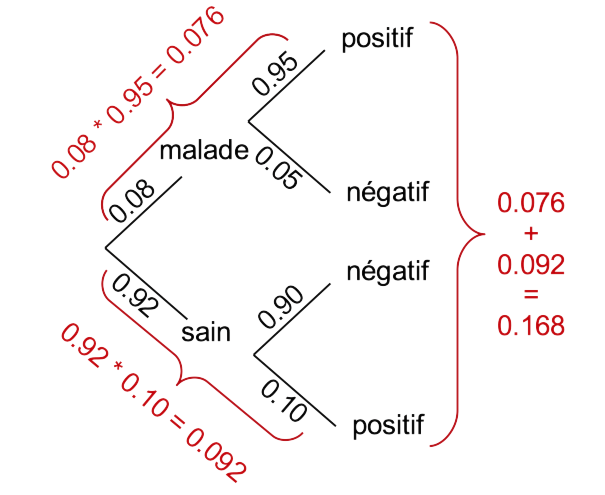
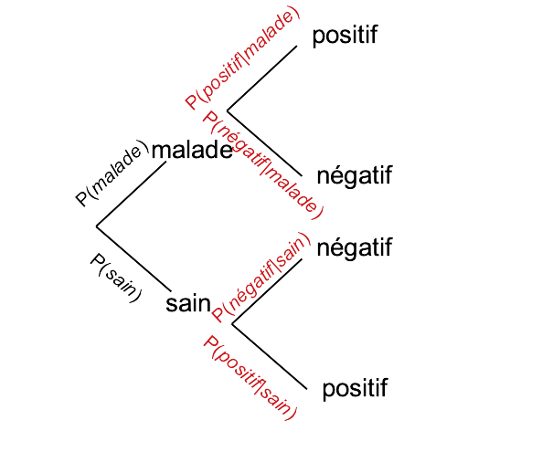
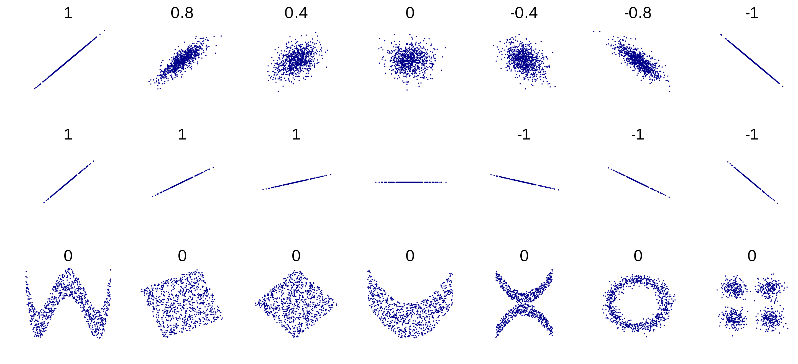
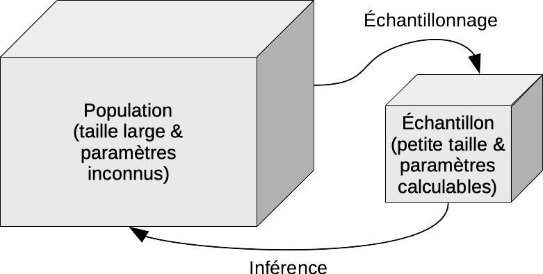

# (PART) SDD I: inférence {.unnumbered}

# Probabilités, distributions I & corrélation {#probacorr}

```{r setup, include=FALSE, echo=FALSE, message=FALSE, results='hide'}
SciViews::R("infer", lang = "fr")
#library(BioDataScience1)
```

##### Objectifs {.unnumbered}

-   Comprendre et être capable de calculer des probabilités

-   Appréhender des lois de distributions statistiques et leurs utilisations pratiques (distribution uniforme, normale)

-   Comprendre les différents niveaux d'association de deux variables numériques

-   Connaître et savoir utiliser les coefficients de corrélation de Pearson, de Spearman, et de Kendall

-   Pouvoir manipuler des matrices de corrélation et des corrélogrammes. Utiliser également la matrice de nuages de points comme représentation graphique complémentaire

-   Appréhender les premiers éléments concernant les tests d'hypothèses

-   Maîtriser le test de corrélation

##### Prérequis {.unnumbered}

Vous devez être à l'aise avec l'utilisation de R, RStudio et R Markdown. Vous avez appris à maîtriser ces outils dans le module \@ref(introvisu).

## Probabilités {#proba}

La vidéo suivante vous introduit la notion de **probabilité** et le calcul de probabilité qu'un **évènement** se produise d'une manière plaisante à partir d'un jeu de hasard proposé par un petit chat à ses amis...

```{r, echo=FALSE}
vembedr::embed_youtube("5TtwG_LR0iY", width = 770, height = 433)
```

```{block, type='note'}
Sachant qu'un **évènement** en statistique est un fait qui se produit, la **probabilité** que cet évènement se produise effectivement peut être quantifiée sur base de l'observation des réalisations passées. Ainsi si l'évènement en question s'est produit, disons, 9 fois sur un total de 12 réalisations, nous dirons que la probabilité que cet évènement se produise est de 9/12, soit 0,75. Notez qu'une probabilité est un nombre compris entre zéro (lorsqu'il ne se produit jamais) et un (lorsqu'il se produit toujours).
```

On écrira, pour la probabilité de l'évènement *E* :

$$0 \leq \mathrm{P}(E) \leq 1$$

### Dépistage

Voyons tout de suite une application en biologie et en médecine : le dépistage d'une maladie qui touche 8% de la population. Le test de dépistage mis en place détecte la maladie dans 95% des cas lorsque la personne testée en est atteinte. Par contre, pour des personnes saines, le test se trompe dans 10% des cas. Comment connaître le risque d'être malade si on est diagnostiqué positif par ce test ?

```{block, type='note'}
Notons d'emblée que les deux évènements "malade" et "sain" sont les seuls possibles. À un moment donné, une personne a la maladie ou ne l'a pas. De plus il n'est pas possible que ces deux évènements se produisent simultanément pour la même personne. Nous parlons alors d'**évènements disjoints**.
```

Pour résoudre ce problème, nous devons d'abord apprendre à *combiner* des probabilités. Il s'agit de calculer la probabilité que deux évènements **successifs** se produisent, sachant la probabilité de chacun des deux (la personne tombe malade ou non *et puis* se fait tester). Deux situations sont possibles :

-   Soit les **évènements successifs sont indépendants**. Dans ce cas, l'occurrence du second *ne dépend pas* de l'occurrence du premier. La **probabilité que les deux évènements successifs indépendants se produisent tous les deux est la multiplication des deux probabilités**. Nous pourrons écrire :

$$\mathrm{P}(E_1 \,\mathrm{et}\, E_2) = \mathrm{P}(E_1) * \mathrm{P}(E_2)$$

-   Soit le second évènement dépend du premier. Ici, c'est le cas, puisque la probabilité que le test soit positif (second évènement) dépend du fait que le patient soit malade ou non (premier évènement).

```{block, type='note'}
Une **probabilité conditionnelle** est la probabilité qu’un évènement *E2* se produise si et seulement si un premier évènement *E1* s’est produit (*E1* et *E2* sont deux évènements successifs). La probabilité conditionnelle s’écrit $\mathrm{P}(E_2|E_1)$.
```

Le calcul se fait ici également par multiplication des deux probabilités, mais il faut choisir la probabilité du second évènement correspondant **de manière conditionnelle** au fait que le premier se soit produit ou non.

$$\mathrm{P}(E_1 \,\mathrm{et}\, E_2) = \mathrm{P}(E_1) * \mathrm{P}(E_2|E_1)$$

Vous pouvez dès lors calculer la probabilité que l'on teste un patient malade (probabilité = 0,08) et que le test soit positif si le patient est malade (0,95) dans ce cas :

```{r}
# Personne malade et détectée positive
(p_sick_positive <- 0.08 * 0.95)
```

Ceci n'indique *pas* la probabilité que le test soit positif, car il est également parfois (erronément) positif pour des patients sains. Mais au fait, quelle est la probabilité d'avoir un patient sain ? **La probabilité que l'un parmi tous les évènements possibles se produise vaut toujours un**. Les seuls évènements possibles ici sont que le patient soit sain ou malade. Donc,

$$\mathrm{P}(sain) + \mathrm{P}(malade) = 1 \rightarrow \mathrm{P}(sain) = 1 - \mathrm{P}(malade) = 0.92$$

Nous pouvons maintenant déterminer la probabilité que le test soit positif dans le cas d'une personne saine. C'est la probabilité que le patient soit sain multipliée par la probabilité que le test soit positif si la personne est saine.

```{r}
# Personne saine et détectée positive
(p_healthy_positive <- 0.92 * 0.10)
```

Bon, il nous reste à combiner les probabilités que le test soit positif, que la personne soit saine ou malade. Mais comment faire ? Ici, nous n'avons pas affaire à des évènements successifs, mais à des évènements mutuellement exclusifs : des **évènements disjoints**. Pour déterminer si l'un parmi deux évènements disjoints se produit, il suffit d'**additionner leurs probabilités respectives**.

$$\mathrm{P}(positif) = \mathrm{P}(positif|sain\ ou\ positif|malade) = \mathrm{P}(positif|sain) + \mathrm{P}(positif|malade)$$

Nous pouvons maintenant déterminer la probabilité que le test soit positif, quelle que soit la personne testée :

```{r}
# Probabilité que le test soit positif 
(p_positive <- p_sick_positive + p_healthy_positive)
```

Nous nous trouvons ici face à un résultat pour le moins surprenant ! En effet, nous constatons que le test est positif dans 16,8% des cas, mais seulement 7,6% du temps, il sera correct (probabilité d'une personne malade détectée). Parmi tous les cas positifs au test, il y en a...

```{r}
p_sick_positive / p_positive
```

... seulement 45,2% qui sont effectivement malades (on parle de **vrais positifs**). Ceci ne correspond pas du tout aux indications de départ sur les performances du test.

##### À vous de jouer ! {.unnumbered}

`r h5p(68, height = 400, toc = "Lecture de probabilités")`

```{block, type='note'}
Dans le cas de deux faits successifs qui ne peuvent chacun que résulter en deux évènements, nous avons seulement quatre situations possibles. Si l'un des cas est qualifié de positif et l'autre de négatif, nous aurons :
  
- les **vrais positifs** (test positif alors que la personne est malade), ici 0.08 * 0.95

- les **faux positifs** (test positif alors que la personne est saine), ici 0.92 * 0.10

- les **vrais négatifs** (test négatif alors que la personne est saine), ici 0.92 * 0.90

- les **faux négatifs** (test négatif alors que la personne est malade), ici 0.08 * 0.05

```

En fait, les performances finales du test de dépistage dépendent *aussi* de la prévalence de la maladie. Ainsi, pour une maladie très commune qui affecterait 80% de la population, nous obtenons :

```{r}
# Vrais positifs
0.80 * 0.95
# Faux positifs
0.20 * 0.10
# Total des positifs
0.80 * 0.95 + 0.20 * 0.10
# Fractions de tests positifs qui sont corrects
(0.80 * 0.95) / (0.20 * 0.10 + 0.80 * 0.95)
```

Ouf ! Dans ce cas-ci le test positif est correct dans 97,4% des cas. Mais qu'en serait-il si la maladie est très rare (probabilité de 0,008) ?

```{r}
# Vrais positifs
0.008 * 0.95
# Faux positifs
0.992 * 0.10
# Total des positifs
0.008 * 0.95 + 0.992 * 0.10
# Fractions de tests positifs qui sont corrects
(0.008 * 0.95) / (0.992 * 0.10 + 0.008 * 0.95)
```

Dans ce cas, un test positif n'aura effectivement détecté un malade que dans ... 7,1% des cas ! Les 92,9% autres cas positifs seront en fait des personnes saines, donc, des faux positifs.

Comme nous pouvons le constater ici, le calcul des probabilités est relativement simple. Mais en même temps, les résultats obtenus peuvent être complètement **contre-intuitifs**. D'où l'intérêt de faire ce genre de calcul !

##### À vous de jouer ! {.unnumbered}

`r h5p(70, height = 400, toc = "Validité d'un test")`

### Arbre des probabilités

Il se peut que tout cela vous paraisse très (trop) abstrait. Vous comprenez peut-être mieux les concepts lorsqu'ils sont présentés de manière plus imagée. Dans ce cas, la méthode alternative de résolution des calculs de probabilités via les **arbres de probabilités** devrait vous aider. Le principe consiste à représenter un arbre constitué de nœuds (des faits qui peuvent se produire). De ces nœuds, vous représentez autant de branches (des segments de droites) que d'évènements possibles. La figure suivante est l'arbre des probabilités correspondant au cas du dépistage de la maladie qui touche 8% de la population.



Du premier nœud nous avons deux branches menant aux deux évènements "malade" et "sain". Chacune de ces deux situations est un nouveau nœud d'où deux autres évènements sont possibles à chaque fois (deux fois deux nouvelles branches) : un test "positif", ou un test "négatif". Les nœuds terminaux (les "négatifs" et "positifs" ici) sont aussi appelés les feuilles de l'arbre. L'arbre reprend donc tous les cas possibles depuis le nœud de départ (sa racine), jusqu'aux feuilles.

L'étape suivante consiste à aller indiquer le long des branches les probabilités associées à chaque évènement : 0.08 pour "malade", 0.95 pour un dépistage "positif" si la personne est malade (notre probabilité conditionnelle $\mathrm{P}(positif|malade)$), etc. À ce stade, une petite vérification peut être faite. La somme des probabilités aux feuilles doit toujours valoir un, et il en est de même de la somme de toutes les branches issues d'un même nœud.

Le calcul se fait ensuite comme suit. Nous repérons tous les cas qui nous intéressent. Ici, il s'agit de toutes les branches qui mènent à un test "positif". Le calcul des probabilités se fait en **multipliant les probabilités lorsque nous passons d'un nœud à l'autre le long d'une branche et en additionnant les probabilités ainsi calculées au niveau des feuilles terminales de l'arbre.** Donc, le cas patient "malade" -\> test "positif" correspond à 0.08 \* 0.95 = 0.076. Le cas patient "sain" -\> test "positif" correspond à 0.92 \* 0.10 = 0.092. Enfin, nous sommons les probabilités ainsi calculées pour les feuilles de l'arbre qui nous intéressent, soit 0.076 + 0.092 = 0.168. *Et voilà ! Nous avons résolu le problème. La probabilité d'avoir un résultat positif avec le test de dépistage dans une population dont 8% sont atteints de la maladie est de 16.8%.*

### Théorème de Bayes

Vous noterez que l'arbre des probabilités représente, en réalité, des probabilités conditionnelles à partir du second niveau (l'arbre peut être évidemment plus complexe). Naturellement, il fonctionnera également si les évènements sont indépendants. Nous aurons simplement les mêmes probabilités reprises aux différents endroits.



Nous connaissons déjà la probabilité conditionnelle d'avoir un résultat positif au test si la personne est malade $\mathrm{P}(positif|malade)$. C'est une donnée du problème (0.95). Maintenant, la probabilité qu'une personne soit malade si elle est positive au test $\mathrm{P}(malade|positif)$ est une information capitale ici, mais nous ne la connaissons pas. Le lien entre les deux n'est pas facile à faire. C'est grâce aux travaux du révérend **Thomas Bayes** au 18^e^ siècle que ce problème a été résolu. Les implications du **théorème de Bayes** sont énormes, car cela permet de déterminer des probabilités dites *a posteriori* (suite à l'occurrence des évènements) en fonction de connaissances *a priori* du problème.

Si nous réanalysons le raisonnement qui est fait dans l'arbre de probabilités, nous pouvons remarquer que le premier calcul ("malade" -\> "positif") correspond en fait à la probabilité que le test soit positif si le patient est malade $\mathrm{P}(positif|malade)$ multipliée par la probabilité que le patient soit malade $\mathrm{P}(malade)$, et ceci est aussi égal à $\mathrm{P}(positif\, et\, malade)$. Donc,

$$\mathrm{P}(positif|malade) * \mathrm{P}(malade) = \mathrm{P}(positif\, et\, malade)$$

Par un raisonnement symétrique, nous pouvons aussi dire que :

$$\mathrm{P}(malade|positif) * \mathrm{P}(positif) = \mathrm{P}(positif\, et\, malade)$$

Donc, nous avons aussi :

$$\mathrm{P}(malade|positif) * \mathrm{P}(positif) = \mathrm{P}(positif|malade) * \mathrm{P}(malade)$$

... et en divisant les deux termes par $\mathrm{P}(positif)$, nous obtenons :

$$\mathrm{P}(malade|positif) = \frac{\mathrm{P}(positif|malade) * \mathrm{P}(malade)}{\mathrm{P}(positif)}$$

```{block, type='note'}
De manière générale, le **théorème de Bayes** s'écrit :

$$\mathrm{P}(A|B) = \frac{\mathrm{P}(B|A) * \mathrm{P}(A)}{\mathrm{P}(B)}$$

```

Cette équation nous donne une façon simple de déterminer $\mathrm{P}(malade|positif)$ à partir de $\mathrm{P}(positif|malade)$, $\mathrm{P}(malade)$, et $\mathrm{P}(positif)$, c'est-à-dire à partir des probabilités auxquelles nous avons facilement accès expérimentalement en pratique. Calculez comme exercice la probabilité qu'un patient soit malade s'il est positif au test avec le théorème de Bayes, et comparez le résultat de votre calcul à ce que nous avions obtenu plus haut (45.2%).

```{block, type='note'}
**À retenir**

- Probabilité d'un évènement :

$$\mathrm{P}(E) = \frac{\mathrm{nbr\ occurences\ } E}{\mathrm{nbr\ total\ essais}}$$

- Probabilité de deux évènements successifs (cas général) :

$$\mathrm{P(A\, \mathrm{et}\, B)} = \mathrm{P}(B|A) * \mathrm{P(A)}$$

- Probabilité qu'un parmi deux évènements se produise (cas général) :

$$\mathrm{P(A\, \mathrm{ou}\, B)} = \mathrm{P}(A) + \mathrm{P(B)} - \mathrm{P}(A\, \mathrm{et}\, B)$$

```

<center>


</center>

##### Pour en savoir plus {.unnumbered}

-   Une [autre explication](https://youtu.be/R13BD8qKeTg) du théorème de Bayes (en anglais).

##### À vous de jouer ! {.unnumbered}

`r h5p(69, height = 400, toc = "Lecture de probabilités 2")`

### Probabilités et contingence

Comme un tableau de contingence indique le nombre de fois que des évènements ont pu être observés, il peut servir de base à des calculs de probabilités. Partons du dénombrement de fumeur en fonction du revenu dans une population.

```{r}
tabac <- dtf(
  revenu_faible = c(634,  1846, 2480),
  revenu_moyen  = c(332,  1622, 1954),
  revenu_eleve  = c(247,  1868, 2115),
  total         = c(1213, 5336, 6549))
rownames(tabac) <- c("**fume**", "**ne fume pas**",  "**total**")
knitr::kable(tabac)
```

-   Quelle est la probabilité d'être un fumeur $\mathrm{P}(fumeur)$ ? Rappelons-nous de la définition de probabilité : nombre de cas où l'évènement se produit sur le nombre total de cas. Ici, on a 1213 fumeurs dans un effectif total de l'échantillon de 6549 personnes, soit :

```{r}
1213 / 6549
```

-   Quelle est la probabilité d'être fumeur si le revenu est élevé $\mathrm{P}(fumeur|revenu\_eleve)$ ? Le nombre de fumeurs à revenus élevés se monte à 247. **Attention, ici l'échantillon de référence n'est plus la population totale, mais seulement ceux qui ont des revenus élevés**, donc 2115 personnes. La probabilité conditionnelle restreint le total à l'évènement qui impose la condition.

```{r}
247 / 2115
```

-   Quelle est la probabilité d'avoir un revenu faible ou d'avoir un revenu élevé ? Cette question peut s'écrire : $\mathrm{P}(revenu\-faible\, ou\, revenu\_eleve)$.

```{r}
2480 / 6549 + 2115 / 6549
```

Il s'agit d'une somme de probabilités disjointes.

-   Quelle est la probabilité d'être fumeur ou d'avoir un revenu moyen ? Cette question peut s'écrire : $\mathrm{P}(fumeur\, ou\, revenu\_moyen)$.

```{r}
1213 / 6549 + 1954 / 6549 - 332 / 6549
```

Il s'agit d'une somme de probabilités **non disjointes**. Si *E1* et *E2* sont deux évènements non disjoints, la probabilité que l'un de ces deux évènements se produise est :

$$\mathrm{P}(E1\, ou\, E2) = \mathrm{P}(E1) + \mathrm{P}(E2) - \mathrm{P}(E1\, et\, E2)$$

Nous devons soustraire le nombre de fois où les deux évènements se sont produits simultanément, car ils ont été comptabilisés deux fois dans l'addition : une fois pour $\mathrm{P}(E1)$ et une seconde fois pour $\mathrm{P}(E2)$.

#### Population de taille infinie

Dans une très grande population, voici les proportions de différents groupes sanguins :

```         
44% O, 42% A, 10% B, 4% AB
```

-   Quelle est la probabilité d'obtenir un individu du groupe B ? Cette question peut s'écrire : $\mathrm{P}(B)$.

```{r}
0.10
```

-   Quelle est la probabilité d'obtenir trois individus du groupe B d'affilée ? Cette question peut s'écrire : $\mathrm{P}(B\, et\, B\, et\, B)$, car nous considérons trois évènements successifs indépendants (ce ne sera réellement le cas en pratique, que si aucun lien de parenté n'intervient dans le choix des trois personnes).

```{r}
0.10 * 0.10 * 0.10
```

#### Population de taille finie

Dans une population de 100 personnes dont les proportions des différents groupes sanguins sont identiques au cas précédent :

-   Quelle est la probabilité d'obtenir un échantillon de trois individus du groupe B issus de cette population ?

```{block, type='note'}
En statistique, nous appelons cela un **tirage au sort sans remise**. Le résultat est très différent si le premier individu tiré au hasard était remis dans la population et pouvait être éventuellement pris à nouveau au second ou troisième tirage (**tirage au sort avec remise**). Notez aussi que, pour une population de taille infinie ou très grande, les deux types de tirage au sort sont équivalents à celui **avec** remise, car enlever un individu d'une population infinie ne change pas fondamentalement son effectif, donc les probabilités ultérieures.
```

Cette question doit s'écrire à l'aide de probabilités conditionnelles : $\mathrm{P}(B\, et\, B\, et\, B) = \mathrm{P}(B)\ et\ \mathrm{P}(B|B)\ et\ \mathrm{P}(B|2B)$ ($\mathrm{P}(B|2B)$ correspond à la probabilité conditionnelle d'obtenir B si les deux individus précédents déjà récupérés sont eux aussi tous les deux du groupe B). Donc :

```{r}
10 / 100 * 9 / 99 * 8 / 98
```

Il s'agit d'évènements successifs **non indépendants**. En effet, le retrait d'un individu de la population de taille finie *modifie* les proportions relatives des groupes sanguins dans le reste de la population, et donc, les probabilités aux tirages suivants. Ainsi pour le groupe B, nous n'avons plus que neuf individus de ce groupe dans une population de 99 individus après le premier tirage d'un individu du groupe B ! Autrement dit, $\mathrm{P}(B|B) \neq \mathrm{P}(B|not\ B)$. On a donc, $\mathrm{P}(B|B) = 9/99$ et ensuite $\mathrm{P}(B|2B) = 8/98$.

##### À vous de jouer ! {.unnumbered}

`r learnr("A06La_proba", title = "Probabilités", toc = "Calculs des probabilités")` 


## Lois de distributions

Étant donné que la science des données repose sur un nombre (si possible important) de répétitions d'une mesure -des réplicats-, il est possible de déterminer à quelle fréquence un évènement *E* se produit de manière expérimentale. La **probabilité observée** est quantifiable sur base d'un échantillon comme nous venons de le voir dans la section précédente. La **probabilité théorique** est connue si le mécanisme sous-jacent est parfaitement connu. Donc, en situation réelle, seule la probabilité observée est accessible, et ce n'est qu'une approximation de la "vraie" valeur, ou **probabilité théorique**. Cependant, dans des situations particulières, les statisticiens ont calculé les probabilités théoriques. Ce sont des **lois de distributions**. Elles associent une probabilité théorique à chaque évènement possible.

```{block, type='info'}
La comparaison des probabilités théoriques et observées constitue l’un des piliers des statistiques. Le raisonnement est le suivant : si les probabilités observées sont suffisamment proches des probabilités théoriques, alors, nous pouvons considérer que les évènements sont générés selon un mécanisme identique ou proche de celui qui est à la base de la loi de distribution théorique correspondante.
```

<center>


</center>

Avant d'explorer ces lois de distributions statistiques, nous devons d'abord introduire la distinction entre **probabilité discrète** et **probabilité continue**. Une probabilité discrète est associée à une variable qualitative ou à la rigueur, à une variable continue discrète qui peut prendre un nombre fini -et généralement relativement petit- de valeurs. À chaque valeur est associé un évènement. Chaque évènement a une certaine probabilité de se produire dans un contexte donné. *Jusqu'à présent, nous n'avons traité que ce cas-là.* Par contre, une variable quantitative continue peut prendre un nombre infini de valeurs représentées généralement par l'ensemble des nombres réels. Dans ce cas, l'association d'un évènement à une valeur de la variable, et d'une probabilité à chaque évènement reste vraie en théorie. Mais en pratique, ces probabilités dites continues ne sont pas calculables par les équations étudiées jusqu'ici. Par contre, les **lois de distributions continues** permettent des calculs, moyennant une petite astuce que nous dévoilerons plus loin dans ce chapitre.

## Distribution uniforme

La loi de distribution uniforme se rapporte à un mécanisme qui génère **tous les évènements de manière équiprobable**.

### Distribution discrète

Dans le cas d'évènements discrets, si $n_E$ est le nombre total d'évènements possibles, la probabilité d'un de ces évènements vaut donc :

$$\mathrm{P}(E) = \frac{1}{n_E}$$

La distribution uniforme est d'application pour les jeux de hasard (dés, boules de loto...). En biologie, elle est plus rare. Dans le cas d'un sexe-ratio de 1:1 (autant de mâles que de femelles), la probabilité qu'un nouveau-né soit un mâle ou une femelle suit une distribution uniforme et vaut 1/2. La distribution spatiale des individus dans une population biologique peut être uniforme lorsque les individus interagissent de telle manière que la distance entre eux soit identique (par exemple, dans un groupe de manchots *Aptenodytes patagonicus* sur la banquise). Imaginons un animal hypothétique pour lequel la portée peut être de 1 à 4 petits de manière équiprobable. Nous avons alors 1/4 des portées qui présentent respectivement, 1, 2, 3 ou 4 petits (Fig. \@ref(fig:unif1)).

```{r unif1, echo=FALSE, fig.cap="Probabilité du nombre de petits dans une portée qui suivrait un distribution strictement uniforme entre 1 et 4."}
dtx(Portée = 1:4, Probabilité = 1/4) %>.%
  chart(., aes()) +
    geom_segment(aes(x = Portée, xend = Portée, y = 0, yend = Probabilité)) +
  ylab("Probabilité")
```

### Distribution continue

Nous avons déjà évoqué le fait que les probabilités issues de distributions continues ne se traitent pas comme celles de probabilités discrètes. Il est maintenant temps d'approfondir la question. Considérons une distribution uniforme discrète, admettant donc un très grand nombre d'évènements équiprobables (avec ce nombre tendant vers l'infini). Donc, la probabilité de chaque évènement est de une unité divisée par le nombre d'évènements possibles $n_E = \infty$ :

$$\mathrm{P}(E) = \frac{1}{n_E} = \frac{1}{\infty} = 0$$

... et ce calcul est *correct* ! Il correspond d'ailleurs au résultat pour une loi de distribution continue.

```{block, type='warning'}
Dans le cas de probabilités continues, la probabilité d'un évènement en particulier est **toujours nulle**. Nous pouvons seulement calculer que l'un parmi plusieurs évènements se produise (compris dans un intervalle).
```

La représentation graphique d'une loi de distribution continue est un outil utile pour la comprendre et vérifier ses calculs. La forme la plus courante consiste à montrer la **courbe de densité de probabilité** pour une distribution continue. Sur l'axe *X*, nous avons les **quantiles** (les valeurs observables), et sur l'axe *Y*, la densité de probabilité[^06-probabilites-correlation-1]. Par exemple, si nous constatons qu'un insecte butineur arrive sur une fleur en moyenne toutes les 4 minutes, la probabilité qu'un butineur arrive dans un intervalle de temps compris entre 0 et 4 min depuis le moment initial $t_0$ de nos observations suit une distribution uniforme continue (Fig. \@ref(fig:unif2)).

[^06-probabilites-correlation-1]: Plus la densité de probabilité est élevée, plus les évènements dans cette région du graphique sont probables.

```{r unif2, echo=FALSE, fig.cap="Probabilité qu'un nouvel insecte butineur arrive dans un intervalle de 0 à 4 min si, en moyenne, un insecte arrive toutes les 4 min."}
# Uniform distribution (density probability) with parameters:
#.min <- 0; .max <- 4 #  .min and .max range of possible events
#.col <- 1; .add <- FALSE # Plot parameters
#.x <- seq(.min - (.max - .min)/4, .max + (.max - .min)/4, l = 1000) # Quantiles
#.d <- function(x) dunif(x, min = .min, max = .max)         # Distribution function
#.q <- function(p) qunif(p, min = .min, max = .max)  # Quantile for lower-tail prob
#.label <- bquote(U(.(.min), .(.max)))
##curve(.d(x), xlim = range(.x), xaxs = "i", n = 1000, col = .col,
##  add = .add, xlab = "Quantiles", ylab = "Probability density") # Curve
##abline(h = 0, col = "gray") # Baseline
#ch_unif <- chart(data = dtx(Quantiles = .x, Prob = .d(.x)), Prob ~ Quantiles) +
#  geom_hline(yintercept = 0, col = "gray") +
#  geom_ribbon(aes(x = .x, ymin = 0, ymax = .d(.x)), fill = "gray", alpha = 0.2) +
#  geom_line() +
#  xlab("Quantile (temps d'observation en min)") +
#  ylab("Densité de probabilité")
#
#ch_unif
SciViews::R("infer") # Pour accéder aux fonctions évoluées de distributions
library(BioDataScience1) # Pour tracer une distribution avec chart()
U1 <- dist_uniform(min = 0, max = 4)
chart(U1) +
  #geom_funfill(fun = dfun(U1), from = 0, to = 4) +
  xlab("Quantile (temps d'observation en min)") +
  ylab("Densité de probabilité")
```

Une autre représentation courante est la **densité de probabilité cumulée** qui représente la probabilité d'observer un quantile *ou moins*. Dans le cas présent, cela représente la probabilité qu'au moins un insecte butineur soit observé pour des durées d'observation croissantes (Fig. \@ref(fig:unif-cumul)).

```{r unif-cumul, echo=FALSE, fig.cap="Probabilité cumulée qu'un nouvel insecte butineur arrive dans un intervalle de 0 à 4 min si, en moyenne, un insecte arrive toutes les 4 min."}
#.dc <- function(x) punif(x, min = .min, max = .max)             # Density function

#chart(data = dtx(Quantiles = .x, Prob = .dc(.x)), Prob ~ Quantiles) +
#  geom_hline(yintercept = 0, col = "gray") +
#  geom_ribbon(aes(x = .x, ymin = 0, ymax = .dc(.x)), fill = "gray", alpha = 0.2) +
#  geom_line() +
#  xlab("Quantile (temps d'observation en min)") +
#  ylab("Densité de probabilité cumulée")
chart$cumulative(U1) +
  #geom_funfill(fun = cdfun(U1), from = 0, to = 4) +
  xlab("Quantile (temps d'observation en min)") +
  ylab("Densité de probabilité cumulée")
```

```{block, type='note'}
**Notation :** nous noterons qu'une variable suit une loi de distribution comme ceci (le tilde ~ se lit "suit une distribution", et *U* représente la distribution uniforme avec entre parenthèses, les *paramètres* de la distribution, ici, les bornes inférieure et supérieure de la distribution) :

$$X \sim U(0, 4)$$

Cela signifie : "la variable aléatoire *X* suit une distribution uniforme 0 à 4".
```

La distribution $U(0, 1)$ est particulière et est appelée **distribution uniforme standard**. Elle a la propriété particulière que si $X \sim U(0, 1)$ alors $(1-X) \sim U(0, 1)$.

##### À vous de jouer ! {.unnumbered}

`r h5p(71, height = 400, toc = "Distribution continue")`

### Quantiles vers probabilités

L'**aire sous la courbe** représente une probabilité associée à l'intervalle considéré pour les quantiles qui bornent l'aire calculée. Concrètement, quelle est la probabilité que *X*, le temps d'attente pour observer un insecte butineur, soit compris entre 2 et 2.5 min ? Nous pouvons répondre en calculant l'aire sous la courbe entre les quantiles 2 et 2.5 (représentée par l'aire en rouge à la Fig. \@ref(fig:unif3)).

```{r unif3, echo=FALSE, fig.cap="Probabilité qu'un insecte butineur arrive entre 2 et 2.5 min après le début d'une observation (aire en rouge)."}
#.x2 <- .x
#.x2[.x2 < 2 | .x2 > 2.5] <- NA
#
#ch_unif +
#  geom_ribbon(aes(x = .x2, ymin = 0, ymax = .d(.x2)), fill = "red", alpha = 0.5) +
#  annotate("text", x = c(2, 2.5), y = 0, label = c("2,0", "2,5"), col = "red") +
#  annotate("text", x = c(2.25), y = 0.12, label = "P?", col = "red")
chart(U1) +
  geom_funfill(fun = dfun(U1), from = 2, to = 2.5) +
  xlab("Quantile (temps d'observation en min)") +
  ylab("Densité de probabilité") +
  annotate("text", x = c(2, 2.5), y = 0, label = c("2,0", "2,5"), col = "red") +
  annotate("text", x = c(2.25), y = 0.12, label = "P?", col = "red")
```

Ici, le calcul est assez simple à faire à la main. Mais nous verrons d'autres lois de distribution plus complexes. Dans tous les cas, R offre des fonctions qui calculent les **aires à gauche ou à droite** d'un quantile donné. Le nom de la fonction est toujours `p<distri>()`, avec pour la distribution uniforme `punif()`. L'aire à gauche du quantile nécessite de spécifier l'argument `lower.tail = TRUE` ("queue en bas de la distribution" en anglais). Pour l'aire à droite, on indiquera évidemment `lower.tail = FALSE`. Donc, pour calculer la probabilité qu'un insecte arrive en moins de 2.5 minutes, nous écrirons :

```{r}
punif(2.5, min = 0, max = 4, lower.tail = TRUE)
```

##### À vous de jouer ! {.unnumbered}

`r h5p(72, height = 400, toc = "Complétez la fonction punif()")`

Mais comme nous voulons déterminer la probabilité qu'un insecte arrive entre 2 et 2.5 minutes, nous devons soustraire à cette valeur la probabilité qu'un insecte arrive en moins de 2 min (la zone en rouge dans la Fig \@ref(fig:unif3) est en effet l'aire à gauche depuis le quantile 2.5 *moins* l'aire à gauche depuis le quantile 2) :

```{r}
punif(2.5, min = 0, max = 4, lower.tail = TRUE) -
punif(2.0, min = 0, max = 4, lower.tail = TRUE)
```

La réponse est 0.125, soit une fois sur huit observations, le temps d'attente enregistré sera compris entre 2 et 2.5 minutes (mais cela n'est valable que pour un très grand nombre d'observations, car n'oublions pas que le hasard fait que les temps d'attente successifs ne sont pas parfaitement prédictibles, seule leur probabilité a un sens).

```{block, type='note'}
Le calcul de probabilités sur base de lois de distributions continues se fait par l'intermédiaire des aires à gauche ou à droite d'un quantile sur le graphique de densité de probabilité. Pour une aire centrale, nous soustrayons les aires à gauche des deux quantiles respectifs.
```

### Probabilités vers quantiles

Le calcul inverse est parfois nécessaire. Par exemple pour répondre à la question suivante :

-   Combien de temps devons-nous patienter pour observer l'arrivée d'un insecte butineur sur la fleur une fois sur trois observations en moyenne ?

Ici, nous partons d'une probabilité (1/3) et voulons déterminer le quantile qui définit une aire à gauche de 1/3 sur le graphique (Fig. \@ref(fig:unif4)).

```{r unif4, echo=FALSE, fig.cap="Temps d'observation nécessaire (quantile Q) pour voir arriver un butineur une fois sur trois (aire P en rouge de 1/3 à gauche de Q)."}
#.q3 <- qunif(1/3, min = 0, max = 4, lower.tail = TRUE)
#.x3 <- .x
#.x3[.x3 > .q3] <- NA
#ch_unif +
#  geom_ribbon(aes(x = .x3, ymin = 0, ymax = .d(.x3)), fill = "red", alpha = 0.5) +
#  annotate("text", x = .q3, y = 0, label = "Q?", col = "red") +
#  annotate("text", x = .q3/2, y = 0.12, label = "P = 1/3", col = "red")
q <- quantile(U1, 1/3)
chart(U1) +
  geom_funfill(fun = dfun(U1), from = 0, to = q) +
  xlab("Quantile (temps d'observation en min)") +
  ylab("Densité de probabilité") +
  annotate("text", x = q, y = 0, label = "Q?", col = "red") +
  annotate("text", x = q/2, y = 0.12, label = "P = 1/3", col = "red")
```

Dans R, la fonction qui effectue ce calcul est `q<distri>()`. Donc ici, il s'agit de `qunif()`. Les arguments sont les mêmes que pour `punif()` sauf le premier qui est une ou plusieurs probabilités. Nous répondons à la question de la façon suivante :

```{r}
qunif(1/3, min = 0, max = 4, lower.tail = TRUE)
```

Donc il faut observer pendant 1.33 min (1 min et 20 secs) pour avoir une chance sur trois d'observer l'arrivée d'un insecte butineur (encore une fois, c'est une probabilité, donc cela ne se vérifiera que sur un très grand nombre d'observations successives indépendantes).

##### À vous de jouer ! {.unnumbered}

`r h5p(73, height = 400, toc = "Complétez la fonction qunif()")`

```{=html}
<!-- ### Calcul avec les snippets

La SciViews Box propose différents snippets pour nous aider à effectuer nos calculs et graphiques relatifs à la distribution uniforme continue. Ils se retrouvent dans le menu `(d)istributions` accédé depuis `...`. Donc `..i` donne *directement* accès à ce menu, et puis `(d)istributions: uniform` accédé depuis `.iu` directement. Ensuite, il suffit de choisir le snippet dans le menu déroulant (voir ci-dessous).


-   `.iuproba` : calcul de probabilités depuis des quantiles
-   `.iuquant` : calcul de quantile depuis des probabilités
-   `.iurandom` : génération de nombres pseudo-aléatoires selon cette distribution
-   `.iudens` : graphique de la densité de probabilité
-   `.iucumul` : graphique de la densité de probabilité cumulée
-   `.iullabel` : ajout d'un label sur le graphique à gauche
-   `.iurlabel`: ajout d'un label sur le graphique à droite

Le snippet `.iurandom` nécessite quelques explications supplémentaires. R est capable de *simuler* la génération de nombres aléatoires selon différentes lois de distribution (`r<distri>()`). `runif()` est la fonction qui le fait pour une distribution uniforme continue. Comme il ne s'agit pas réellement de nombres aléatoires, on parle de générateur de nombres **pseudo-aléatoires**. En fait, il s'agit d'une série de nombres qui a les mêmes propriétés que des nombres réellement aléatoires à peu de choses près. R se positionne au hasard dans cette série. Donc, à chaque fois que vous appelez la fonction `runif()`, vous obtenez logiquement des valeurs différentes. À des fins de reproductibilité, il est possible de *forcer* R à partir en un point précis de la série avec la fonction `set.seed()` avec un nombre comme argument qui donne la position. Par exemple `set.seed(281)`[^07-probabilites-distributions-2]. La génération de nombres pseudo-aléatoires dans les instructions qui suivent sera alors toujours la même. Voici un exemple de 10 nombres aléatoires générés depuis une distribution uniforme standard (compris entre 0 et 1). Chaque fois que vous exécuterez ces deux instructions exactement l'une après l'autre, vous obtiendrez toujours la même suite. Si vous réexécutez la seconde instruction sans la première, vous obtiendrez par contre une suite différente.

[^07-probabilites-distributions-2]: Si vous utilisez `set.seed()` prenez soin de spécifier **toujours une valeur différente** prise au hasard comme argument de la fonction ! -->
```

### Calculs dans R

Dans R de base, pour chaque distribution statistique, quatre fonctions sont proposées qui commencent par p/q/r/d, suivi d'un diminutif pour la loi de distribution. Pour la distribution uniforme, c'est `unif`. Nous avons donc :

| fonction                                           | rôle                                                                                                   |
|----------------------------------------------------|--------------------------------------------------------------------------------------------------------|
| `punif(q, min = 0, max = 1, lower.tail = TRUE, …)` | Calcule une ou plusieurs probabilités à partir de quantile(s)                                          |
| `qunif(p, min = 0, max = 1, lower.tail = TRUE, …)` | Calcule un ou plusieurs quantiles à partir de probabilité(s)                                           |
| `runif(n, min = 0, max = 1)`                       | Simule un échantillon de *n* nombres tirés au hasard de cette distribution (nombres pseudo-aléatoires) |
| `dunif(x, min = 0, max = 1, …)`                    | Calcule la densité de probabilité pour divers quantiles *x*                                            |

Avec `SciViews::R("infer")`, nous avons aussi une autre façon de manipuler les distributions statistiques qui consiste à définir un objet **distribution** qui contient l'information relative à votre distribution, et à ensuite utiliser des méthodes pour en extraire une information ou pour effectuer des calculs dessus. Les fonctions qui créent les distributions commencent toutes par `dist_`. Pour la distribution uniforme, il s'agit de `dist_uniform(min, max)`. Donc, nous créons la distribution uniforme pour nos insectes butineurs comme suit :

```{r}
U <- dist_uniform(min = 0, max = 4)
U
```

À la place des variantes p/q/r/d, nous avons quatre méthodes que nous pouvons appliquer sur notre objet `U` :

-   `cdf(U, q = ...)` pour "cumulative distribution function" qui calcule l'aire à gauche d'un ou plusieurs quantiles, donc, l'équivalent de `punif(q = ..., min = 0, max = 4, lower.tail = TRUE)`. Il n'y a pas de fonction pour calculer l'aire à droite, mais comme on sait que c'est le complément à un, on fera `1 - cdf(U, q = ...)`.

-   `quantile(U, p = ...)`, équivalent de `qunif(p = ..., min = 0, max = 4, lower.tail = TRUE)`.

-   `generate(U, times = ...)[[1]]` équivalent de `runif(n = ..., min = 0, max = 4)`.

-   `density(U, x = ...)[[1]]` équivalent à `dunif(x = ..., min = 0, max = 4)`.

```{r}
# Fonctions donnant un résultat identique
cdf(U, q = 3); punif(q = 3, min = 0, max = 4)
quantile(U, p = 1/3); qunif(p = 1/3, min = 0, max = 4, lower.tail = TRUE)
density(U, 1:3)[[1]]; dunif(1:3, min = 0, max = 4)
set.seed(575); generate(U, 5)[[1]]
set.seed(575); runif(5, min = 0, max = 4)
```

Notez l'utilisation de `set.seed()` ici. Cette fonction initialise le générateur de nombres **pseudo-aléatoires**. Il s'agit d'un code informatique qui génère une suite de nombres qui a des propriétés équivalentes à une série réellement aléatoire, mais sans l'être réellement. On initie le générateur à un endroit dans la suite de nombres à l'aide de `set.seed()` auquel on donne un nombre entier au hasard comme argument (naturellement, on doit donner à chaque fois un autre nombre... sauf si on veut générer exactement la même suite, comme c'est le cas ci-dessus pour comparer la sortie de `generate(U)` par rapport à `runif()`). L'utilisation de `set.seed()` rend votre code **reproductible**. N'hésitez donc pas à l'utiliser avant tout calcul faisant intervenir le générateur de nombres pseudo-aléatoires dans vos documents comme ceci :

```{r}
set.seed(946)
runif(10, min = 0, max = 1) # Série de 10 nombres les mêmes à chaque exécution
```

##### À vous de jouer ! {.unnumbered}

`r h5p(74, height = 400, toc = "Fonction set.seed()")`

Mais revenons à notre comparaison des fonctions p/q/r/d et des méthodes de l'objet **distribution**. Un premier avantage que vous aurez certainement remarqué, c'est que les paramètres de la distribution (ici `min =` et `max =`) ne sont introduits qu'une seule fois, à la construction de notre objet `U`. Si la distribution doit être utilisée plusieurs fois, c'est un avantage. Ensuite, nous pouvons aussi avoir d'autres informations relatives à cette distribution, par exemple (voyez l'aide en ligne de ces différentes fonctions pour plus de détails) :

```{r}
format(U)
parameters(U)
mean(U)
variance(U)
support(U)
```

Bien que nous ne l'utiliserons pas dans ce cours, les objets **distribution** peuvent contenir plusieurs distributions différentes, et même, une mixture de plusieurs distributions. Enfin, dernier avantage, vous pouvez utiliser `chart()` pour créer le graphique de densité de probabilité ou `chart$cumulative()` pour tracer le graphique de densité de probabilité cumulée très facilement pour les objets **distribution**. Ensuite, vous y ajouter une aire à l'aide de `geom_funfill()` en utilisant `dfun()` pour une aire de densité ou `cdfun()` pour une aire de densité cumulée. Pour annoter le graphique, vous utilisez `annotate("text")`. Voici ce que cela donne :

```{r}
chart(U) +
  geom_funfill(fun = dfun(U), from = 1, to = 3) +
  annotate("text", x = 2, y = 0.10, label = "P[1, 3]", col = "red")
```

... et pour le graphique de densité de probabilité cumulée :

```{r}
chart$cumulative(U) +
  geom_funfill(fun = cdfun(U), from = 1, to = 3)
```

## Distribution normale

La vidéo suivante vous permettra de récapituler certaines notions étudiées jusqu'ici concernant les types de variables et vous introduira la loi de distribution normale ou distribution de Gauss ou encore, gaussienne.

```{r, echo=FALSE}
vembedr::embed_youtube("THk2GBxkg4o", width = 770, height = 433)
```

### Une "courbe en cloche"

La distribution normale est la distribution la plus utilisée en statistique. Elle se rencontre très souvent en biologie comme dans bien d'autres domaines, à chaque fois qu'une variable continue définie sur tout le domaine des réels est issue d'un nombre important de composantes indépendantes dont les effets sont additifs. La forme de sa densité de probabilité est caractéristique et dite "en cloche" (Fig. \@ref(fig:normal)).

```{r normal, echo=FALSE, fig.cap="Un exemple de distribution normale."}
# Normal distribution (density probability) with parameters:
#.mu <- 175; .s <- 10 #  mu = .mu and sigma = .s
#.col <- 1; .add <- FALSE # Plot parameters
#.x <- seq(-3.5*.s + .mu, 3.5*.s + .mu, l = 1000)     # Quantiles
#.d <- function(x) dnorm(x, mean = .mu, sd = .s) # Distribution function
#.q <- function(p) qnorm(p, mean = .mu, sd = .s) # Quantile for lower-tail prob
#.label <- bquote(N(.(.mu), .(.s)))               # Curve parameters
##curve(.d(x), xlim = range(.x), xaxs = "i", n = 1000, col = .col,
##  add = .add, xlab = "Quantiles", ylab = "Probability density") # Curve
##abline(h = 0, col = "gray") # Baseline
#
#chart(data = dtx(Quantiles = .x, Prob = .d(.x)), Prob ~ Quantiles) +
#  geom_hline(yintercept = 0, col = "gray") +
#  geom_ribbon(aes(x = .x, ymin = 0, ymax = .d(.x)), fill = "gray", alpha = 0.2) +
#  geom_line() +
#  xlab("Quantile") +
#  ylab("Densité de probabilité")
N <- dist_normal(mu = 175, sigma = 10)
chart(N) +
  ylab("Densité de probabilité")
```

Il s'agit d'une densité de probabilité symétrique et asymptotique à ses deux extrémités en $+\infty$ et $-\infty$. La distribution normale a deux paramètres : la moyenne $\mu$ et l'écart type $\sigma$. Sa densité de probabilité est représentée par l'équation suivante :

$$\Phi(Y) = \frac{1}{ \sigma \sqrt{2 \pi}} e^{-\frac{1}{2} \left( \frac{Y - \mu}{\sigma} \right)^2}$$

Pour une variable aléatoire $Y$ qui suit une distribution normale avec une moyenne $\mu$ et un écart type $\sigma$, nous considérons généralement le carré de l'écart type qui est la variance, notée $\sigma^2$  :

$$Y \sim N(\mu, \sigma^2)$$

À noter que l'on rencontre aussi parfois la notation utilisant l'écart type ou lieu de la variance, donc $Y \sim N(\mu, \sigma)$.

### Loi normale réduite

Parmi toutes les distributions normales possibles, l'une d'entre elles est particulière : la **distribution normale réduite** qui a toujours une moyenne nulle et une variance, et donc un écart type unitaire.

$$N(0, 1)$$

Elle représente la distribution des valeurs pour une variable qui a été **standardisée**, c'est-à-dire, à laquelle on a soustrait la moyenne et que l'on a divisée par son écart type.

$$Z = \frac{Y - \mu}{\sigma}$$

Sa formulation est nettement simplifiée par rapport à la distribution normale :

$$\Phi(Z) = \frac{1}{\sqrt{2 \pi}} e^{-\frac{Z^2}{2}}$$

La probabilité qu'une observation soit dans un intervalle de $\pm 1 \sigma$ autour de la moyenne est de 2/3 environ. De même, un intervalle de $\pm 2 \sigma$ définit une aire de 95%, et celle-ci devient supérieure à 99% pour des observations qui se situent dans l'intervalle $\pm 3 \sigma$ (Fig. \@ref(fig:normal2)).

```{r normal2, echo=FALSE, fig.cap="La distribution normale réduite avec les aires centrales autour de 1 et 2 écarts types mises en évidence."}
# Normal distribution (density probability) with parameters:
#.mu <- 0; .s <- 1 #  mu = .mu and sigma = .s
#.col <- 1; .add <- FALSE # Plot parameters
#.x <- seq(-3.5*.s + .mu, 3.5*.s + .mu, l = 1000)     # Quantiles
#.x2 <- .x1 <- .x
#.x1[.x < -1 | .x > 1] <- NA
#.x2[.x < -2 | .x > 2] <- NA
#.d <- function(x) dnorm(x, mean = .mu, sd = .s) # Distribution function
#.q <- function(p) qnorm(p, mean = .mu, sd = .s) # Quantile for lower-tail prob
#.label <- bquote(N(.(.mu), .(.s)))               # Curve parameters
#
#chart(data = dtx(Quantiles = .x, Prob = .d(.x)), Prob ~ Quantiles) +
#  geom_hline(yintercept = 0, col = "gray") +
#  geom_ribbon(aes(x = .x, ymin = 0, ymax = .d(.x)), fill = "gray", alpha = 0.2) +
#  geom_ribbon(aes(x = .x2, ymin = 0, ymax = .d(.x2)), fill = "red", alpha = 0.2) +
#  geom_ribbon(aes(x = .x1, ymin = 0, ymax = .d(.x1)), fill = "orange", alpha = 0.2) +
#  geom_line() +
#  xlab("Quantile") +
#  ylab("Densité de probabilité") +
#  geom_vline(xintercept = 0, color = "gray") +
#  annotate("text", x = c(-2, -1, 1, 2), y = 0, label = c("-2s", "-1s", "1s", "2s"), col = "red") +
#  annotate("text", x = c(-0.5, 1.5), y = 0.05, label = c("P = 68%", "P = 95%"), col = "red")
N0 <- dist_normal()
chart(N0) +
  geom_funfill(fun = dfun(N0), from = -2, to = 2, fill = "red", alpha = 0.2) +
  geom_funfill(fun = dfun(N0), from = -1, to = 1, fill = "orange", alpha = 0.2) +
  ylab("Densité de probabilité") +
  geom_vline(xintercept = 0, color = "gray") +
  annotate("text", x = c(-2, -1, 1, 2), y = 0, label = c("-2s", "-1s", "1s", "2s"), col = "red") +
  annotate("text", x = c(-0.5, 1.5), y = 0.05, label = c("P = 68%", "P = 95%"), col = "red")
```

### Fonctions dans R pour la normale

Les fonctions p/q/r/d relatives à la distribution normale dans R sont composées du suffixe `norm`. Le calcul de probabilités se fait à l'aide de `pnorm()`, de quantiles à partir de `qnorm()`. Un échantillon pseudo-aléatoire s'obtient à partir de `rnorm()`. L'objet **distribution** s'obtient avec `dist_normal(mu =..., sigma = ...)`. Faites bien attention que les arguments équivalents dans les fonctions p/q/r/d sont `mean =` et `sd =`. Dans les deux cas, il s'agit de la moyenne et de l'écart type de la distribution qui sont ses deux paramètres. De plus, le nom formaté de la distribution reprend la variance à la place de l'écart type (variance = écart type^2^). Cela donne donc :

```{r}
N1 <- dist_normal(mu = 12, sigma = 1.5) # Arguments mu =, sigma =
N1 # Attention: N(mu, variance) 1.5^2 = 2.2
quantile(N1, p = 0.95)
qnorm(p = 0.95, mean = 12, sd = 1.5) # Notez le nom des arguments mean = et sd =
```

##### À vous de jouer ! {.unnumbered}

`r learnr("A06Lb_distri", title = "Probabilités", toc = "Calculs avec une distribution normale")` 

### Théorème central limite

Une des raisons pour lesquelles la distribution normale est très répandue est liée au fait que beaucoup d'autres distributions tendent vers elle de manière asymptotique. Le **théorème central limite** démontre cela, quelle que soit la distribution de départ. *Sa démonstration sort du cadre de ce cours, mais sachez qu'il s'agit probablement du théorème le plus important en statistiques.* En pratique, la distribution normale est souvent une bonne approximation d'autres distributions pour des tailles d'échantillons déjà à partir de quelques dizaines d'individus.

```{r, echo=FALSE}
vembedr::embed_youtube("4dhm2QAA2x4", width = 770, height = 433)
```

## Corrélation

### Association de deux variables

Nous pouvons décrire une variable numérique à l'aide de plusieurs descripteurs comme la moyenne par exemple (nous venons de rencontrer la moyenne comme paramètre de la distribution normale, mais il s'agit également d'une grandeur que nous pouvons calculer sur nos données : on parle alors d'une **statistique**).

$$\bar{x}=\sum_{i=1}^n{\frac{x_i}{n}}$$

où $x$ est une variable quantitative (donc **numeric** dans R) et $n$ est la taille de l'échantillon, c'est à dire, le nombre d'individus mesurés. On notera $\bar{x}$ la moyenne de $x$, que l'on prononcera "x barre". Nous avons abordé la différence entre un échantillon et une population dans la section \@ref(population). Soyez certain de maîtriser la différence avant de continuer de lire cette section.

Nous pouvons décrire l'étendue d'une variable numérique à l'aide de la **variance** qui, pour rappel, est la somme des écarts à la moyenne divisée par le nombre de degrés de liberté (*n* dans le cas d'une population et *n* - 1 dans le cas d'un échantillon).

$$var_x = S^2_x = \frac{\sum_{i = 1}^n (x_i - \bar{x})^2}{n-1}$$

L'écart type, noté $\sigma$ dans le cas d'une population et $S$ dans le cas d'un échantillon, est la racine carrée de la variance. C'est une autre mesure de la dispersion d'une variable numérique. Donc :

$$S_x = \sqrt{S^2_x}$$

Plus la variance est élevée, plus les observations sont dispersées autour de la moyenne. Lorsque nous avons affaire à deux variables numériques, une représentation de *l'une par rapport à l'autre* se fait naturellement à l'aide d'un graphique en nuage de points. Voici trois situations fictives différentes (*y1*, *y2* et *y3* en fonction de *x*) :

```{r, echo=FALSE, results='hide', fig.width=9, fig.height=3}
set.seed(653643)
df <- dtx(
  x  =  rnorm(100),
  y1 = x + rnorm(100, sd = 0.2),
  y2 = rnorm(100),
  y3 = -x + rnorm(100, sd = 0.2))
pl <- list(
  chart(data = df, y1 ~ x) + geom_point(),
  chart(data = df, y2 ~ x) + geom_point(),
  chart(data = df, y3 ~ x) + geom_point()
)
combine_charts(pl, ncol = 3L)
```

Nous pouvons observer que la **forme du nuage de points** diffère entre ces trois situations. Le graphique **A** est allongé le long d'une oblique. Cela signifie que, lorsque des valeurs de *x* sont faibles, les valeurs de *y1* sont faibles aussi. Lorsque les valeurs de *x* sont élevées, celles de *y1* tendent à l'être également. Nous avons plutôt une **proportionnalité** entre les valeurs observées pour *x* et pour *y1*. Dans le graphique **C** de droite, c'est l'inverse. Nous avons une **proportionnalité inverse** entre *x* et *y3*. Dans le graphique **B** du centre, le nuage de point ne s'étire pas dans une direction oblique particulière. Nous dirons ici qu'il n'y a pas d'association entre *x* et *y2*. Ce type d'association entre deux variables numérique est un élément important dans notre analyse, car un nuage de points qui s'allonge le long d'une direction oblique sur le graphique est signe d'un mécanisme sous-jacent responsable de cette association (mais attention à ne pas conclure directement à un mécanisme de cause à effet direct, voir plus loin). Il serait donc souhaitable de pouvoir quantifier le degré d'une telle association.

Nous pouvons définir la **covariance** comme étant une mesure de la variance dans le même sens pour toutes les paires de valeurs observées entre nos deux variables numériques. Elle se définit de manière très similaire à la variance, mais fait naturellement intervenir simultanément les observations de *x* et *y*, ainsi que leurs moyennes respectives :

$$cov_{x,y} = \frac{\sum_{i = 1}^n (x_i - \bar{x}) \cdot (y_i - \bar{y})}{n-1}$$

Voyons ce que cela donne dans notre exemple fictif contenu dans un data frame nommé `df` :

```{r}
cov(df$x, df$y1)
cov(df$x, df$y2)
cov(df$x, df$y3)
```

La covariance (fonction `cov()` dans R) quantifie effectivement l'association entre les deux variables *x* et *y*. Nous avons une valeur positive entre *x* et *y1*, faible et se rapprochant de zéro entre *x* et *y2*, et négative pour *x* et *y3* d'une proportionnalité inverse. Cette mesure n'est cependant pas *normée*, c'est-à-dire qu'elle peut varier vers des valeurs très grandes ou très petites en fonction des données. Donc, pour une même forme de nuage de points, la valeur dépendra, par exemple, des unités de mesure choisies. Si je transforme les données de mon jeu fictif `df` en les multipliant par dix pour simuler un changement d'unité dans `df2`, j'obtiens :

```{r}
df2 <- df * 10
cov(df2$x, df2$y1)
cov(df2$x, df2$y2)
cov(df2$x, df2$y3)
```

C'est embêtant, puisque la forme du nuage de points n'a, lui, pas changé du tout.

##### À vous de jouer ! {.unnumbered}

`r h5p(127, height = 400, toc = "Covariance entre deux variables")`

Le **coefficient de corrélation de Pearson**, noté *r*, est une autre mesure qui est *normée* de telle façon qu'il prenne la valeur +1 pour une proportionnalité directe parfaite (les points sont strictement alignés le long d'une droite) et -1 lorsque la proportionnalité est inverse parfaite (et toujours 0 en cas de non-association).

$$cor_{x,y} = r_{x,y} = \frac{cov_{x,y}}{\sqrt{S^2_x \cdot S^2_y}} = \frac{cov_{x,y}}{\sqrt{S^2_x} \cdot \sqrt{S^2_y}} = \frac{cov_{x,y}}{S_x \cdot S_y}$$

C'est grâce à la division par le produit des écarts types de *x* et *y* que nous arrivons à normer correctement le coefficient. Celui-ci peut se calculer à l'aide de la fonction `cor()` dans R. Cela donne :

```{r}
cor(df$x, df$y1)
cor(df2$x, df2$y1)
cor(df$x, df$y2)
cor(df2$x, df2$y2)
cor(df$x, df$y3)
cor(df2$x, df2$y3)
```

Cette fois-ci, nous obtenons la même valeur pour *r* que le calcul se fasse à partir de `df` ou de `df2`. De plus les valeurs absolues très proches de 1 (0,978 dans le cas **A** et 0,980 dans le cas **C**) suggèrent que la proportionnalité est très forte. C'est effectivement ce que nous observons sur les graphiques.

##### À vous de jouer ! {.unnumbered}

`r h5p(128, height = 400, toc = "Avantage du coefficient de corrélation de Pearson")`

Faites attention à deux points importants.

1.  Le coefficient de corrélation de Pearson mesure une association *linéaire* entre deux variables numériques. La figure suivante montre quelques nuages de points et les valeurs de *r* associées.



2.  L'existence d'une corrélation n'implique pas forcément que la variation d'une des deux variables est le résultat de la variation de l'autre (cause à effet). Il se peut, par exemple, qu'il y ait une troisième variable non prise en compte qui soit à l'origine de la variation, directement ou indirectement des deux autres. Une variable particulièrement pernicieuse de ce point de vue est le temps. À peu près tout ce qu'on étudie en biologie est variable dans le temps. Et donc, bien souvent, il existe des corrélations entre des variables qui n'ont rien à voir l'une avec l'autre lorsqu'elles sont toutes deux mesurées à différents moments, ce qu'on appelle des séries temporelles ou chronologiques. La vidéo suivante apporte d'autres éclaircissements sur ce sujet, sur base d'un exemple tiré de la littérature scientifique.

```{r, echo=FALSE}
vembedr::embed_youtube("4EWKAoKGAyg", width = 770, height = 433)
```

L'association entre deux variables numériques peut ainsi s'envisager selon trois niveaux impliquant des hypothèses de plus en plus fortes quant aux mécanismes responsables de cette association :

1.  La **corrélation**. Ici les deux variables numériques sont sur le même pied d'égalité. Nous nous bornons à *observer* l'association sans élaborer plus d'explication sur son existence. C'est le coefficient de corrélation qui la quantifie.

2.  La **relation**. Ici, nous modélisons l'association, par exemple par une droite, dite **droite de régression**. Nous verrons cet outil très important des statistiques et de la science des données dans la partie modélisation du cours de Science des Données biologiques II. Dans ce cas, nous considérons qu'un mécanisme sous-jacent est responsable de la forme du nuage de points, et nous considérons qu'une fonction mathématique peut être utilisée pour prédire les valeurs d'une variable connaissant celles de l'autre.

3.  La **causalité**. En plus de la relation, nous considérons que c'est la variation d'une des deux variables qui est **à l'origine**, directement ou indirectement de la variation de l'autre. Une relation de cause à effet ne peut être démontrée de manière sûre que par l'expérience, comme expliqué dans la vidéo plus haut.

##### À vous de jouer ! {.unnumbered}

`r h5p(126, height = 400, toc = "Association de deux variables")`

#### Matrice de corrélation

Dans un cas multivarié (plus de deux variables), nous pouvons toujours étudier les associations entre variables numériques à l'aide de *r* à condition de calculer ces descripteurs statistiques pour tous les couples de variables considérées deux à deux. Pour *N* variables, nous rassemblerons tous ces calculs dans une matrice carrée *N* par *N* qui croise tous les cas deux à deux possibles dans un même tableau.

Prenons un exemple à trois variables. Le jeu de données `trees` rassemble la mesure du diamètre, de la hauteur et du volume de bois de cerisiers noirs. La matrice de corrélation peut se calculer à l'aide de `cor()` dans R, ou mieux, à l'aide de `correlation()` dans `SciViews::R`.

```{r, warning=FALSE}
trees <- read("trees", package = "datasets")
tabularise$headtail(trees)
trees_cor <- correlation(trees)
trees_cor |> tabularise()
```

Vous noterez que :

-   Les éléments sur la diagonale de la matrice de corrélation valent toujours 1. En effet, il s'agit de la corrélation d'une variable en fonction d'elle-même, or

$$r_{x,x} = 1$$

-   Le triangle inférieur et le triangle supérieur (de part et d'autre de la diagonale) sont identiques, ou si vous préférez, sont comme le reflet dans un miroir l'un de l'autre. C'est parce que le coefficient de corrélation de *x* et *y* est toujours le même que celui de *y* et *x*.

$$r_{x,y} = r_{y,x}$$

Pour ces raisons seul le triangle inférieur (ou supérieur) est informatif. Le reste (diagonale et autre triangle) est trivial ou répétitif. Vous trouverez parfois une représentation de la matrice de confusion sous la forme uniquement du triangle inférieur. La méthode `summary()` effectue une telle représentation, et simplifie encore la représentation pour aider à trouver les corrélations importantes dans un gros tableau.

```{r}
summary(trees_cor)
```

Voyez la page d'aide de `correlation()` pour plus d'information via `?correlation`. Vous pouvez passer un **data frame** à la fonction, ou encore, utiliser `correlation(data = df, ~ var1 + var2 + var3)` avec une formule pour spécifier les variables à traiter. L'argument `use =` permet de spécifier quoi faire en cas de valeurs manquantes. Si vous indiquez `"complete.obs"`, toute ligne du tableau contenant au moins une valeur manquante sera éliminée avant le calcul. Avec `"pairwise.complete.obs"` les éliminations de valeurs manquantes se font pour chaque paire de variables individuellement des autres.

Il existe aussi des représentations graphiques spécialisées, appelées **corrélogrammes** pour visualiser les coefficients de corrélations dans un cas multivarié. La fonction `plot()` appliquée à notre objet **Correlation** en offre une version simple.

```{r}
plot(trees_cor)
```

La matrice est représentée par des ellipses de plus en plus allongées au fur et à mesure que *r* se rapproche de 1. Une couleur bleue est utilisée pour les corrélations positives et une couleur rouge pour les corrélations négatives (mais vous pouvez aussi choisir d'autres couleurs). Ici, toutes les corrélations sont positives. Sur le jeu de données zooplancton, nous pouvons réaliser un corrélogramme plus intéressant qui illustre mieux la diversité de cette représentation graphique. Considérons, à titre d'exemple, les variables contiguës `size` jusqu'à `density` (que l'on peut indiquer par `size:density` dans un `sselect()`) :

```{r}
zoo <- read("zooplankton", package = "data.io")
zoo %>.%
  sselect(., size:density) %>.%
  correlation(.) ->
  zoo_cor
plot(zoo_cor)
```

Vous noterez que les variables `elongation` et `compactness` sont redondantes (*r* = 1). De plus, les données le long de la diagonale et sur le triangle supérieur n'apportent rien. Nous pouvons aussi bien décider de ne représenter que le triangle inférieur sur notre corrélogramme en ajoutant un argument `type = "lower"`.

```{r}
plot(zoo_cor, type = "lower")
```

#### Importance des graphiques

```{block, type='warning'}
Faites bien attention avec le coefficient de corrélation, la matrice de corrélation et le corrélogramme, car des formes de nuages de points complexes peuvent se solder par des valeurs peu indicatives !
```

Un jeu de données artificiel appelé "quartet d'Anscombe" montre très bien comment des données très différentes peuvent avoir même moyenne, même variance et même coefficient de corrélation. Ce n'est qu'avec un graphique en nuage de points (ou matrice de nuages de points, voir plus loin) qu'il est possible de détecter le problème.

```{r}
anscombe <- read("anscombe", package = "datasets")
head(anscombe)
```

Séparons les quatre variables *x* d'un côté et les quatre variables *y* de l'autre.

```{r}
ans_x <- anscombe[, 1:4]
ans_y <- anscombe[, 5:8]
```

````{=html}
<!--- G.E.
Que valent les moyennes^[La fonction `lapply()` distribue la fonction donnée en argument sur tous les éléments du tableau, et calcule ici la moyenne successivement pour les 4 variables.], les variances et les coefficients de corrélation\ ?

```{r, eval=FALSE}
# Moyennes des X
lapply(ans_x, mean)
# Variance des X
lapply(ans_x, var)
# Moyenne des Y
lapply(ans_y, mean)
# Variance des Y
lapply(ans_y, var)
```

--->
````

Que valent les moyennes, les variances, les écarts-types pour les quatre variables *x* ?

```{r}
fmean(ans_x)
fvar(ans_x)
fsd(ans_x)
```

Nous voyons que les quatre variables ont identiquement la même moyenne, la même variance et le même écart-type.

Que valent les moyennes, les variances, les écarts-types pour les quatre variables *y* ?

```{r}
fmean(ans_y)
fvar(ans_y)
fsd(ans_y)
```

À nouveau, c'est les mêmes valeurs pour les quatre séries, aux arrondis près. Que donnent les coefficients de corrélation[^06-probabilites-correlation-2] ?

[^06-probabilites-correlation-2]: Ici, nous croisons les *x* et les *y*, et extrayons la diagonale de ce tableau qui correspond aux coefficients entre *x1* et *y1*, entre *x2* et *y2*, entre *x3* et *y3* et entre *x4* et *y4*, respectivement.

```{r}
diag(correlation(ans_x, ans_y))
```

Nous avons à nouveau quatre fois la même valeur... et pourtant :

```{r}
pl <- list(
  chart(data = anscombe, y1 ~ x1) + geom_point(),
  chart(data = anscombe, y2 ~ x2) + geom_point(),
  chart(data = anscombe, y3 ~ x3) + geom_point(),
  chart(data = anscombe, y4 ~ x4) + geom_point()
)
combine_charts(pl)
```

Nous voyons que ces quatre paires de variables n'ont **rien à voir les unes avec les autres !** Il est même possible d'aller encore plus loin, voir le [datasaurus dozen](https://blog.revolutionanalytics.com/2017/05/the-datasaurus-dozen.html), ou encore [ici](https://www.autodeskresearch.com/publications/samestats).

##### À vous de jouer ! {.unnumbered}

`r h5p(129, height = 400, toc = "Variables les plus corrélées")`

#### Matrice de nuages de points

La matrice de nuages de points part du même principe que la matrice de corrélation ou que le corrélogramme : représenter plusieurs variables deux à deux selon une grille *N* par *N* pour *N* variables numériques. Ici, il s'agit de représenter des **nuages de points** deux à deux. Nous venons de voir pourquoi c'est important de le faire en complément des autres outils dans le cadre de notre exploration de l'association entre ces variables. Pour réaliser ce graphique, nous pouvons utiliser `ggscatmat()` du package {GGally} :

<!-- Dans la SciViews Box, un snippet est disponible dans le menu `charts: multivariate` à partir de `.cm`, entrée de menu `multivariate X-Y scatterplot`. -->

```{r}
GGally::ggscatmat(trees, 1:3)
```

Comme dans le cas de la matrice de corrélation, les graphiques en nuage de points sur la diagonale ne seraient pas très utiles puisqu'ils représenteraient une variable par rapport à elle-même. Ils sont donc remplacés par des graphes de densité montrant la répartition des données pour chaque variable considérée individuellement. Sur le triangle supérieur, ce sont les coefficients de corrélation de Pearson qui sont indiqués. Sur le triangle inférieur, les différentes possibilités de nuages de points deux à deux sont représentées. La variable sur l'axe des abscisses se lit dans la colonne au-dessus et la variable représentée sur l'axe des ordonnées se lit dans la ligne à droite. Par exemple, le graphique en bas à gauche correspond au diamètre en abscisse et au volume en ordonnée. Cette représentation graphique est donc complémentaire au corrélogramme.

#### Matrice de variance-covariance

De même que nous pouvons calculer une matrice de corrélation, nous pouvons calculer une matrice de covariance, mais sachant que $cov_{x,x} = var_x$, nous avons également les variances le long de la diagonale. Pour cette raison, nous appelons ce tableau, une **matrice de variance-covariance**. Par exemple, pour le jeu de données `trees`, cela donne :

```{r, warning=FALSE}
cov(trees) |> tabularise()
```

Comme ces descripteurs statistiques ne sont pas normés, ils sont plus difficiles à interpréter. Nous préférons donc la matrice de corrélation pour étudier l'association entre plusieurs variables numériques. Néanmoins, la matrice de variances-covariance interviendra plus tard dans d'autres traitements statistiques et il est utile de la connaitre (par exemple, dans le cadre de l'ACP que nous étudierons en Science des Données biologiques II).

##### À vous de jouer ! {.unnumbered}

`r h5p(130, height = 400, toc = "Matrice de variance-covariance")`

#### Corrélations de Spearman et Kendall

Le coefficient de corrélation de Pearson représente une corrélation **linéaire**. Cependant, il se peut que vous soyez intéressé par une corrélation **non linéaire**, un nuage de points qui s'allonge le long d'une courbe. Dans ce cas, vous pouvez utiliser soit le coefficient $\rho$ de Spearman, soit le $\tau$ de Kendall.

-   Le $\rho$ de Spearman est le même calcul que le coefficient de Pearson, mais appliqué sur les données préalablement *transformées en rangs* (observations rangées de la plus petite à la plus grande, et ensuite, les valeurs sont remplacées par le numéro d'ordre de chaque observation : 1, 2, 3... pour les trois plus petites par exemple). Sa valeur vaudra +1 ou -1 lorsque les points s'alignent parfaitement le long de n'importe quelle fonction monotone croissante ou décroissante.

-   Le $\tau$ de Kendall utilise un calcul selon la même logique que les tests de Wilcoxon ou de Kruskal-Wallis que nous découvrirons dans les prochains modules \ref(wilcox) et \ref(kruskal). Nous allons ici compter le nombre de paires concordantes $n_c$ définies par $x_i < x_j\ \mathrm{et}\ y_i < y_j$, ou $x_i > x_j\ \mathrm{et}\ y_i > y_j$. Nous compterons aussi le nombre de paires discordantes $n_d$ telles que $x_i < x_j\ \mathrm{et}\ y_i > y_j$, ou $x_i > x_j\ \mathrm{et}\ y_i < y_j$. Enfin, si $x_i = x_j\ \mathrm{et}\ y_i = y_j$, la paire n'est pas comptabilisée. Nous avons alors pour un échantillon de *n* observations des variables numériques *x* et *y* :

$$\tau_{x,y} = \frac{n_c - n_d}{\frac{1}{2} \cdot n \cdot (n - 1)}$$

En pratique dans R, les fonctions `cor()` et `correlation()` peuvent être utilisées, mais en spécifiant `method = "spearman"` ou `method = "kendall"`. Pour `trees`, cela donne :

```{r}
correlation(trees, method = "spearman")
```

```{r}
correlation(trees, method = "kendall")
```

... à comparer avec la matrice de corrélation de Pearson :

```{r}
correlation(trees) # Équivalent à method = "pearson"
```

Les valeurs obtenues diffèrent, mais les tendances restent similaires ici. Les différences sont d'autant plus importantes que le nuage de points est curvilinéaire. À vous de bien choisir votre coefficient en fonction de ce que vous recherchez, une association linéaire (Pearson) ou pas (Spearman, le plus utilisé, ou Kendall éventuellement).

## Test de corrélation

C'est bien beau de pouvoir quantifier une corrélation, mais à partir de quand est-elle *significative* au sens statistique du terme ? En d'autres termes, nous voudrions déterminer si l'allongement du nuage de points peut être fortuit (par le biais de l'échantillonnage aléatoire) ou non. Il existe un test d'hypothèse qui répond à cette question. La section suivante traite de l'échantillonnage, du travail préliminaire ainsi que la définition d'un test d'hypothèse.

### Échantillonnage

Nous avons déjà abordé cette question dans le chapitre 5. Si nous pouvions mesurer **tous** les individus d'une population à chaque fois, nous n'aurions pas besoin des statistiques. Mais ce n'est pratiquement jamais possible. Tout d'abord, le nombre d'individus est potentiellement très grand. Le travail nécessaire risque alors d'être démesuré. Pour limiter les mesures à un nombre raisonnable de cas, nous effectuons un **échantillonnage** qui consiste à prélever un petit sous-ensemble de taille $N$ donné depuis la population de départ. Il existe différentes stratégies d'échantillonnage, que nous avons déjà abordées (toujours au chapitre 5).

##### À vous de jouer ! {.unnumbered}

`r h5p(81, height = 400, toc = "Méthode d'échantillonnage")`

Nous n'avons pas forcément accès à tous les individus d'une population. Dans ce cas, nous devons la limiter à un sous-ensemble raisonnable. Par exemple, il est impossible de mesurer *toutes* les souris. Par contre, nous pouvons décider d'étudier la ou les souches de souris disponibles dans l'animalerie, ou chez nos fournisseurs.

Quoi qu'il en soit, l'échantillon n'est qu'un petit sous-ensemble, si possible sélectionné par un mécanisme faisant intervenir le hasard. Donc, deux échantillons issus de la même population ont une très forte probabilité d'être différents l'un de l'autre. Il en va également de même des statistiques calculées sur ces échantillons, comme les effectifs observés pour chaque niveau de variables qualitatives ou les valeurs moyennes pour les variables quantitatives, par exemple. **Cette variabilité d'un échantillon à l'autre ne nous intéresse pas, car elle n'apporte pas d'information sur la population elle-même.** Ce qui nous intéresse, c'est d'estimer au mieux les grandeurs (effectifs par niveaux, moyennes, etc.) qui caractérisent la population toute entière.

```{block, type='note'}
L'estimation de paramètres d'une population par le biais de calculs sur un échantillon représentatif issu de cette population s'appelle l'**inférence statistique** ou **inférence** tout court. Rappelez-vous le schéma qui relie population et échantillon via l'échantillonnage d'une part, et l'inférence d'autre part.



```

##### À vous de jouer ! {.unnumbered}

`r h5p(82, height = 400, toc = "Inférence statistique")`

##### Travail préliminaire {.unnumbered}

Avant de vous lancer dans l'inférence statistique, assurez-vous d'avoir effectué soigneusement les trois étapes suivantes :

1.  Vous comprenez bien la question posée, en termes biologiques. Vous connaissez ou vous vous êtes documenté sur l'état de l'art en la matière (bibliographie). Que sait-on déjà du phénomène étudié ? Quels sont les aspects encore inconnus ou à l'état de simples hypothèses ?

2.  Vous avez vérifié que la façon dont les mesures ont été prises permettra effectivement de répondre à la question posée. *En particulier, vous avez vérifié que l'échantillonnage a été réalisé dans les règles pour qu'il soit représentatif de la population étudiée.* En outre, vous cernez clairement quelle est la population effectivement étudiée. C'est important pour éviter plus tard de surgénéraliser les résultats obtenus (les attribuer à une population plus large que celle effectivement étudiée).

3.  Vous avez effectué une analyse exploratoire des données. Vous avez représenté les données à l'aide de graphiques appropriés et vous avez interprété ces graphiques afin de comprendre ce que le jeu de données contient. Vous avez également résumé les données sous forme de tableaux synthétiques et vous avez, si nécessaire, remanié et nettoyé vos données.

### Test d'hypothèse

Le test d'hypothèse ou test statistique est l'outil le plus simple pour répondre à une question par l'inférence statistique. Il s'agit ici de réduire la question à sa plus simple expression en la réduisant à deux **hypothèses** contradictoires (en gros, la réponse à la question est soit "oui", soit "non" et rien d'autre).

-   L'**hypothèse nulle**, notée $H_0$ est l'affirmation de base ou de référence que l'on cherchera à réfuter,
-   L'**hypothèse alternative**, notée $H_1$ ou $H_a$ représente une autre affirmation qui doit nécessairement être vraie si $H_0$ est fausse.

Les deux hypothèses ne sont pas symétriques. Notre intention est de **rejeter** $H_0$. Dans ce cas, nous pourrons considérer que $H_1$ est vraie avec un certain degré de certitude que nous pourrons également quantifier. Si nous n'y arrivons pas, nous dirons que nous ne pouvons pas rejeter $H_0$, mais nous ne pourrons jamais dire que nous l'**acceptons,** car dans ce cas, deux explications resteront possibles : (1) $H_0$ est effectivement vraie, ou (2) $H_0$ est fausse mais nous n'avons pas *assez* de données à disposition pour le démontrer avec le niveau de certitude recherché.

##### À vous de jouer ! {.unnumbered}

`r h5p(83, height = 400, toc = "Hypothèse nulle")`

Revenons à notre réflexion qui a initié la réalisation d'un test d'hypothèse. À partir de quand une corrélation entre deux variables est-elle significative ? Il existe un test d'hypothèse qui répond à cette question, avec une version pour chacun des trois coefficients de corrélation : *r* de Pearson, $\rho$ de Spearman et $\tau$ de Kendall. Pour *r* de Pearson, nous aurons les hypothèses suivantes :

-   $H_0:\ r = 0$
-   $H_1:\ r \neq 0$

Il existe aussi des variantes unilatérales à gauche ($H_1\ :\ r < 0$, dans *r* `less`) ou à droite ($H_1\ :\ r > 0$, dans *r* `greater`) dans le cas où nous aurions des indications que l'association ne peut qu'être de type proportionnalité inverse ou directe, respectivement.

Prenons l'exemple de *r* pour les deux variables les plus corrélées dans `trees` : `diameter` et `volume`. Notez la forme particulière de la formule à utiliser. Comme les deux variables sont sur le même pied d'égalité, il n'y a pas de raison d'en placer une à gauche du signe `~` dans la formule. On l'écrit alors `~ var1 + var2`.

```{r}
cor.test(data = trees, ~ diameter + volume, alternative = "greater")
```

L'exécution de ce code nous donne un rapport avec :

-   Un titre qui précise le test d'hypothèse effectué (test de corrélation de Pearson avec des probabilités sous $H_0$)

-   Les variables employées pour ce test

-   L'hypothèse alternative du test

-   La dernière ligne donne la valeur précise de la corrélation entre les deux variables

-   Le résultat du test se trouve au niveau de la valeur de *p* à la troisième ligne. L'interprétation se fait en fonction de la valeur *p* (*p-value* en anglais). En fonction d'un seuil choisi avant de faire le test, et appelé seuil $\alpha$. La décision est prise comme suit :

    -   Si la valeur *p* est inférieure à $\alpha$, nous rejetons l'hypothèse $H_0$, considérée comme trop peu probable,
    -   Si la valeur *p* est supérieure ou égale à $\alpha$, nous ne rejetons pas $H_0$, et considérons que notre échantillon ne nous permet pas de déterminer si notre hypothèse nulle est suffisamment improbable (soit elle est effectivement correcte, soit l'effectif $N$ de notre échantillon est insuffisant pour démontrer qu'elle ne l'est pas au seuil $\alpha$ choisi).

Souvent en biologie, on choisi $\alpha$ = 5%, mais dans les cas où nous souhaitons avoir plus de "certitude" dans notre réponse, nous pouvons aussi choisir un seuil plus restrictif de 1%, voire de 0,1%. Encore une fois, les explications sont détaillées ci-dessous.

Prenons la valeur courante en biologie afin d'interpréter ce test. Nous avons réalisé un test unilatéral à droite avec `alternative = "greater"` puisque le volume de bois ne peut qu'augmenter avec le diamètre de l'arbre (relation inverse non crédible ici).

On peut utiliser la fonction `tabularise()` pour obtenir un tableau bien formaté (utile dans un rapport) :

```{r, warning=FALSE}
cor.test(data = trees, ~ diameter + volume, alternative = "greater") |> tabularise()
```

Comme la valeur *p* est inférieure à $\alpha$, nous pouvons rejeter $H_0$ et conclure que le coefficient de corrélation entre le diamètre et le volume est significativement positif au seuil $\alpha$ de 5% (*r* = 0.967, ddl = 29, valeur *p* \<\< 0.001).

On s'en doutait avec un coefficient aussi proche de 1. Mais qu'en est-il pour l'association entre le diamètre et la hauteur ?

```{r, warning=FALSE}
cor.test(data = trees, ~ diameter + height, alternative = "greater") |> tabularise()
```

Elle est, elle aussi, significative au seuil $\alpha$ de 5%. La valeur *p* vaut ici un peu plus de 0,1%. Que donnerait un test de Spearman sur ces mêmes variables ?

```{r}
cor.test(data = trees, ~ diameter + height,
  alternative = "greater", method = "spearman") |> tabularise()
```

R nous avertit qu'en présence d'ex æquo, le calcul n'est qu'approchant. Ici aussi, nous rejetons $H_0$. Enfin, pour comparaison (en pratique, on ne fait pas systématiquement tous les tests, mais on choisit celui qui est le plus adéquat), que donnerait un test de Kendall ?

```{r}
cor.test(data = trees, ~ diameter + height,
  alternative = "greater", method = "kendall") |> tabularise()
```

Même remarque concernant les ex æquo et valeur *p* très similaire ici à celle du test de Spearman.

Nous venons de réaliser nos premiers tests d'hypothèses. Dans les prochains modules, nous approfondirons la compréhension de ces tests d'hypothèses qui sont des outils statistiques très utilisés en biologie.

##### À vous de jouer ! {.unnumbered}

`r h5p(131, height = 400, toc = "Test de corrélation")`

`r learnr("A06Lc_correlation", title = "Coefficients et tests de corrélation", toc = "Coefficients et tests de corrélation")`

```{r assign_A06Ia_correlation, echo=FALSE, results='asis'}
if (exists("assignment"))
  assignment("A06Ia_correlation", part = NULL,
    url = "https://github.com/BioDataScience-Course/A06Ia_correlation",
    course.ids = c(
      'S-BIOG-027' = !"A06Ia_{YY}M_correlation"),
    course.urls = c(
      'S-BIOG-027' = "https://classroom.github.com/a/4bocoG5d"),
    course.starts = c(
      'S-BIOG-027' = !"{W[23]+1} 13:00:00"),
    course.ends = c(
      'S-BIOG-027' = !"{W[24]+1} 23:59:59"),
    term = "Q2", level = 3,
    toc = "Association entre des variables")
```


```{=html}
<!--

**Entamez maintenant votre gros projet transmodule sur la santé humaine en y calculant des corrélations et en effectuant des tests de corrélations.**

{r assign_A06Ga_human_health_I, echo=FALSE, results='asis'}
if (exists("assignment2"))
  assignment2("A06Ga_human_health", part = "I",
    url = "https://github.com/BioDataScience-Course/A06Ga_human_health",
    course.ids = c(
      'S-BIOG-027' = !"A06Ga_{YY}M_human_health"),
    course.urls = c(
      'S-BIOG-027' = "https://classroom.github.com/a/..."),
    course.starts = c(
      'S-BIOG-027' = !"{W[25]+1} 13:00:00"),
    course.ends = c(
      'S-BIOG-027' = !"{W[37]+1} 23:59:59"),
    term = "Q2", level = 4, n = 4,
    toc = "Biométrie humaine, part I")
-->
```

```{=html}
<!-- {r assign_A10Ga_urchin_VI, echo=FALSE, results='asis'}
if (exists("assignment2"))
  assignment2("A10Ga_urchin", part = "VI",
    url = "https://github.com/BioDataScience-Course/A03Ga_urchin",
    course.ids = c(
      'S-BIOG-027' = !"A03Ga_{YY}M_urchin", # TODO: how to account it in Q2???
      'S-BIOG-921' = !"A03Ga_{YY}C_urchin"),
    course.urls = c(
      'S-BIOG-027' = "https://classroom.github.com/a/...", 
      'S-BIOG-921' = "https://classroom.github.com/g/..."),
    course.starts = c(
      'S-BIOG-027' = !"{W[29]+1} 13:00:00"),
    course.ends = c(
      'S-BIOG-027' = !"{W[37]+1} 23:59:59"),
    term = "Q2", level = 4, n = 2,
    toc = "Biométrie de l'oursin violet, part VI")
-->
```

## Récapitulatif des exercices

Vous venez de terminer le module six. Ce module vous a permis d'apprendre les bases des probabilités, de découvrir les premières lois de distributions, la corrélation et les premiers éléments concernant les tests d'hypothèse. Pour évaluer votre compréhension de cette matière, vous aviez les exercices suivants à réaliser :

`r show_ex_toc()`

##### Progression {.unnumbered}

`r launch_report("06", height = 800)`
