# Prise en main {#prise}

Cette annexe comprend une description détaillée des différents outils utilisés dans le cadre de cette formation.

## RStudio {#rs}

Une fois que vous avez démarré la SciViews Box, vous pourrez accéder à **RStudio** qui est une interface conviviale pour manipuler des analyses statistiques dans le logiciel **R**. On parle de "IDE" pour *Integrated Development Environment* en anglais, ou *Environnement de développement intégré*. RStudio[^a2-utilisation-git-1] permet de piloter vos analyses statistiques dans le logiciel **R**. En fait, **R** est un second logiciel, lancé en arrière-plan. C'est lui qui réalise effectivement les calculs demandés dans l'interface de RStudio. Si cela parait compliqué, ne vous inquiétez pas : cela se fait de manière totalement transparente. Si cela vous est demandé --dans la version **Server** de RStudio, mais pas dans la machine SaturnCloud-- vous entrez votre login et mot de passe pour lancer votre session de travail. Dans la SciViews Box, ces informations sont :

[^a2-utilisation-git-1]: En réalité, il existe deux versions de RStudio : **RStudio IDE** qui fonctionne en mode local, comme la plupart des logiciels que vous utilisez sur votre ordinateur, et **RStudio Server** qui offre quasiment la même interface à l'utilisateur, mais qui fonctionne sur une machine distante (dans SaturnCloud, par exemple). Pour des raisons de simplicité, lorsque nous indiquons "RStudio" dans le texte, cela se réfère indifféremment à ces deux moutures, sauf indication particulière et pour les fonctionnalités spécifiques à l'une ou à l'autre.

-   Username : **sv**
-   Password : **sv**
-   Cochez éventuellement **Stay signed in** pour éviter de devoir rentrer ces informations continuellement.

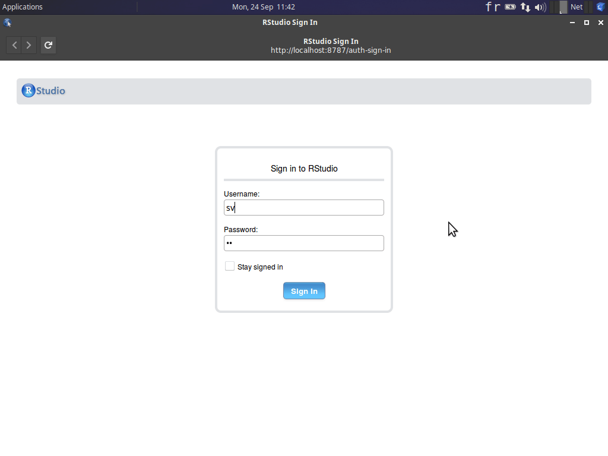

RStudio s'ouvre. La fenêtre principale comporte différents éléments :

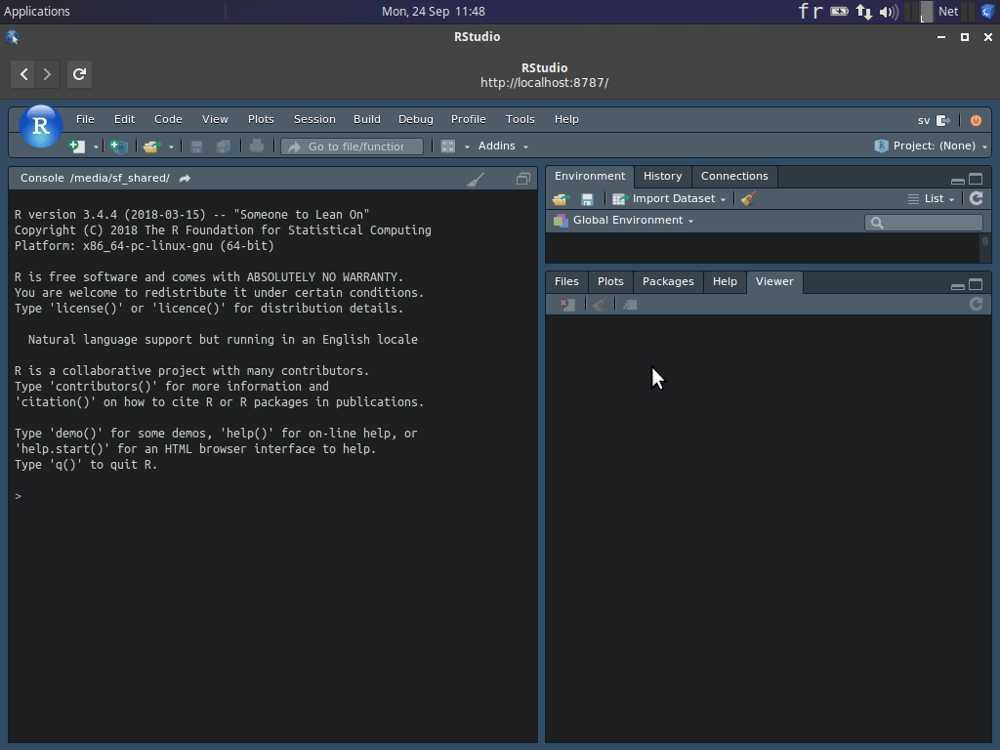

-   Une *barre de menu* et une *barre d'outils générale* en haut
-   Un *panneau* à gauche intitulé **Console** où vous pouvez entrer des instructions qui sont envoyées à **R** pour manipuler vos données
-   Un panneau à droite en haut qui comprend plusieurs *onglets*, dont **Environment** (ou **Environnement** si vous utilisez RStudio en français, noté dorénavant *version anglaise \|\| version française* comme **Environment \|\| Environnement**) qui vous indique les différents items --on parle d'**objets**-- chargés en mémoire dans **R**. Mais pour l'instant, il n'y a encore rien dans cet onglet.
-   Un panneau en bas à droite comportant lui aussi plusieurs onglets. Vous devriez voir le contenu de **Files \|\| Fichiers** au démarrage, un explorateur de fichiers simplifié.

Pour l'instant, aucun document de travail n'est encore ouvert. Pour en créer un, ou ouvrir un document existant, vous utilisez le menu `Files || Fichiers`, ou encore, le premier bouton de la barre d'outils générale :

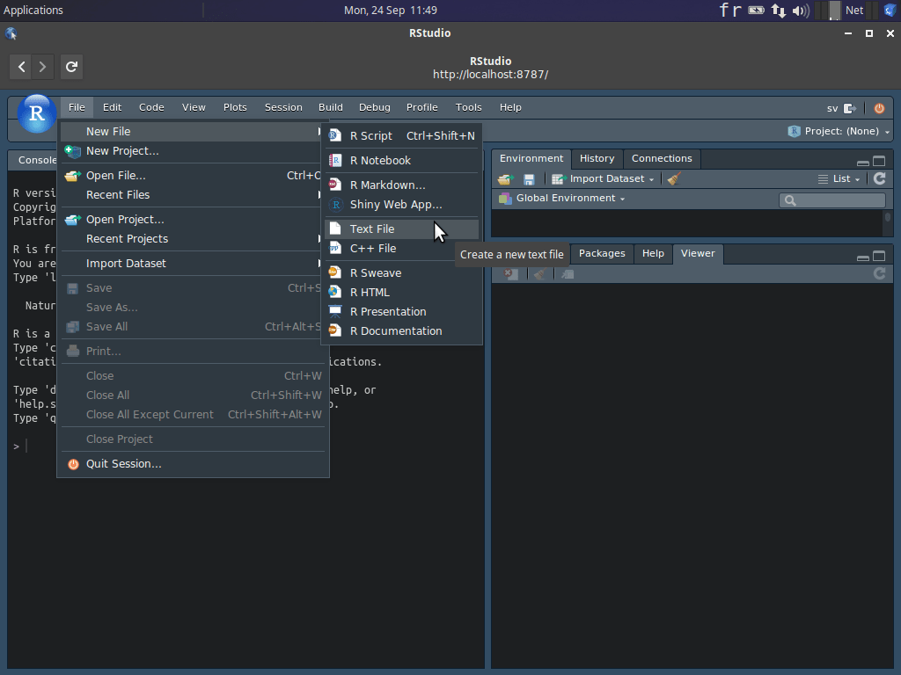

Le menu `Session` permet d'interagir directement avec **R**. Par exemple, il est possible de relancer **R** à partir d'une entrée de ce menu (`Session -> Restart R || Session -> Redémarrer R`) :

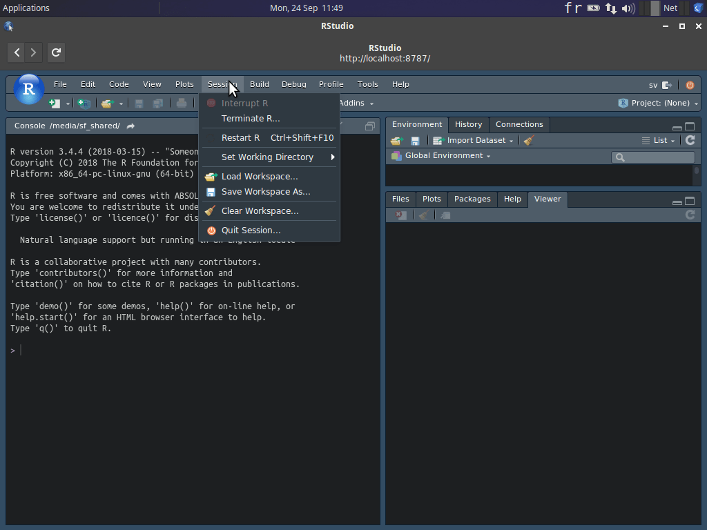

Le menu `Help || Aide` expose différentes entrées permettant d'accéder à la documentation de **R** ou de **RStudio**. Les **aide-mémoires** (`Help -> Cheat Sheets || Aide -> Cheat Sheets`) sont très pratiques lors de l'apprentissage. Nous conseillons de les consulter régulièrement et éventuellement, de les imprimer pour s'y référer plus facilement sans encombrer votre espace de travail dans votre ordinateur.

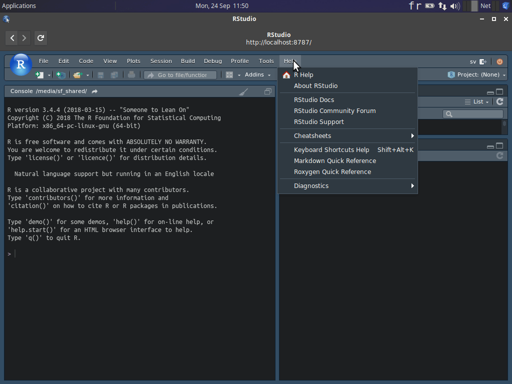

Le dernier item de la barre d'outils générale, intitulé **Project \|\| Projet** permet d'ouvrir, fermer, et gérer les **projets** RStudio, c'est-à-dire, des espaces de travail organisés autour d'une analyse particulière, et qui peuvent contenir plusieurs fichiers et sous-dossiers (ce sera détaillé ci-dessous).

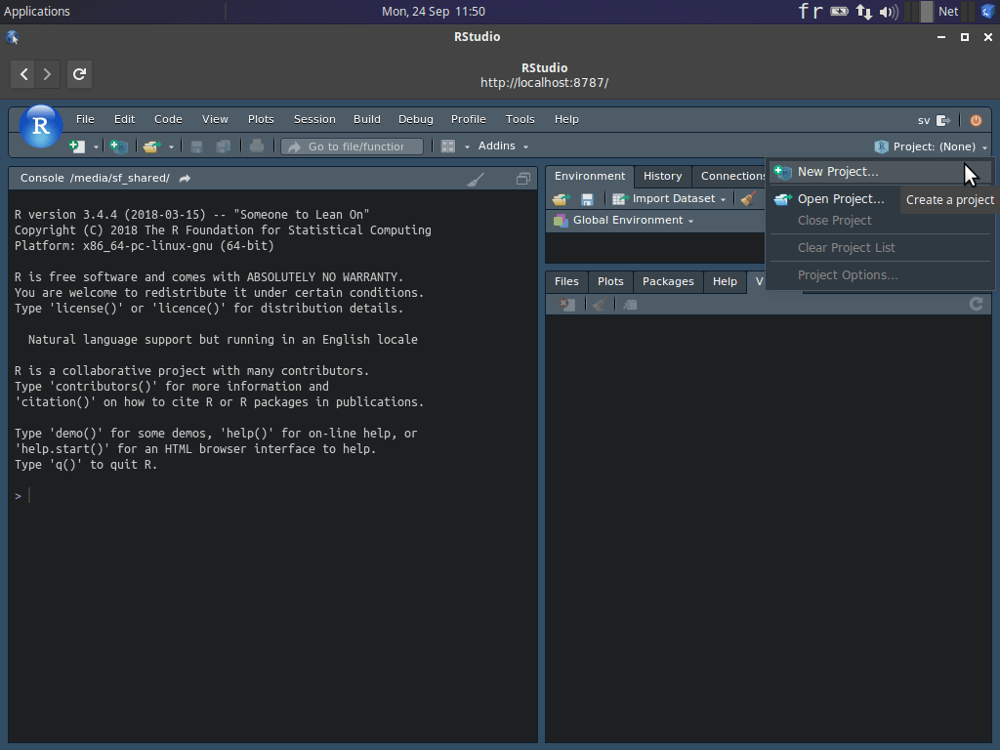

Vous avez maintenant repéré les éléments les plus importants de l'interface de RStudio.

*À ce stade, vous pouvez vous familiariser avec l'aide-mémoire relatif à l'IDE RStudio. Vous verrez qu'il y a beaucoup de fonctionnalités accessibles à partir de sa fenêtre principale. Ne vous laissez pas intimider : vous les apprendrez progressivement au fur et à mesure de votre utilisation du logiciel.*

### Projet dans RStudio {#rs-projet}

Un **projet** sert, dans RStudio, à organiser son travail. Il va regrouper l'ensemble des **jeux de données**, des **rapports**, des **présentations**, des **scripts** (fichiers composés d'une série d'instructions réalisant un traitement particulier) d'une analyse, généralement en relation avec une ou plusieurs expériences ou observations réalisées sur le terrain ou en laboratoire. Voici à quoi ressemble l'interface de RStudio lorsque vous ouvrez un projet :

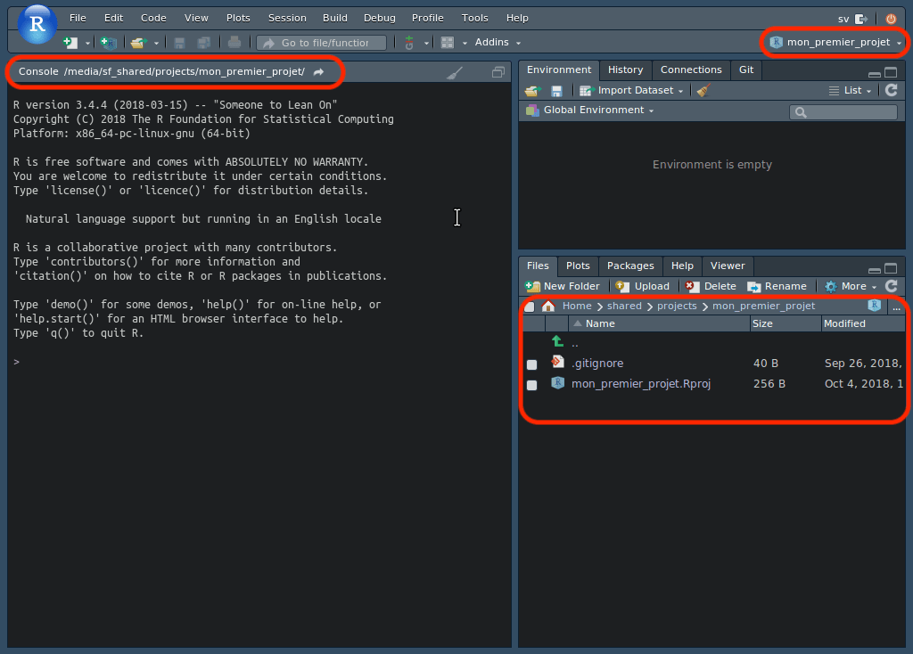

Notez que le **nom du projet** est mentionné en haut à droite. Notez également que le répertoire de base de votre projet est le répertoire actif dans l'onglet **Console** (`/media/shared/projects/mon_premier_projet/` dans l'exemple, mais dans SaturnCloud ce sera probablement plutôt `~/workspace/mon_premier_projet`). Remarquez aussi que l'onglet **Files \|\| Fichiers** affiche son contenu. Un fichier `mon_premier_projet.Rproj` y est créé automatiquement par RStudio. Ce fichier contient les paramètres de configuration propres à ce projet[^a2-utilisation-git-2]. C'est aussi une excellente façon de repérer qu'un répertoire est la base d'un projet RStudio, en repérant ce fameux fichier `.Rproj`.

[^a2-utilisation-git-2]: N'éditer **jamais** à la main un fichier `.Rproj`. Laisser RStudio s'en occuper !

#### Création d'un projet {#create-project}

Créez votre premier projet en suivant les quatre étapes suivantes :

-   **Étape 1 :** dans RStudio, cliquez sur l'item en haut à droite dans la barre d'outils générale de RStudio qui ouvre un menu relatif aux projets. Sélectionnez-y l'entrée `New Project... || Nouveau projet..`.

-   **Étape 2 :** une boite de dialogue s'ouvre. Sélectionnez `New Directory || Nouveau répertoire` pour créer votre projet dans un nouveau dossier. Il est également possible d'employer un dossier existant comme point de départ `Existing Directory || Répertoire existant`).

-   **Étape 3 :** sélectionnez `New Project || Nouveau projet` tout en haut dans la boite de dialogue suivante qui vous propose également des projets particuliers (que nous n'utiliserons pas pour l'instant).

-   **Étape 4 :** RStudio vous demande quelques informations pour préconfigurer votre projet.

    -   Nommez le projet dans `Directory name || Nom du répertoire`. Indiquez ici `project_test`
    -   Indiquez où vous voulez le placer dans `Create project as subdirectory of || Créer un projet en tant que sous-répertoire de`. Sélectionnez le sous-dossier `workspace` dans Saturn Cloud ou le sous-dossier `projects` dans le dossier `shared` partagé entre la SciViews Box et la machine hôte si vous travaillez dans VirtualBox.
    -   Cochez l'option `Create a git repository || Créer un répôt gity`.
    -   Assurez-vous que l'option `Use renv with this project || Utiliser renv avec ce projet` soit bien **décochée** (**il est très important de ne pas sélectionner renv, sous peine de réinstaller et dupliquer de nombreux dossiers et fichiers --appelés "packages" ou "paquets" R-- dans votre projet**)

Vous utilisez le même menu déroulant `Project || Projet` en haut à droite de la barre d'outils générale pour réouvrir un projet existant (`Open Project... || Ouvrir le projet...`) ou fermer le projet actuel (`Close Project || Fermer le projet`). Vous remarquez également que les derniers projets visités sont listés en dessous, ce qui permet d'y accéder plus rapidement.

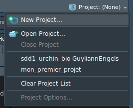

```{block, type='warning'}
**Un projet ne doit bien sûr être créé qu'une seule fois !** Une fois les étapes ci-dessus effectuées, vous retournez simplement à votre projet en ouvrant le menu projets en haut à droite et en sélectionnant votre projet dans la liste. S'il n'y apparaît pas, choisissez `Open Project... || Ouvrir le projet...` et sélectionnez le fichier `.Rproj` relatif à votre projet. Ne créez bien évidemment **jamais** de projet à l'intérieur des dossiers d'un autre projet, surtout si vous utilisez Git. Sinon, RStudio va s'emmêler les pinceaux !
```

#### Organisation d'un projet {#orga-projet}

Le dossier `workspace` (Saturn Cloud) ou `projects` (SciViews Box dans VirtualBox) contient maintenant un projet RStudio intitulé `project_test`. Depuis la SciViews Box, il se situe dans (version VirtualBox représentée ci-dessous) :

```         
/home
  /sv
    /shared
      /projects
        /project_test          # Répertoire de base du projet
          project_test.Rproj   # Fichier de configuration du projet RStudio
          .gitignore           # Fichier relatif à la gestion de version 
```

Vous devez maintenant structurer votre projet afin d'avoir différents sous-dossiers pour organiser au mieux votre travail. Ceci concerne à la fois les données et les rapports d'analyse en lien avec ce projet.

Cliquez sur le bouton `New Folder || Nouveau dossier` dans la barre d'outils de l'onglet **`Files || Fichiers`** et appelez ce nouveau dossier `data`. Ajoutez également le dossier `R` de la même manière.

```         
/home
  /sv
    /shared
      /projects
        /project_test           # Répertoire de base du projet
           data                 # Dossier contenant les données
           project_test.Rproj   # Fichier de configuration du projet RStudio
           .gitignore           # Fichier relatif à la gestion de version
           R                    # Dossier contenant les scripts d'analyse
```

Vous obtenez donc un projet configuré de la manière suivante :

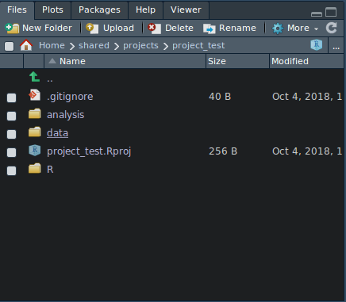

L'organisation cohérente d'un projet est indispensable pour le bon fonctionnement et la clarté de vos analyses de données.

#### Chemins relatifs dans un projet {#chemins-relatifs}

L'utilisation d'un projet permet de structurer de manière cohérente son travail. Vous allez maintenant devoir rendre votre projet **portable**.

Un projet RStudio pourra être qualifié de *portable* s'il est possible de déplacer son répertoire de base et tout ce qu'il contient (ou le renommer) sans que les analyses qu'il réalise n'en soient affectées. Ceci est utile pour copier, par exemple, le projet d'un ordinateur à un autre, ou si vous décidez de restructurer vos fichiers sur le disque dur.

-   La première règle est de placer tous les fichiers nécessaires dans le dossier du projet ou dans un sous-dossier. C'est ce que nous venons de faire plus haut.

-   La seconde règle est de référencer les différents fichiers au sein du projet avec des **chemins relatifs**. Nous allons maintenant apprendre à faire cela. Partons d'un projet qui contient les dossiers et fichiers suivants :

<!-- -->

```         
/home
  /sv
    /shared
      /projects
        /project_test             # Répertoire de base du projet
           analysis               # Dossier contenant les analyses
                rapport_test.Rmd  # Rapport d'analyse
           data                   # Dossier contenant les données
                dataset.csv       # Jeu de données
           project_test.Rproj     # Fichier de configuration du projet RStudio
           .gitignore             # Fichier relatif à la gestion de version
           R                      # Dossier contenant les scripts d'analyse
```

Les différents systèmes d'exploitation (Windows, macOS, Linux) utilisent des conventions différentes pour les chemins d'accès aux fichiers. Dans notre cas, la machine virtuelle dans SaturnCloud ou VirtualBox utilise un système d'exploitation **Linux**. La barre oblique (`/` dite "slash" en anglais) sépare les différents dossiers imbriqués sous Linux et sous macOS. Le système d'exploitation Windows utilise, pour sa part, la barre oblique inverse (`\`, dite "backslash" en anglais, mais dans R et RStudio, vous pourrez également utiliser le slash `/`, ce que nous vous conseillons de faire toujours pour un maximum de compatibilité entre systèmes). Par exemple, votre fichier `dataset.csv` qui contient les données du projet hypothétique d'exemple se référence comme suit dans VirtualBox, donc sous Linux :

```         
/home/sv/shared/projects/project_test/data/dataset.csv
```

Ce chemin d'accès est le plus détaillé. Il est dit **chemin d'accès absolu** au fichier. Vous noterez qu'il est totalement dépendant de la structure actuelle des dossiers sur le disque. Si vous renommez `project_test` ou si vous le déplacez ailleurs, la référence au fichier sera cassée ! Ainsi, si vous partagez votre projet, généré avec une SciViews Box fonctionnant dans VirtualBox avec un collaborateur qui utilise SaturnCloud, il installera le projet probablement dans `/home/jovyan/workspace`[^a2-utilisation-git-3]. Par conséquent, le chemin d'accès aux données devra être adapté en `/home/jovyan/workspace/project_test/data/dataset.csv`, sans quoi l'analyse ne pourra plus s'exécuter correctement chez lui.

[^a2-utilisation-git-3]: Vous noterez que RStudio indique `HOME || Accueil` dans l'onglet **Files \|\| Fichiers** pour représenter le dossier de l'utilisateur qui est en réalité `/home/sv` dans VirtualBox ou /`home/jovyan` dans SaturnCloud.

Décodons ce chemin d'accès :

-   `/`, racine du système
-   `/home/sv/`, notre dossier personnel comme utilisateur `sv`
-   `/home/sv/shared/`, le dossier partagé entre la SciViews Box dans VirtualBox et notre ordinateur hôte
-   `/home/sv/shared/projects/project_test/`, le dossier de base de notre projet
-   `/home/sv/shared/projects/project_test/data/`, le répertoire qui contient le fichier `dataset.csv`.

Le répertoire utilisateur `/home/<user>` est différent sous macOS (il s'appelle `/Users/<user>`) et sous Windows (il se nomme généralement `C:\Users\<user>`). Comme c'est un répertoire clé, et qu'il est impossible d'écrire un chemin absolu qui soit le même partout, il existe un raccourci : le "tilde" (`~`) qui signifie "mon répertoire utilisateur". Ainsi, vous pouvez aussi accéder à votre jeu de données `dataset.csv` comme ceci dans VirtualBox :

```         
~/shared/projects/project_test/data/datasets.csv
```

Ce chemin d'accès est déjà plus "portable" d'un système à l'autre et d'un utilisateur à l'autre. Il est donc à préférer[^a2-utilisation-git-4]. Si cette façon d'écrire le chemin d'accès est compatible entre les trois systèmes d'exploitation, elle ne permet toujours pas de déplacer ou de renommer notre projet.

[^a2-utilisation-git-4]: Dans R sous Windows, si vous utilisez les backslashs, vous devez les doubler (`~\\Documents\\...`). Ce n'est ni très esthétique, ni compatible avec les deux autres systèmes. Heureusement, nous avons déjà noté que R comprend aussi le slash comme séparateur sous Windows, de sorte que la même syntaxe peut être utilisée partout ! **Nous vous conseillons donc d'utiliser également les slashs sous Windows dans R ou RStudio.**

L'utilisation d'un **chemin relatif** permet de définir la position d'un fichier par rapport à un autre dossier qui est dit **"répertoire actif"**. A titre d'exemple, nous voulons faire référence au jeu de données `dataset.csv` depuis notre rapport `rapport_test.Rmd`.

Demandez-vous d'abord quel est le **répertoire actif**. Pour un fichier R Markdown ou R Notebook, c'est facile, c'est le dossier qui contient ce fichier. Dans la console R, cela peut varier selon le contexte. Si vous avez ouvert un projet, c'est le répertoire de base du projet par défaut, mais cela peut être modifié. **Le répertoire actif pour la console R est toujours indiqué en première ligne à côté de l'icône de R et de son numéro de version.** Vous pouvez aussi interroger R à l'aide de l'instruction `getwd()` qui vous indiquera alors quel est le répertoire actif :

```{r, eval=FALSE}
getwd()
```

Vous apprendrez que vous pouvez réaliser cela dans un **script R** (fichier regroupant une succession d'instructions), ou dans un **chunk R** (zone spéciale contenant des instructions à exécuter dans votre document) dans votre document R Markdown :

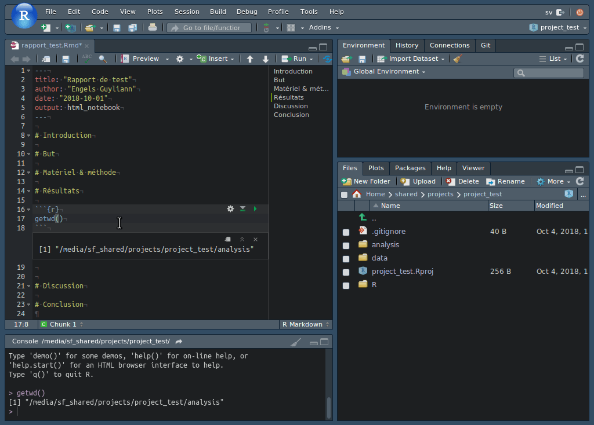

Une fois que vous connaissez le répertoire actif, vous naviguez *à partir de* celui-ci. Il existe une convention pour reculer d'un dossier dans la hiérarchie. Pour cela vous indiquez `..` à la place d'un nom de dossier. Voici ce que cela donne :

```         
../data/dataset.csv
```

C'est un **chemin relatif**. Comment le lit-on ? Tout d'abord, notez --c'est très important-- que le chemin d'accès ne commence pas par `/` (Linux ou macOS), ou `C:\` (ou toute autre lettre, sous Windows), ni par `~`. C'est le signe que l'on ne part pas de la racine du système de fichier ou du dossier de l'utilisateur, mais du **répertoire actif**. Ensuite, les différents éléments se décryptent comme suit :

-   `~/shared/projects/project_test/analysis`, répertoire actif au départ pour le document R Notebook
-   `..` retourne en arrière d'un niveau. On est donc dans `~/shared/projects/project_test`
-   `/data` navigue dans le sous-dossier `data`. On est donc maintenant dans `~/shared/projects/project_test/data`. C'est le répertoire qui contient le fichier qui nous intéresse
-   `/datasets.csv` pointe bien vers le fichier qui nous intéresse.

*À noter que si le fichier se trouve déjà dans le répertoire actif, le chemin relatif se résume au nom du fichier directement. C'est donc très simple dans ce cas.*

Nulle part dans ce chemin relatif n'apparaît le nom du dossier de base du projet, ni aucun autre dossier parent. Ainsi, il est possible de renommer ou déplacer le projet sans casser la référence relative à n'importe quel fichier à l'intérieur de ce projet. Donc, en utilisant uniquement des références relatives, **le projet reste parfaitement portable**, y compris entre SaturnCloud et VirtualBox, par exemple.

#### Chemins portables avec here::here() {#here}

Il existe un autre mécanisme qui permet de référencer vos fichiers à l'intérieur de votre projet tout en assurant sa portabilité : la fonction `here::here()`. Quel que soit l'endroit où vous vous situez dans le projet, ou dans n'importe lequel de ses sous-dossiers, cette fonction pointera toujours vers le dossier de base du projet (projet en cours s'il y en a un ouvert dans RStudio, ou projet recherché en amont dans la hiérarchie de fichiers à partir du répertoire actif dans le cas contraire), donc dans notre exemple, `/home/sv/shared/projects/project_test`. La fonction accepte un ou plusieurs arguments sous forme de chaînes de caractères entre guillemets et séparés par une virgule qui complètent le chemin d'accès depuis ce répertoire de base. Donc, vous pouvez écrire `here::here("data", "datasets.csv)`. Cela produira `/home/sv/shared/projects/project_test/data/datasets.csv` qui est bien le chemin d'accès souhaité. Comme ce chemin d'accès est construit à la demande, la première partie correspondant au répertoire de base sera toujours bien calculée, même si le projet est déplacé ou renommé. Notez que vous auriez très bien pu aussi indiquer `here::here("data/datasets.csv)`, cela fonctionnera aussi.

### Scripts R dans RStudio {#script}

Un script R est une suite d'instructions qui peuvent être interprétées pour effectuer nos analyses. Ce script est stocké dans un fichier dont l'extension est `.R` (attention : "R" majuscule), et que l'on placera de préférence dans le sous-dossier `R` de notre projet.

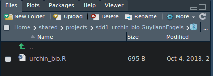

Un script R s'ouvre dans la fenêtre d'édition de RStudio. Les parties de texte précédées d'un dièse (`#`) sont des commentaires. Ils ne sont jamais exécutés, mais ils permettent de structurer et d'expliquer le contenu du document (ou bien d'empêcher temporairement l'exécution d'instructions). Voici un exemple de script R :

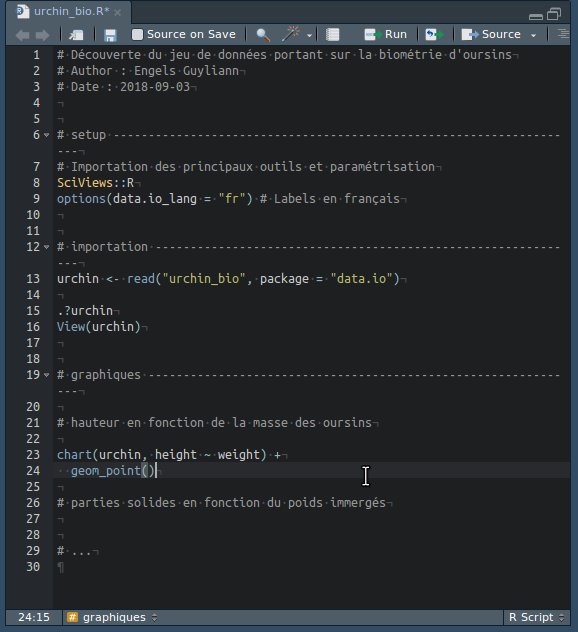

Pour bien documenter vos scripts, commencez-les toujours par quelques lignes de commentaires qui contiennent un titre, le nom du ou des auteurs, la date, un copyright éventuel, et une description courte de ce qu'il fait ... L'utilisation de sections comme à la ligne 6 ci-dessus est vivement conseillée. Ces sections sont créées à l'aide de l'entrée de menu `Code -> Insert Section... || Code -> Insérer une section...` dans RStudio. Elles sont reprises dans un menu déroulant depuis le bas de la fenêtre d'édition pour une navigation rapide dans le script.

#### Création d'un script R

Vous avez à votre disposition plusieurs méthodes pour créer un nouveau script R dans RStudio, dont deux vous sont montrées dans l'animation ci-dessous.

`r img("annexe_a2/rscript1.gif")`

#### Utilisation d'un script R

Un script R est un document au format natif de R. R va interpréter les instructions qui composent le script et qui ne sont pas précédées d'un dièse (cliquez sur `Run || Exécuter` dans la barre d'outils de la fenêtre d'édition, ou utilisez le raccourci clavier `Ctrl+Entrée` (ou `Cmd+Entrée` dans macOS) pour exécuter les instructions les unes après les autres.

`r img("annexe_a2/rscript.gif")`

Un script R doit être organisé de manière cohérente afin d'être exécutable de haut en bas. Dans l'exemple ci-dessus, on commence par :

-   **Étape 1 :** configuration de R en "mode SciViews" avec l'instruction `SciViews::R`.

-   **Étape 2 :** instruction `urchin <- read("urchin_bio", package = "data.io")` pour lire le jeu de données `urchin_bio` provenant du package {data.io} (un "package" R est une sorte d'"addin" qui peut contenir de nouvelles fonctions, des jeux de données et de la documentation) et l'"assigner" ou "affecter" à `urchin` (le nom sous lequel nous avons choisi de nous référer à l'objet créé dans R). On retrouve à présent `urchin` dans l'environnement global (`Global Environment` dans l'onglet **Environment \|\| Environnement** dans la fenêtre en haut à droite) de RStudio. Cet onglet liste, en effet, tous les objets en mémoire dans la session actuelle de R.

-   **Étape 3 :** `.?urchin` et `View(urchin)` entrés à la console R (et validées en appuyant sur la touche `Entrée`) donnent des renseignements sur le jeu de données en renvoyant vers la page d'aide du jeu de données ou en ouvrant ce jeu de données dans une fenêtre de visualisation.

-   **Étape 4 :** réaliser des graphiques avec une fonction de R nommée `chart()`. Une fonction est un petit programme qui réalise une tâche particulière sur base d'éléments fournis en entrée entre parenthèses, et que l'on nomme **arguments de la fonction**. À l'issue du traitement, la fonction renvoie un résultat que l'on peut envoyer vers une autre fonction ou "assigner" à un nom pour le réutiliser plus tard.

Notez que les instructions exécutées dans le script sont envoyées dans la fenêtre `Console` en bas à gauche et que le résultat de leur exécution est affiché directement en dessous dans la même fenêtre.

### Quarto/R Markdown/R Notebook {#Rmd}

Un document Quarto est un fichier dont l'extension est `.qmd`. Un document R Markdown a, quant à lui, une extension `.Rmd`. Ces deux formats sont très similaires. Ils combinent à la fois des instructions R (pour les analyses) et le langage Markdown (un système de balisage de texte pour le formater, par exemple, pour définir un titre, une partie de texte en gras...), ce que l'on appelle le **"R Markdwon"**. Le R Markdown ne vous permet pas de visualiser directement le résultat final d'un rapport d'analyse[^a2-utilisation-git-5]

[^a2-utilisation-git-5]: Les systèmes d'édition professionnels dissocient en effet le fond de la forme : vous rédiger d'abord le contenu, et ensuite, vous indiquer le style à lui appliquer.

`r img("annexe_a2/rmd.gif")`

Tout comme dans un script R, les instructions doivent également être exécutées lors de la réalisation du rapport. Une forme spéciale de document R Markdown est le **R Notebook**. Ce dernier est un peu un intermédiaire entre un script R et un document R Markdown. Il se présente de manière très similaire à ce dernier, mais vous pouvez devez exécuter le code qu'il contient ligne par ligne comme dans un script R pour obtenir le rendu, alors que le R Markdown ou le Quarto intégrera toujours l'exécution de code R à la compilation du document final. Si cela ne vous parait pas clair, pas d'inquiétude : vous comprendrez plus tard par la pratique.

Un document Quarto / R Markdown / R Notebook se structure de la manière suivante :

-   Un **préambule**, encore appelé **entête YAML** ("YAML" est le nom du langage utilisé pour y encoder des informations)
-   Des zones d'édition de texte (le langage employé est ici Markdown)
-   Des zones de code appelées des **chunks** (aussi appelés "morceaux" dans RStudio en français)

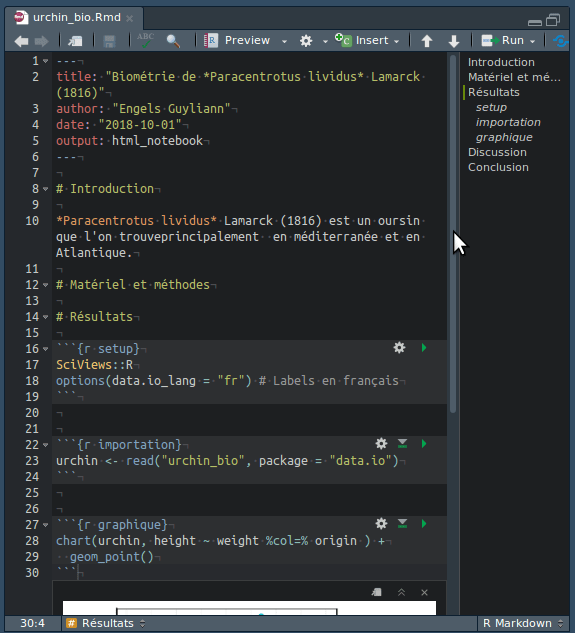

Le **préambule** est nécessairement situé au tout début du document et est délimité à l'aide de trois tirets `---` sans rien d'autre sur une ligne au début et à la fin. Le préambule comporte un ensemble d'entrées de type `nom: valeur` qui configurent le document ou la façon dont il sera compilé en document final (rapport, présentation, publication...). Nous pouvons y indiquer le titre principal, le ou les auteurs, la date ...

Le reste du document Quarto / R Markdown est subdivisé en zones successives et contrastées sur des fonds de couleurs différentes qui alternent zones d'édition de texte et chunks. Ces chunks seront interprétés pour réaliser un calcul, un graphique, un tableau, etc. Le résultat de ce traitement sera placé au même endroit dans le document final. La présentation diffère profondément selon que le document est édité en mode "source" ou en mode "visuel". On passe d'un mode à l'autre grâce aux deux boutons `Source` et `Visual` à la gauche de la barre d'édition du document.

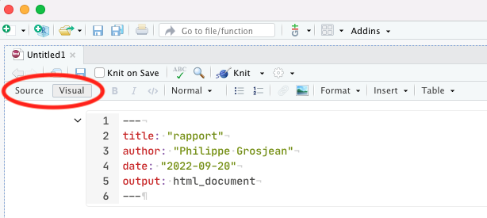

En mode "visuel", le document présente un rendu qui suggère la présentation finale, un peu comme Microsoft Word, mais gardez bien à l'esprit que le rendu final réel dépendra du style que vous appliquerez et du format de sortie choisi (dissociation entre contenu et rendu, contrairement à Word). Dans le mode visuel, vous effectuez la mise en forme de votre texte en utilisant les outils de la barre d'outils d'édition juste après le bouton `Visual`. Par exemple pour créer un titre de niveau deux, vous cliquerez sur le quatrième item qui indique le format actuel (probablement `Normal`, et vous sélectionnerez `Header 2 || Titre 2`. Le paragraphe où se trouve le curseur est alors transformé en titre de niveau deux. Pour transformer un paragraphe en liste, vous irez dans `Format -> Bullets & Numbering -> Bulletted List || Liste à puces`, et ainsi de suite. Les différents items parlent d'eux-mêmes pour la majorité. Explorez-les et expérimentez-les sur un document de test pour vous les approprier.

Le mode "source" est intéressant, car il expose la structure et le formatage du document en "brut de décoffrage". Cela vous permet de voir comment le formatage Markdown se matérialise sous forme de **"balises"** dans le texte. Si vous basculez le document dans ce mode, vous découvrirez, par exemple, qu'un titre de niveau deux commence par deux dièses suivis d'un espace (`## titre niveau 2`) et qu'une liste à points commence par un tiret suivi de trois espaces (`-   item de liste à points`). Ce mode permet aussi un contrôle plus fin sur le contenu de votre document, mais comme il nécessite de connaitre la signification des balises Markdown, vous préférerez certainement le mode visuel au début. En cours d'édition, vous pouvez basculer d'un mode à l'autre librement quand vous le souhaitez.

Toujours en mode source, les chunks sont balisés en entrée par trois apostrophes inverses suivies d'accolades contenant des instructions relatives au programme à utiliser sur une seule ligne, par exemple, ```` ```{r} ```` pour des chunks faisant appel au logiciel **R**, et sont terminés par trois apostrophes inverses (```` ``` ````), également sur une ligne sans rien d'autre. Entre les deux, les instructions R et les commentaires avec un dièse devant se présentent exactement comme dans un script R.

Structurez le contenu narratif de votre document Markdown à l'aide de titres de niveaux appropriés. Vous pouvez utiliser jusqu'à six niveaux de titres préfixés à l'aide d'un à six dièses et d'une espace. Utilisez donc un titre de niveau un pour le titre **Introduction** et des titres de niveau deux pour les sous-parties de votre introduction, et ainsi de suite.

#### Création d'un Quarto/R Markdown/R Notebook

Vous avez à votre disposition deux méthodes pour créer un nouveau document Quarto/R Markdown/R Notebook dans RStudio et l'ouvrir pour édition. Voyez l'animation ci-dessous.

`r img("annexe_a2/rmd2.gif")`

#### Utilisation d'un Quarto/R Markdown/R Notebook

**Afin de visualiser les résultats des chunks dans votre rapport final, vous devez veiller à exécuter chaque chunks dans l'ordre dans un R Notebook**. Ceci n'est pas nécessaire dans un Quarto ou un R Markdown, mais dans ce cas, tous les chunks sont systématiquement réexécutés les uns après les autres à chaque génération de rapport, ce qui peut être pénible si les calculs sont longs.

Pour exécuter un chunk, vous pouvez :

-   cliquer sur le bouton **Play**, sous forme d'une flèche verte pointant vers la droite, située en haut à droite du chunk
-   cliquer sur `Run || Exécuter` et sélectionner `Run Current Chunk || Exécuter le Chunk actuel` dans le menu déroulant qui apparaît
-   Employer le raccourci clavier `Ctrl+Shift+Entrée` (ou `Cmd+Shift+Entrée` sous macOS)

`r img("annexe_a2/rmd3.gif")`

L'item `Run || Exécuter` ouvre un menu qui expose plusieurs autres actions intéressantes, entre autres :

-   Exécuter la/les ligne(s) d'instruction sélectionnée(s) : `Run Selected Line(s) || Exécuter la ou les Lignes sélectionnées`, raccourci `Ctrl+Entrée` ou `Cmd+Entrée`
-   Exécuter le chunk dans lequel le curseur se trouve en entier : `Run Current Chunk || Exécuter le Chunk actuel` que nous avons déjà mentionné
-   Exécuter tous les chunk précédents : `Run All Chunk Above | Exécuter tous les chunks au-dessus`
-   Redémarrer R et exécuter tous les chunks dans la foulée : `Restart R and Run All Chunks || Redémarrer R et exécuter tous les chunks`. **Cette action est particulièrement intéressante pour s'assurer que le document est réellement reproductible !**
-   ...

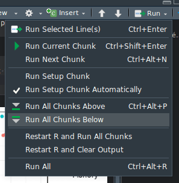

Après la phase d'édition du texte et des instructions dans les chunks, vous pouvez visualiser votre document final en cliquant sur le bouton `Preview || Prévisualiser` (R Notebook), `Knit || Tricoter` (R Markdown) ou `Render || Rendu` (Quarto). Dans le cas du R Notebook, vous devrez obligatoirement avoir exécuté tous les chunks auparavant. Pour le Quarto ou le R Markdown, ce n'est pas nécessaire puisque leur exécution fait partie intrinsèque de la compilation du document final.

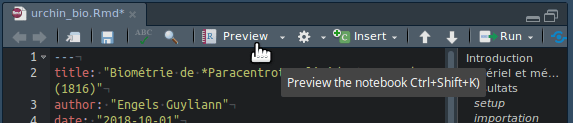

Le document final est généré avec un rendu simple et professionnel. Par défaut, ce document final présente le texte que vous avez écrit avec les résultats que vous avez choisi de générer via R, mais également les instructions que vous avez employées pour obtenir ces résultats. Ceci permet de mieux comprendre, directement dans le rapport, comment tout cela a été calculé. Il est possible de cacher le code (dans un document généré depuis un R Notebook), ou d'indiquer une directive de compilation dans les chunks pour éviter que le code ne s'imprime dans le document final. Voyez les options en cliquant sur le petit engrenage à côté de la flèche verte en haut à droite du chunk. Consultez l'aide-mémoire de R Markdown accessible à partir du menu RStudio `Help -> Cheat Sheets -> Markdown Reference Guide || Aide -> Cheat Sheets -> Guide de référence de R Markdown`, voir **chunk options** p. 2-3 pour plus d'informations sur les nombreuses options disponibles.

Par exemple, en ajoutant la directive `echo=FALSE` dans la balise d'entrée d'un chunk (```` ```{r, echo=FALSE} ````), on empêche d'imprimer le code de ce chunk dans le document final.

`r img("annexe_a2/rmd7.gif")`

Notez que sur la droite du bouton `Preview || Prévisualiser` (R Notebook) `Knit | Tricoter` (R Markdown) ou `Render || Rendu` (Quarto), vous avez un autre bouton représenté par un petit engrenage blanc. Il donne accès à un menu déroulant qui vous permet de modifier la façon de générer vos rapports. L'entrée tout en bas `Output Options... || Options de sortie...` permet de paramétrer la présentation du document final.

Si vous cliquez sur la petite flèche noire pointant vers le bas juste après `Preview || Prévisualiser` ou `Knit || Tricoter`, vous avez un autre menu déroulant qui donne accès aux différents formats possibles : HTML, PDF, Word, etc. Essayez les différentes options pour visualiser comment votre document final se présente dans les différents formats.

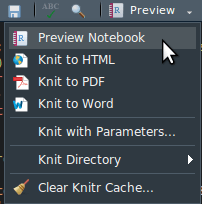

## GitHub {#github-annexe}

Un réseau social a été conçu autour de Git pour sauvegarder vos projets sur le "cloud", les partager et collaborer avec d'autres personnes. Ce système se nomme [GitHub](https://github.com) (tout comme Facebook ou LinkedIn). GitHub rassemble donc "Git", la gestion de version et "Hub" relatif au réseau. D'autres réseaux équivalents existent comme [Gitlab](https://about.gitlab.com) ou [Bitbucket](https://bitbucket.org).

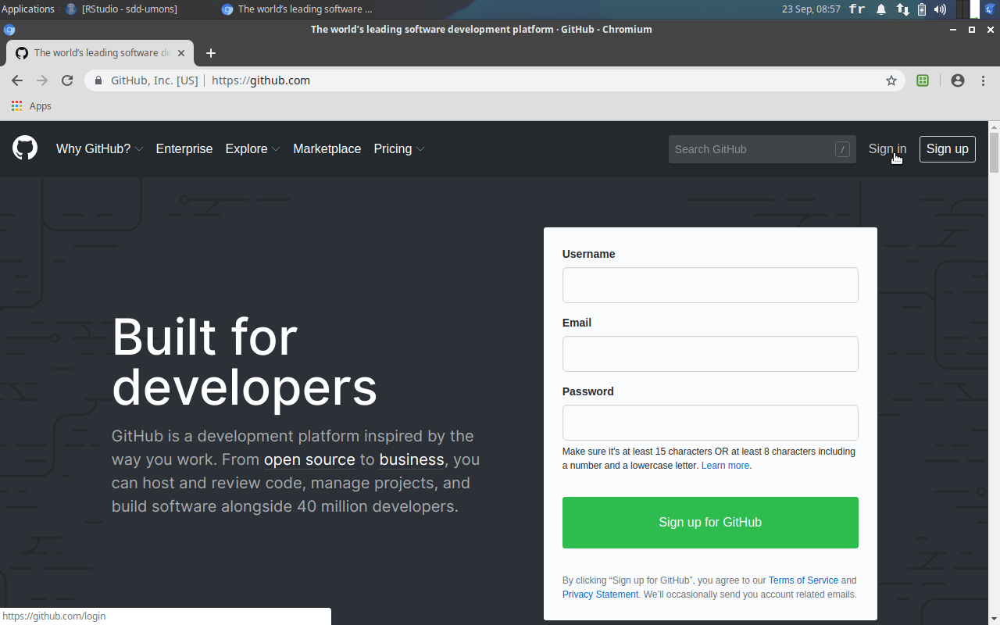

### Votre activité et profil

Pour vous montrer différentes sections sur GitHub, nous utiliserons le compte de [GuyliannEngels](https://github.com/GuyliannEngels). Une fois enregistré dans GitHub, nous nous trouvons dans une page qui nous montre notre activité. Au milieu de la page, nous pouvons observer les dépôts épinglés (section "Pinned") que vous considérez comme les plus importants.

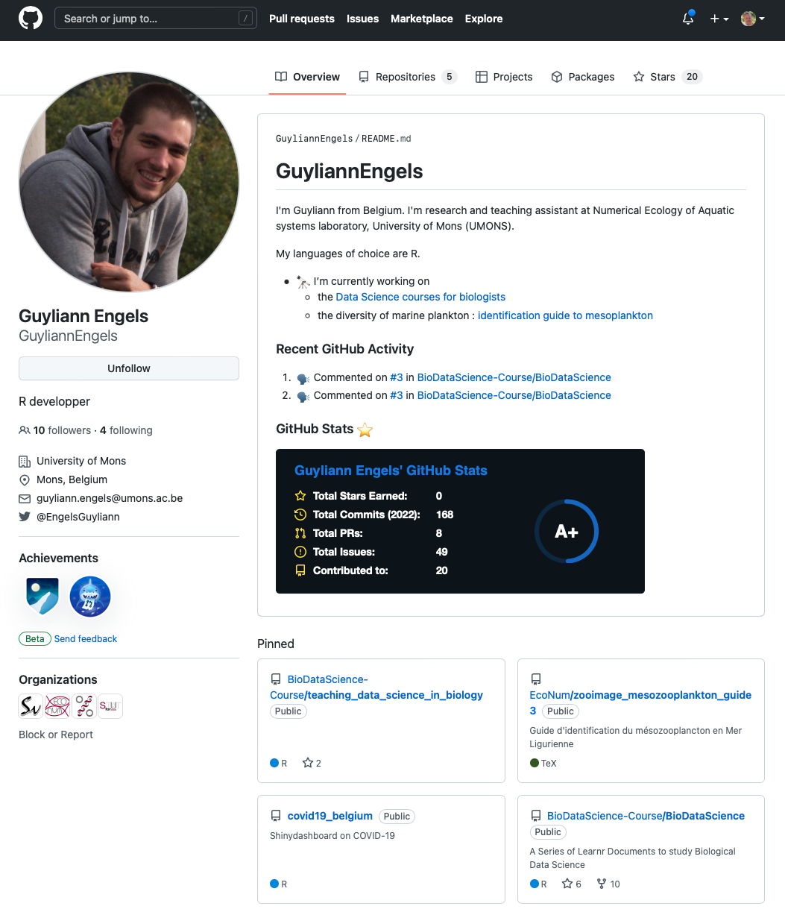

Plus bas dans la page, il y a un graphique qui représente vos contributions au cours du temps. Il indique de manière globale votre travail, c'est-à-dire vos contributions dans les différents projets.

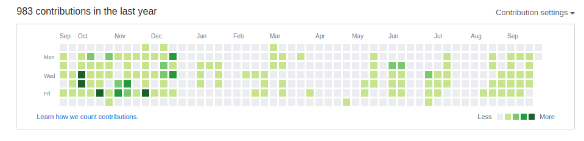

Dans notre exemple, nous pouvons observer 983 contributions pendant l'année écoulée.

### Vos projets

GitHub vous sert à héberger vos projets dans des **dépôts** (qui se nomment des *repositories* en anglais). Notre exemple se base sur le dépôt [sdd-umons-2024](https://github.com/BioDataScience-Course/sdd-umons-2024), que vous pouvez librement consulter et qui contient les sources du présent ouvrage en ligne. Il s'agit en effet d'un dépôt public. Vous avez la possibilité d'avoir des projets publics ou privés (vos exercices dans le cadre du cours seront, eux, dans des dépôts privés visibles uniquement de vous et de vos enseignants).

Les projets publics sont visibles par tous. La collaboration est la pierre angulaire de GitHub. Donc, tout le monde peut y apporter des modifications dans des copies de vos dépôts et puis vous les proposer d'une manière qui vous permet d'examiner les améliorations suggérées, de les discuter, et enfin de les incorporer ou de les rejeter. Cela s'appelle un **Pull request**, mais nous y reviendrons plus tard. Pour des projets plus sensibles, vous avez la possibilité de les héberger en mode privé et de ne les partager qu'avec un nombre restreint et prédéterminé d'utilisateurs.

La référence à un dépôt sur GitHub est composée de deux éléments. Le premier est le nom de la personne ou de l'organisation auquel le dépôt appartient. Le second élément est le nom du dépôt lui-même. Dans notre exemple, nous aurons donc `BioDataScience-Course/sdd-umons-2024`. Tous les projets relatifs au cours de sciences des données biologiques à l'UMONS sont hébergés dans l'organisation [BioDataScience-Course](https://github.com/BioDataScience-Course) (Il en sera de même pour tous les travaux que vous réaliserez dans le cadre de vos cours).

Vous pouvez observer une première barre d'outils comprenant les sections `Code`, `Issues`, `Pull requests`, `Actions`, `Projects`, `Wiki`, `Security`, `Insights` et `Settings` (par la suite, nous ne détaillerons que les sections importantes dans le cadre de votre cours de science des données).

`r img("annexe_a2/github5.gif")`

#### Code

Dans cette section, vous pouvez visualiser le contenu des différents fichiers qui se trouvent dans le dépôt. Vous naviguez dans les sous-dossiers simplement en cliquant dessus. La visualisation des fichiers se fait, éventuellement, selon plusieurs présentations différentes, dont le mode "Raw" pour voir le texte brut. C'est l'équivalent du mode "Source" dans l'éditeur de documents R Markdown de RStudio. Le bouton vert `Code` dans cette section est important. C'est grâce à lui que vous pourrez récupérer le contenu du dépôt. On parle de **cloner** un dépôt.

`r img("annexe_a2/github4.gif")`

Comme il s'agit d'un système de gestion de versions, toutes les versions successives du dépôts sont stockées et accessibles, mais au départ, vous ne voyer que la dernière version. Chaque fois que vous enregistrez une version, vous réaliser ce que l'on appelle dans le jargon Git un **commit**. Le nombre de commits et des informations à son propos sont présentées dans la barre grisée sous les quelques boutons.

`r img("annexe_a2/github6.gif")`

#### Issues {#issues-annexe}

Cette section est prévue pour discuter des problèmes ou des idées à développer. C'est une sorte de petit forum de discussion. Vous utiliserez ces "issues" pour poser vos questions à vos enseignants et pour interagir entre vous dans les projets de groupe.

`r img("annexe_a2/github7.gif")`

#### Insights

La section `Insights` nous renseigne sur l'activité du projet. On peut y voir, par exemple, les contributeurs du projet, le nombre de commits réalisés par chacun, etc.

`r img("annexe_a2/github8.gif")`

Concernant vos projets dans le cadre du cours, ces informations sont employées pour évaluer la contribution de chacun dans les travaux de groupes et ajuster la note en fonction.

### Permettre à RStudio de communiquer avec GitHub

Dans le cours de Science des Données vous utiliserez RStudio pour éditer vos documents et travailler avec R. Mais d'autre part, vous partagerez vos œuvres via GitHub. C'est d'ailleurs un schéma classique que nous vous conseillons d'adopter aussi en dehors du cours ! Les professionnels travaillent tous comme cela. Nous devons donc trouver un moyen de permettre à RStudio de communiquer avec GitHub. Les fonctionnalités existent, dans l'onglet **Git** (qui n’apparaît que si vous êtes dans un projet géré par Git). Encore faut-il indiquer à GitHub que vous autoriser votre RStudio à accéder à votre compte et à vos dépôts. Pour cela, deux solution très différentes existent : le code d'accès personnel **PAT**, un code généré par GitHub et que vous incluez dans votre SciViews Box, ou la **clé SSH**, une clé privée/publique générée au contraire dans votre machine et dont vous renseignez la partie publique à GitHub pour qu'il puisse l'utiliser. Nous allons voir ces deux méthodes successivement, sachant que la version VirtualBox de la SciViews Box utilise le PAT, alors que c'est plus facile d'utiliser la clé SSH dans SaturnCloud.

#### Personal Access Token {#github-pat}

**Note : dans SaturnCloud, une autre technique basée sur la clé SSH est utilisée. Dans ce cas, voyez la section suivante.**

L'authentification dans GitHub peut se faire via un *Personal Access Token* (PAT). Il s'agit d'une sorte de mot de passe long et compliqué (donc bien sécurisé) que GitHub génère pour vous et que vous devez renseigner à tout logiciel souhaitant accéder à votre compte. Ce système d'authentification ne doit être réalisé qu'une seule fois dans RStudio. La procédure est la suivante.

1.  Dans RStudio (que vous aurez lancé au préalable via la machine virtuelle VirtualBox, ou en local), entrez la commande suivante dans votre console et appuyez sur `Entrée`.

    usethis::create_github_token()

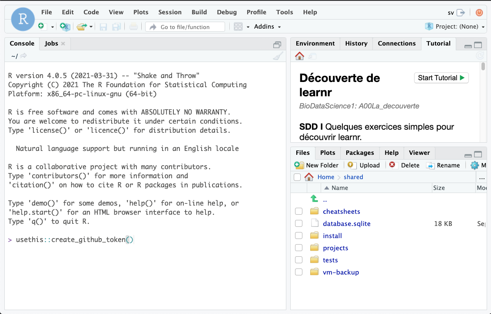

Vous êtes automatiquement redirigé vers GitHub dans votre navigateur Web (il faut peut-être s'y identifier). Vous êtes face à une page qui s'appelle "New personal access token". Les champs sont déjà préremplis.

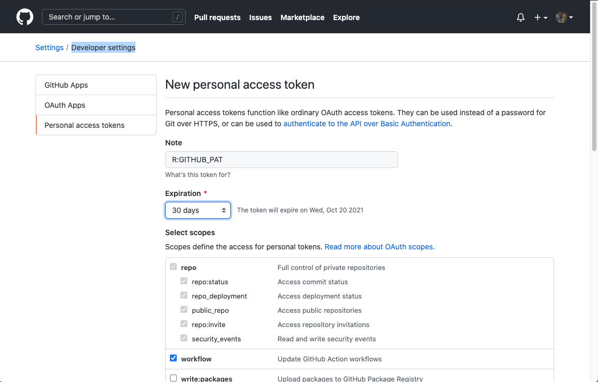

2.  Modifiez la date d'expiration

Vous pouvez conserver les options telles quelles. Cependant, votre clé d'authentification a une durée de validité limitée à 30 jours par défaut. C'est une bonne pratique de renouveler ses mots de passe régulièrement, mais chaque mois... c'est un peu court. Dans le champ `Expiration`, nous vous conseillons de changer la valeur pour couvrir toute votre année académique.

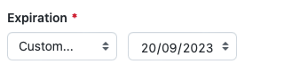

3.  Générez votre "token" en cliquant sur le bouton vert "Generate token" tout en bas de la page.

Vous vous retrouver à présent dans une nouvelle page GitHub qui liste tous vos PATs (vous n'en aurez probablement qu'un seul à ce stade). Votre token est affiché dans un encadré en vert avec une petite icône de presse-papier à sa droite. Cliquez sur cette icône presse-papier pour le copier. **Attention : une fois sorti de la page, vous ne pourrez plus jamais voir ce token (mais vous pourrez en recréer d'autres si nécessaire, pas de panique).**

```{block, type='warning'}
À ce propos, **n'enregistrer jamais ce token dans votre ordinateur, tout comme d'ailleurs n'importe quel mot de passe, à moins d'utiliser un logiciel coffre-fort comme [Keeweb](https://keeweb.info) et ne les placez pas non plus dans un email ou un fil sur une messagerie dans l'espoir d'en conserver une trace**. Dans le cas du token, il n'est pas nécessaire du tout d'en conserver la trace parce que vous pouvez toujours en créer un nouveau si nécessaire. D'ailleurs, aucun de vos mots de passe ne doit se trouver dans vos notes, vos fichiers Word ou Excel, votre messagerie, etc. ni dans votre ordinateur, ni dans votre smartphone. **C'est une faute grave et une brèche de sécurité énorme que vous offrez aux hackers mal intentionnés que de stocker en clair vos mots de passe sous forme électronique.**
```

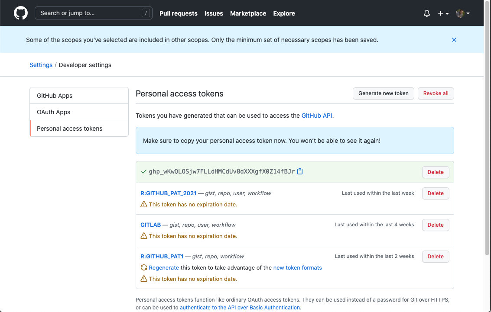

4.  Revenez dans RStudio dans l'onglet **Console**. Comme indiqué dans les instructions, exécutez maintenant la commande suivante (puis appuyez sur `Entrée`):

    gitcreds::gitcreds_set()

5.  Vous avez un message qui vous demande votre token. Collez-le dans la Console à l'aide du raccourci `Ctrl+V` (ou `Cmd+V` dans macOS) ou clic bouton droit dans l'onglet **Console** de RStudio et sélection de l'entrée de menu contextuel `Paste || Coller`. Votre token est collé dans la Console. Validez ensuite avec la touche `Entrée`.

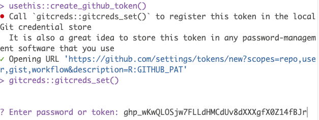

Votre token doit à présent être enregistré dans la SciViews Box.

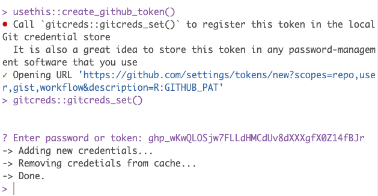

Une fois cela réalisé, vous pourrez travailler dans GitHub depuis RStudio (clone de dépôts, push/pull, ...). Si plus tard, vous perdez ce lien et que RStudio se plaint de ne pas pouvoir communiquer avec GitHub et vous demande un mot de passe, vous devez alors régénérer un autre token et suivre la même procédure à nouveau.

#### Clé SSH dans SaturnCloud

Le principe de la clé SSH est assez différent. Vous créez dans votre ordinateur une paire de clés. L'une est publique et sert à encoder les données à un bout de la chaîne. L'autre est privée et ne réside *que* dans votre ordinateur. Elle est nécessaire pour pouvoir décoder les données. Donc, avec la clé publique, on peut encoder, mais pas décoder. La procédure de création des clés privée/publique est un rien plus compliquée que la génération du PAT. Mais SaturnCloud nous propose de le faire pour nous, et en plus, de générer une seule paire de clés pour l'ensemble de nos ressources. C'est donc bien pratique. *La procédure relative à la clé SSH entre SaturnCloud et GitHub est intégrée dans la page du site accessible depuis le bouton bleu __RStudio__ en haut à droite. Cependant, au cas où vous devriez refaire l'opération, elle est brièvement rappelée ci-dessous.*

Dans [SatunCloud](https://saturncloud.io), vous vous identifiez dans votre compte. Ensuite, vous cliquez sur **USER** et choisissez **Manage <votre_login>**. Là, vous avez une page nommée **Access Keys**. C'est la section du milieu intitulée **Git SSH Key** qui nous intéresse. Vous allez créer cette clé (en demandant à SaturnCloud de le faire pour vous). Ensuite, vous verrez une boite de dialogue qui expose la clé publique ainsi générée. Cliquez sur l'icône en forme de presse-papier pour la copier.

Rendez-vous dans un second temps dans [GitHub.com](https://github.com) où vous vous identifiez et vous allez dans les paramètres de votre compte. Pour cela, vous cliquez sur votre avatar en haut à droite de la page du site et vous sélectionnez **Settings** dans le menu déroulant. Vous allez dans la section **SSH and GPG keys** à gauche. Ensuite, dans **SSH keys** vous cliquez sur le bouton **New SSH key**. Vous indiquez un titre qui ne soit pas déjà utilisé si vous avez déjà d'autres clés enregistrées (nous vous conseillons `SaturnCloud`). Enfin, vous collez la clé publique depuis le presse-papier dans le champ **Key**. Vous terminez l'opération en cliquant sur le bouton **Add SSH key**. En principe, la communication entre RStudio et GitHub est effective à présent. Cette clé n'expire pas et ne doit pas être recréée. Mais si vous suspectez un problème, vous pouvez toujours en recréer un autre dans SaturnCloud. Ensuite, dans GitHub vous effacez l'ancienne et ajouter la nouvelle de la même façon.

```{block, type='note'}
Que ce soit via un PAT ou via la clé SSH, RStudio ne doit vous demander aucun mot de passe et ne doit pas afficher de message d'erreur de connexion lors d'opérations entre Rstudio et GitHub (clone, push, pull...). Lorsque vous clonerez vos dépôts depuis GitHub, vous devrez par contre penser à utiliser la référence **HTTPS** si vous utilisez un PAT, et la référence **SSH** si vous utilisez une clé SSH. **Si vous inversez les références, cela ne fonctionnera pas !**
```

### Créer un dépôt {#create-repository}

Lorsque nous souhaitons créer un nouveau dépôt GitHub, nous devons l'initialiser comme suit :

`r img("annexe_a2/github10.gif")`

Pour créer un nouveau dépôt (`Create a new repository`), nous devons fournir les informations suivantes :

-   `Repository template`

Nous devons décider d'utiliser ou non un "template" existant parmi la liste des templates que nous avons à disposition.

-   `Owner`

Nous devons décider du responsable du dépôt, soit une organisation, soit une personne.

-   `Repository name`

Nous devons choisir un nom court, mais pertinent pour notre dépôt et qui ne soit pas déjà utilisé dans l'organisation ou l'espace de l'utilisateur sélectionné.

-   `Description`

Nous pouvons indiquer ici une courte description de notre dépôt.

-   `Public` ou `Private`

Nous devons décider si notre projet est public ou privé.

-   `README`

Nous pouvons éditer un fichier de présentation qui se nomme `README`. Ce dernier va présenter succinctement notre projet. On peut l'éditer depuis GitHub directement. Si ce fichier est au format Markdown (nettement conseillé), il se nommera alors `README.md`. Ainsi, vous pourrez formater les titres et le texte dans ce fichier.

-   `.gitignore`

Il est intéressant de configurer le dépôt avec un fichier `.gitignore` orienté sur l'utilisation de **R**. GitHub peut en effet héberger des projets dans des langages informatiques très variés.

-   `license`

Nous pouvons adjoindre à notre projet une licence. Il en existe plusieurs qui définissent précisément ce que l'on a le droit de faire ou non avec votre dépôt. Le site <https://choosealicense.com> peut vous aider à choisir la licence la plus appropriée en fonction du contenu que vous souhaitez y héberger. Une fois votre dépôt configuré, il ne vous reste plus qu'à le **cloner** comme expliqué dans la section \@ref(github-clone).

### Cloner un dépôt existant via RStudio {#github-clone}

Lorsque nous souhaitons travailler sur un de nos projets hébergés dans un dépôt GitHub, il faut commencer par le cloner pour avoir une copie en local de ce dernier. Notez que "local" signifie ici dans la machine sur laquelle nous travaillons. Si nous utilisons une ressource SaturnCloud ou tout autre service dans le Cloud comme [Posit Cloud](https://posit.co/products/cloud/cloud/) par exemple, le contenu du dépôt sera recopié dans cette machine-là dans le Cloud. Notre contenu sera donc "local" de manière relative au logiciel qui s'y exécute.

`r img("annexe_a2/github9.gif")`

Pour commencer, vous devez copier le lien menant à votre dépôt GitHub. Il vous suffit de cliquer sur le bouton vert `Code` dans la section du même nom et de copier l'URL proposée dans le presse-papier (vous avez d'ailleurs un bouton avec une icône suggérant la copie pour le faire). **Mais attention, avant de faire cela, il faut déterminer quel format doit être copié.** Si vous vous identifiez via un PAT, il faut récupérer la version **HTTPS**. Si vous utilisez une clé SSH, vous devez utiliser la version **SSH**. Donc pour simplifier, si vous utilisez la SciViews Box dans VirtualBox choisissez **HTTPS**. Si au contraire, vous utilisez la SciViews Box dans SaturnCloud, choisissez la version **SSH**.

Ensuite, vous devez vous rendre dans RStudio et cliquer sur `Project || Projet` en haut à droite, suivi de `New Project... || Nouveau projet...` (Si les projets restent encore un peu flous pour vous, rendez-vous dans la section \@ref(#rs-projet)). Une nouvelle fenêtre s'ouvre. Vous devez sélectionner `Version Control || Contrôle de version`, puis `Git` dans les préférences successives.

Pour finir, vous devez :

-   renseigner l'URL précédemment copiée depuis GitHub,

-   choisir un nom à votre dépôt (une bonne pratique est de nommer votre projet du même nom que votre dépôt, sans l'extension `.git` à la fin),

-   choisir un dossier pour cloner votre dépôt (le sous-dossier `projects`, du dossier `shared` est dédié à cela en version VirtualBox, ou le dossier `workspace` dans la version SaturnCloud) et

-   créer une copie en local de votre projet en cliquant sur `Create Project || Créer un projet`.

Vous êtes à présent prêt à éditer votre projet. Vous réaliserez des **commits** (enregistrement d'une version de votre dépôt), des **pulls** (récupération en local des modifications de votre dépôt enregistrées dans GitHub) et des **pushes** (envoi de vos modifications locales dans le dépôt GitHub) pour enregistrer des versions successives de votre travail et pour les synchroniser avec le dépôt GitHub. Vous apprenez à faire cela dans le module 1 du cours.

### Déposer un projet déjà créé

Nous avons créé un projet dans RStudio et l'avons configuré avec le gestionnaire de version Git comme présenté dans l'annexe \@ref(create-project). Cependant, après avoir progressé dans ce projet (et réalisé plusieurs **commits**), nous souhaitons le partager à présent via GitHub. Rassurez-vous, il ne faut pas tout recommencer. Il aurait été plus simple de réfléchir dès le début du projet à cette éventualité et de créer le dépôt GitHub en premier lieu, mais cela reste parfaitement faisable à ce stade de transformer un projet local RStudio en un dépôt GitHub.

> Une bonne pratique avant de vous lancer dans un nouveau projet et de se poser et de réfléchir aux objectifs du projet et aux moyens à mettre en œuvre pour atteindre ces objectifs.

Pour les explications, nous partons d'un projet RStudio d'exemple fictif qui se nomme `repos-example`. Comme vous pouvez le voir, trois **commits** ont déjà été réalisés dans ce projet, mais nous ne pouvons pas faire de **pull** ou **push**, puisque notre projet n'est pas lié à un dépôt distant GitHub ou autre.

`r img("annexe_a2/github1.gif")`

Pour déposer un projet RStudio existant dans GitHub, vous devez commencer par créer un nouveau dépôt dans Github qui ressemble très fortement à l'annexe \@ref(create-repository). Avec une particularité que vous ne devez pas configurer le `README`, le `.gitignore` et la `license`. Comme le dépôt est vide, GitHub vous propose plusieurs options pour le remplir, dont `…or push an existing repository from the command line` . Il s'agit donc de mettre en ligne (**push**) un projet existant sous forme de dépôt local Git. Copier les trois lignes de code proposées à cet endroit dans le presse-papier.

`r img("annexe_a2/github12.gif")`

Dans votre projet RStudio, sélectionnez le menu `Tools || Plus` puis `Shell... || Nouveau terminal`. Un onglet **Terminal** vient de s'ouvrir à côté de l'onglet **Console** en bas à gauche. Il vous suffit ensuite d'y coller les trois instructions qui se trouvent dans le presse-papier et de taper sur la touche `Entrée` pour transformer votre projet git en un dépôt GitHub.

`r img("annexe_a2/github13.gif")`

Pour vérifier que votre projet RStudio est correctement mis en ligne dans GitHub, vous pouvez recharger votre page dans <https://github.com>.

`r img("annexe_a2/github14.gif")`

### Copier un dépôt

Lorsque vous souhaitez apporter votre aide à un projet qui n'est pas le vôtre, vous devez réaliser un **fork** puis un **clone**. N'oubliez pas que la base de GitHub est de faciliter la collaboration. Pour soumettre vos modifications au projet de départ, il faut faire un **pull request**. Cette étape permet de proposer vos modifications au responsable du projet original sous une forme qui lui permet de visualiser et de discuter les changements proposés. Il pourra alors, en connaissance de cause, accepter ou refuser vos modifications.

## GitHub Classroom {#github-classroom}

**GitHub Classroom** est une extension de GitHub qui facilite le travail avec GitHub dans le contexte d'exercices à réaliser pour un cours. Vous serez amené à cloner et modifier des dépôts issus de GitHub Classroom pour réaliser vos exercices d'analyse des données dans des projets GitHub dans le cadre de votre cours de Science des Données biologiques à l'UMONS.

Nous avons fait le choix de configurer vos dépôts pour qu'ils soient privés par défaut. De cette façon, vos travaux ne sont visibles que par vous et vos enseignants. Mais vous êtes libre de les rendre publics à tout moment en allant modifier les paramètres dans GitHub. Cela peut être utile pour montrer ce que vous êtes capables de faire (par exemple pour un stage ou même plus tard lorsque vous postulerez pour un emploi).

Vous rencontrerez tout au long de cet ouvrage des encarts d'exercice avec l'icône GitHub comme ci-dessous. Il s'agit d'**assignations GitHub Classroom**. Il vous suffit de cliquer sur le lien mis à votre disposition et de suivre les instructions pour que le dépôt GitHub relatif à cet exercice soit créé pour vous dans l'organisation GitHub [BioDataScience-Course](https://github.com/BioDataScience-Course).

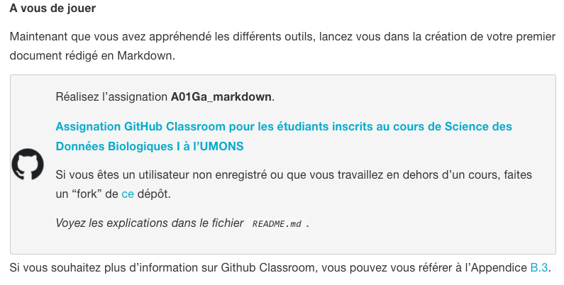

Ce lien vous redirige vers le site GitHub Classroom. Vous devez alors accepter l'assignation (**Accept assigment**).

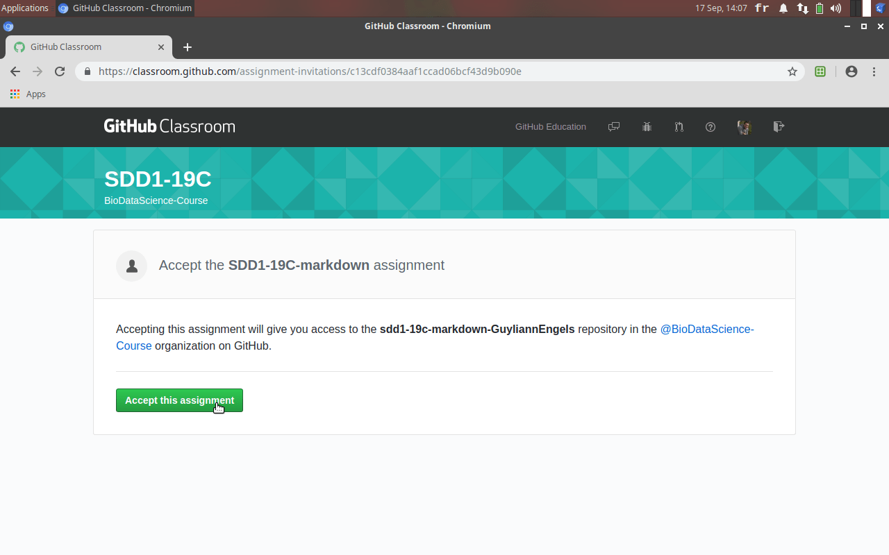

Votre travail individuel ou par groupe se configure. Ensuite, une fois la configuration terminée, une page apparaît, qui vous offre la possibilité d'aller directement dans le dépôt correspondant à votre assignation dans GitHub.

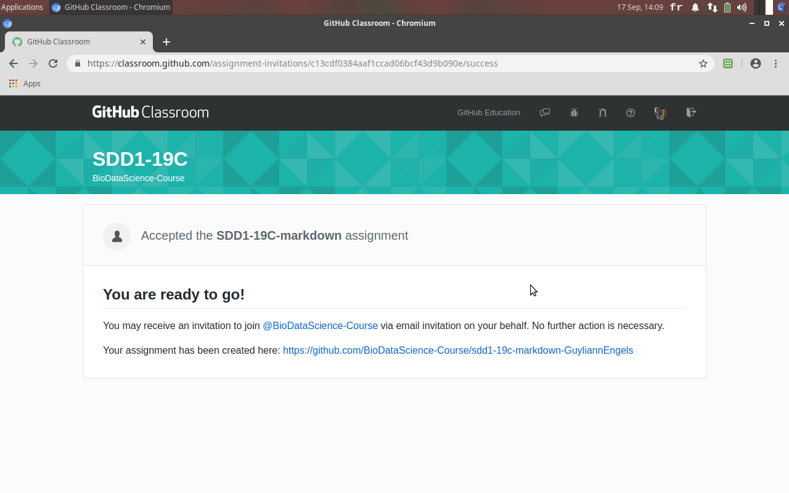

Depuis GitHub, vous devez cloner votre dépôt pour y avoir accès dans RStudio, comme expliqué dans la section \@ref(github-clone). Vous êtes alors prêt à travailler dans votre projet. N'oubliez pas de réaliser des **commits**, des **pulls** et des **pushes** régulièrement en indiquant des messages courts mais explicites concernant les modifications effectuées dans les messages de vos commits.
