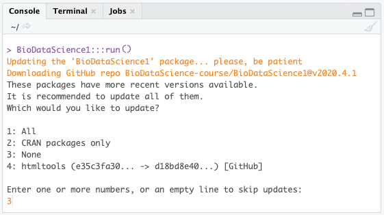
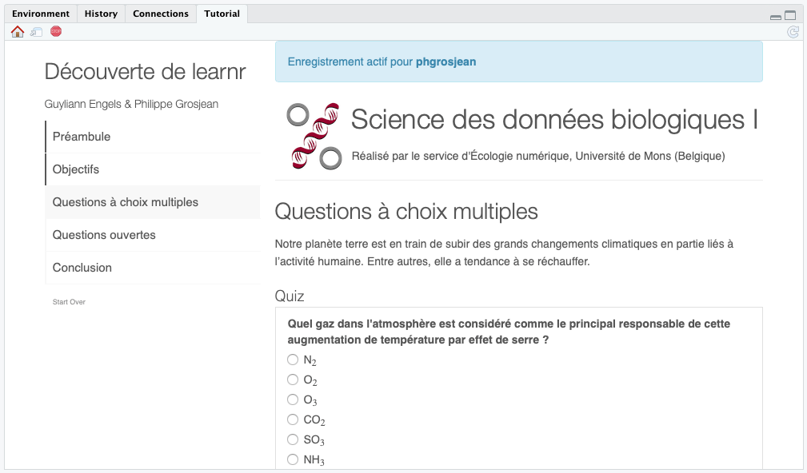
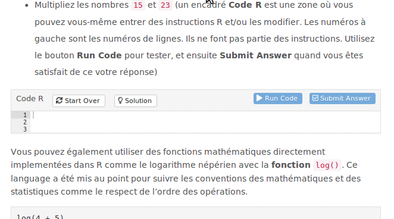
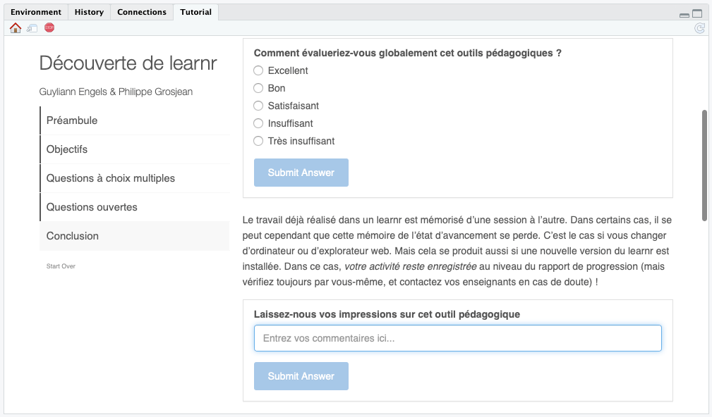

# Tutoriels "learnr" {#learnr}

En complément de ce cours en ligne, vous allez utiliser également des tutoriels interactifs construits avec [learnr](https://rstudio.github.io/learnr/). Si ce n'est déjà fait, commencez par installer ces tutoriels dans RStudio.

Allez dans le bouton **Addins** au milieu de la barre d'outils générale de RStudio et sélectionnez `Run SDD I tutorial or app` dans la section **BioDataScience1**, ou entrez l'instruction ci-dessous dans la fenêtre **Console** de RStudio suivie de la touche `Entrée` :

```         
BioDataScience1::run()
```

Si la section n'apparaît pas dans les addins, ou si l'instruction génère une erreur qui indique qu'il n'y a pas de package BioDataScience1, vous devez installer les deux packages {BioDataScience} et {BioDataScience1} du cours[^a3-tutoriels-1]. **Cela ne doit pas se produire si vous êtes étudiant•e UMONS car ces packages sont déjà installés dans votre SciViews Box et vous ne devez donc pas exécuter le code juste ci-dessous !** Dans la Console, entrez les lignes de code suivantes pour effectuer cette installation :

[^a3-tutoriels-1]: Pour le cours 2, vous installerez aussi le package {BioDataScience2} et pour le cours 3 ou 4, {BioDataScience3} selon la même technique.

```{r, eval=FALSE}
remotes::install_github("BioDataScience-Course/BioDataScience")
remotes::install_github("BioDataScience-Course/BioDataScience1")
```

Un fois l'addin lancé, si une mise à jour du package est disponible, elle sera installée. Si d'autres packages R peuvent également être mis à jour, cela vous sera demandé. Dans ce cas, **refusez la mise à jour des autres packages R** en indiquant `3` puis la touche `Entrée` pour l'option `None` (à part le package {BioDataScience1} nous voulons conserver les versions de tous les autres packages R identiques à la version installée avec la SciViews Box par souci de compatibilité et reproductibilité de nos analyses).



Après la mise à jour éventuelle du package, la liste des tutoriels vous est proposée :

```         
1: A00La_discovery
2: A01La_tools
3: A01Lb_base
...
```

Sélectionnez le tutoriel désiré dans la boite de dialogue (si lancé à partir de l'addin) ou entrez le numéro correspondant au tutoriel que vous voulez exécuter dans la console. Un document learnr interactif apparaît. Par exemple, en entrant `1` suivi de la touche `Entrée`, vous êtes redirigé vers le tutoriel concernant la découverte de R et intitulé `A00La_discovery`.

```{block, type='warning'}
L'onglet **Tutorial || Tutoriel** donne également accès aux différents tutoriels, mais la liste n'est **pas** mise-à-jour automatiquement. **Vous devez donc vous assurer que cette liste correspond bien aux versions les plus récentes des exercices en ayant exécuté au moins une fois `BioDataScience1::run()` au cours de la session actuelle.** Ensuite, si une mise-à-jour a été installée, il faut aussi rafraîchir la liste des tutoriels présentés dans l'onglet **Tutorial || Tutoriel** en allant dans le menu de RStudio `Session` -> `Restart R || Session -> Redémarrer R`.

Dans certains cas, le lancement des tutoriels à partir de l'addin ou à partir de `BioDataScience1::run()` lance la compilation du tutoriel dans l'onglet **Jobs || Travaux**, mais ce tutoriel ne s'affiche *pas* dans **Tutorial || Tutoriel** ensuite. C'est un bug dans RStudio. Si c'est le cas, vous pouvez alors relancer le tutoriel à partir de l'onglet **Tutorial || Tutoriel** en cliquant sur le bouton **Start Tutorial**, et normalement, il doit apparaître maintenant.
```

La première chose à vérifier à l'ouverture du tutoriel interactif est le nom d'utilisateur (équivalent à votre **username** dans Github) qui sera utilisé pour l'enregistrement de votre activité si vous êtes étudiant UMONS. En effet, votre progression devra être enregistrée, mais cela ne peut se faire que si vous renseignez ces données correctement.



Si vous êtes correctement enregistré, un bandeau bleu l'indiquera avec votre login GitHub en gras comme ci-dessus. Dans le cas contraire, un message sur fond jaune ou rouge (selon le contexte) indiquera le contraire. De même, si vous voyez également un message sur fond rouge qui indique que la base de données est inaccessible, cela signifie que vous n'êtes pas correctement connecté à l'Internet ou que votre connexion Internet ne permet *pas* d'accéder à la base de données qui enregistre votre activité. Essayez un autre réseau, ou même, essayez en redémarrant complètement votre ordinateur (ou la machine virtuelle sur le cloud). Si la base de données est actuellement inaccessible, vous pouvez toujours effectuer les exercices, mais votre activité sera temporairement enregistrée localement dans votre ordinateur. Dès la prochaine connexion fructueuse, et dès la soumission d'un exercice learnr, l'ensemble de votre activité sera alors enregistrée d'un coup dans la base de données.

## Organisation d'un learnr

Le learnr est un outil pédagogique mis au point pour proposer des tutoriels interactifs comprenant des illustrations, des questions à choix multiples, des exercices R... Les learnr qui vous seront proposés tout au long de votre formation en Science des Données biologiques seront composés de la manière suivante :

-   Objectifs
-   Introduction
-   Une série d'exercices
-   Conclusion

Vous retrouvez d'ailleurs cette structure en haut à gauche dans la page de celui-ci. Chaque page du tutoriel est importante et nécessite votre attention.

### Objectifs

Cette section détaille l'ensemble des notions que vous allez apprendre à maîtriser dans le tutoriel. Par exemple, pour le premier tutoriel, l'objectif est de découvrir comment fonctionne un "learnr" à l'aide de différentes questions de culture générale.

### Introduction

Cette section facultative vous place dans le contexte du tutoriel interactif avec un rappel succinct des notions théoriques indispensables pour répondre à la série d'exercices, et éventuellement aussi, le contexte du jeu de données traité. **Cette section ne remplace pas les autres matériels pédagogiques qui vous sont proposés.** Vous devez donc travailler et étudier la section du cours correspondant *avant* de vous lancer dans le tutoriel dans un second temps... sinon, il ne servira à rien.

### Divers exercices

Cette ou ces sections peuvent être de longueur variable en fonction de la difficulté et des notions à appréhender. Les questions sont présentées sous forme de quiz (questions fermées) ou de zones de code R (questions ouvertes).

Pour les quiz, vous devez cliquer sur le bouton bleu `Submit Answer`. En cas d'erreur, vous avez la possibilité de réessayer dans les questions formatives (mais pas dans les questions d'évaluation). Pour les étudiants de l'UMONS, les points sont calculés en fonction du nombre d'essais nécessaires pour obtenir la bonne réponse (10% déduits par essai infructueux, ce qui est finalement une pénalité très faible qui vous permet plusieurs essais incorrects, tout en conservant une excellente note à l'exercice... mais n'en abusez pas tout de même).

Des zones de code R vous sont proposées dans certains exercices. Elles vous permettent d'expérimenter directement des instructions dans R depuis le document learnr. Pour exécuter ces instructions, il faut cliquer sur le bouton `Run Code`. **Vous pouvez le faire autant de fois que vous le voulez, et ce, sans perte de points.** Modifiez le code, cliquez `Run Code`, analysez le résultat, modifiez votre code, recliquez `Run Code`, etc. jusqu'à ce que vous soyez satisfait du résultat. Finissez l'exercice et soumettez votre réponse en cliquant sur le bouton `Submit Answer`. Tout comme pour les quiz, 10% sont déduits à chaque soumission de réponse incorrecte. Voici un exemple de question nécessitant l'écriture de code R :



Selon le cas, vous pouvez alors avoir un encart bleu qui indique simplement que votre réponse est enregistrée, ou alors, si l'exercice est assorti d'une correction automatique, vous verrez un encart vert en cas de bonne réponse ou un encart rouge qui vous donne un indice sur ce qui est incorrect (**attention : ces messages d'aide sont élaborés automatiquement par l'ordinateur et ne sont pas toujours totalement fiables ; concentrez-vous surtout sur le fait que la réponse n'est pas celle attendue et tentez de déterminer ce qui ne va pas**).

Un bouton `Hint`, lorsqu'il est présent, vous propose une aide si vous êtes bloqué sur la question. Un bouton `Solution` ou le dernier `Hint` affiché après celui qui indique que le suivant sera la solution à la question... montrent ce qu'il fallait entrer. **N'allez pas voir directement la solution. Essayez d'abord par vous-même !** Ces aides supplémentaires sont, en effet, à utiliser en dernier recours seulement si vous êtes bloqué, moyennant une pénalité de 10% à chaque "hint" vu (et si vous avez lu la solution, vous n'aurez plus que la moitié des points pour cet exercice).

Quelle que soit la façon dont vous répondez à une question, vous obtenez donc au moins la moitié des points. Si vous avez été voir la solution avant de chercher la réponse par vous-même, nous considérons que c'est parce que vous n'arrivez pas à résoudre cet exercice seul. Dans le cadre d'une auto-évaluation, nous vous faisons confiance pour analyser la réponse et essayer de comprendre où sont vos lacunes pour progresser. *Si vous ne le faites pas, vous n'apprendrez rien, et vous serez incapables de résoudre les exercices dans les projets GitHub ensuite.* Au moins vous sollicitez les aides pour obtenir la réponse, au plus vous obtiendrez une bonne note pour cet exercice. Mais ne perdez pas de temps sur les exercices qui vous semblent difficiles et utilisez les `Hint`s à bon escient.

### Conclusion

Cette section termine le tutoriel et propose de laisser, de manière optionnelle, un commentaire (soyez constructifs, si vous pensez que le tutoriel pourrait être amélioré d'une quelconque façon : nous tiendrons compte de vos remarques pour les versions des années suivantes). Fermez le tutoriel lorsqu'il est terminé en cliquant sur le bouton rouge en forme de panneau stop dans la barre d'outils de l'onglet **Tutorial \|\| Tutoriel**.


