# Communication & esprit critique {#commcritique}

```{r setup, include=FALSE, echo=FALSE, message=FALSE, results='hide'}
SciViews::R("infer", "explore", lang = "fr")
```

## Communication

Savoir communiquer ses résultats est vital en science des données. Ce n'est pas si facile, car il faut pouvoir simplifier les analyses et utiliser au mieux les visuels (c'est-à-dire, les graphiques) pour raconter une histoire qui soit à la fois captivante et compréhensible. **Communiquer le fruit de ses recherches de la meilleure façon qui soit pour que les non-initiés puissent le comprendre fait partie du bagage indispensable du scientifique des données**.

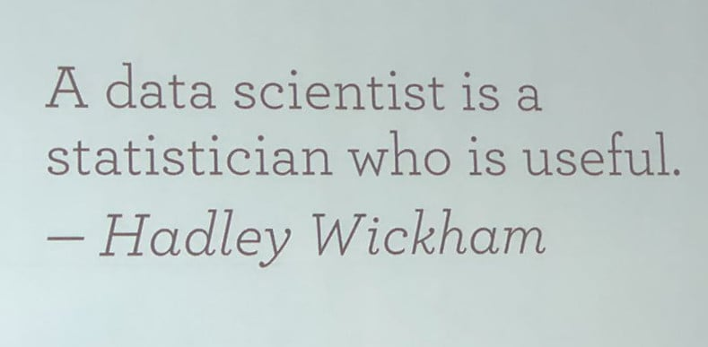

Hans Rosling était sans nul doute l'un des plus doués pour communiquer des résultats statistiques. La vidéo suivante est un peu longue (20min) et en anglais, mais elle en vaut vraiment la peine[^a5-communication-critique-1]. De plus, il explique à quel point il est important de partager et de rassembler les données dans de grandes bases de données, et ensuite d'en tirer des études *utiles* pour l'humanité. C'est l'avenir des sciences des données, y compris en biologie, qu'il est en train de prédire là à l'époque où il a tourné cette vidéo.

[^a5-communication-critique-1]: Vous pouvez activer les sous-titres en anglais via la barre de boutons en bas de la vidéo.

```{r, echo=FALSE}
vembedr::embed_youtube("hVimVzgtD6w", width = 770, height = 433)
```

### Présentations R Markdown et Quarto

Parmi tous les formats R Markdown ou Quarto, il en existe plusieurs adaptés aux présentations de type "PowerPoint". Le format **R Presentation** est très simple et parfaitement intégré dans RStudio. Divers formats compilés depuis R Markdown sont également disponibles. Les formats **ioslides** ou **Slidy**, ou **xaringan** sont adaptés aux explorateurs Web. Le format **Beamer** permet de créer une présentation en PDF. Enfin, il est possible de compiler sa présentation au format **PowerPoint**.

Le format [**R Presentations**](https://support.posit.co/hc/en-us/sections/200130218-R-Presentations) (menu `File -> New file -> R Presentation` dans RStudio) est très simple pour créer des diapositives de présentation directement depuis Markdown sous forme HTML, et pouvant s'exécuter dans RStudio ou dans un explorateur Web.

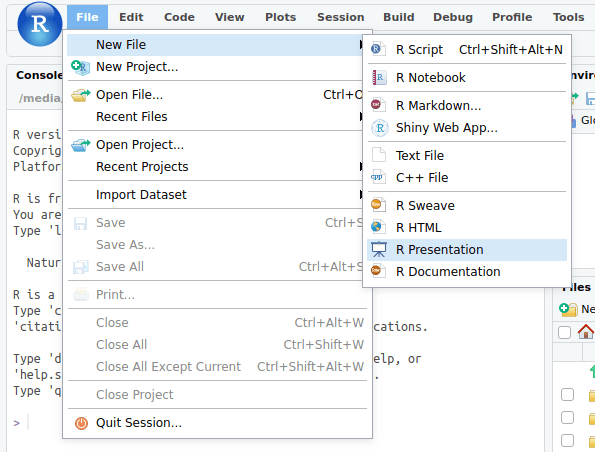

Ce type de présentation est très bien intégré dans RStudio. Outre l'édition au format R Markdown la présentation elle-même apparaît dans un onglet spécial **Presentation** en haut à droite qui n'interfère pas avec les autres onglets. Par contre, les possibilités de personnalisation sont plutôt limitées.

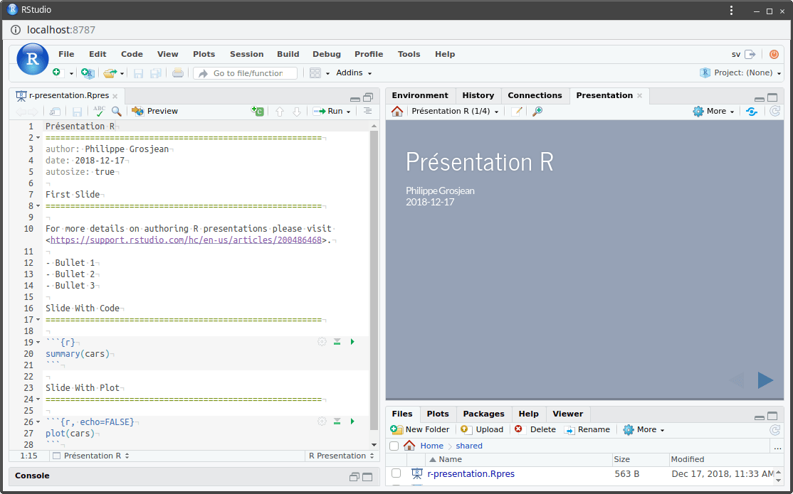

Deux formats basés sur le HTML et JavaScript (comprenez, des formats qui s'exécutent dans un explorateur Web) sont aussi proposés par défaut via les types de documents R Markdown ou Quarto (menu `File -> New File -> R Markdown...` ou `File -> New File -> R Quarto Document`, puis `Presentation`).

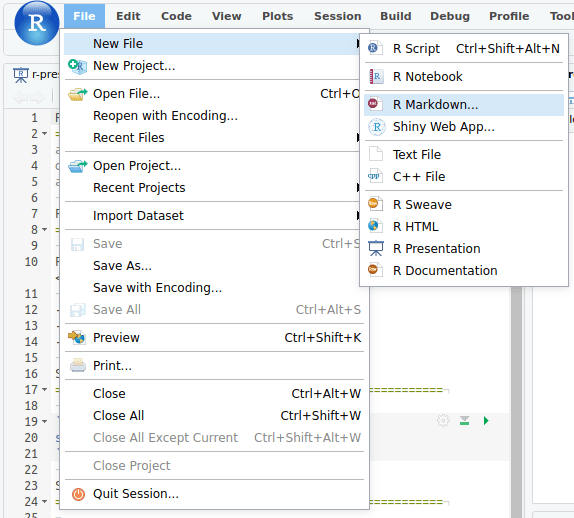

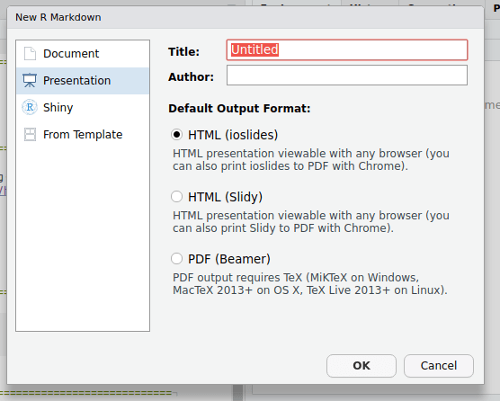

Les deux formats Web par défaut sont **ioslides** et **Slidy** pour R Markdown ou le format est **Reveal JS** pour Quarto. L'apparence et les fonctionnalités des différents systèmes diffèrent quelque peu. Le mieux est de tester les différentes versions et de choisir celui qu'on préfère. La présentation apparaît dans une fenêtre séparée. Les possibilités de personnalisation sont plus poussées, mais elles se font à l'aide de feuilles de styles au format CSS. Cela impose de comprendre leur logique.

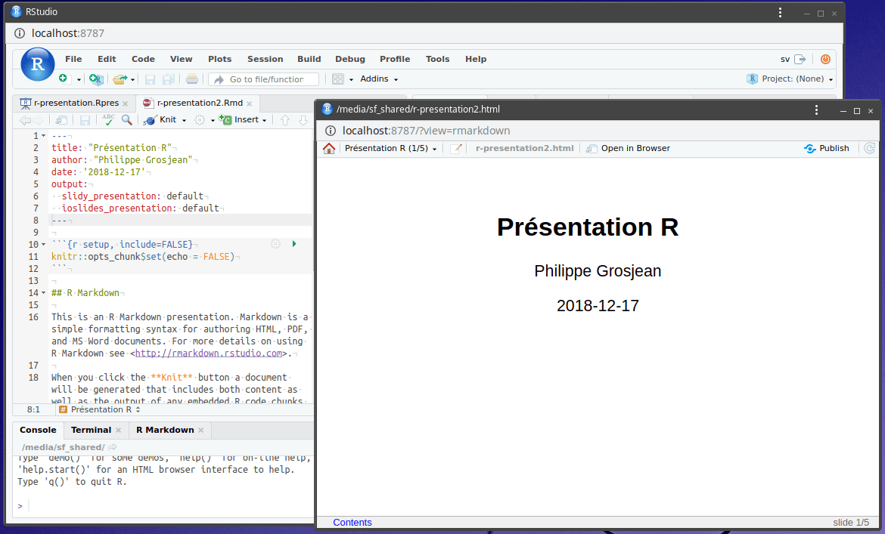

Une troisième option est de compiler un document PDF de présentation en passant par le package **Beamer** sous LaTeX. L'avantage est que c'est lisible partout. L'inconvénient : seul du *contenu statique* est accepté (pas de gifs animés, pas de vidéos ou difficilement directement dans la présentation). Sinon, les possibilités de personnalisation sont immenses[^a5-communication-critique-2].

[^a5-communication-critique-2]: Toutes nos présentations dans le cadre du cours sont au format R Markdown/Beamer avec un template UMONS/SDD fortement personnalisé.

Avec le format **Beamer**, vous voyez le PDF résultant dans une fenêtre séparée. Cette fenêtre ne permet pas de lancer la présentation. Il vous faut l'ouvrir dans un lecteur PDF séparé qui offre cette fonctionnalité (Acrobat Reader, Mac Preview, SumatraPDF sous Windows, eVince sous Linux ...) pour visionner votre présentation confortablement.

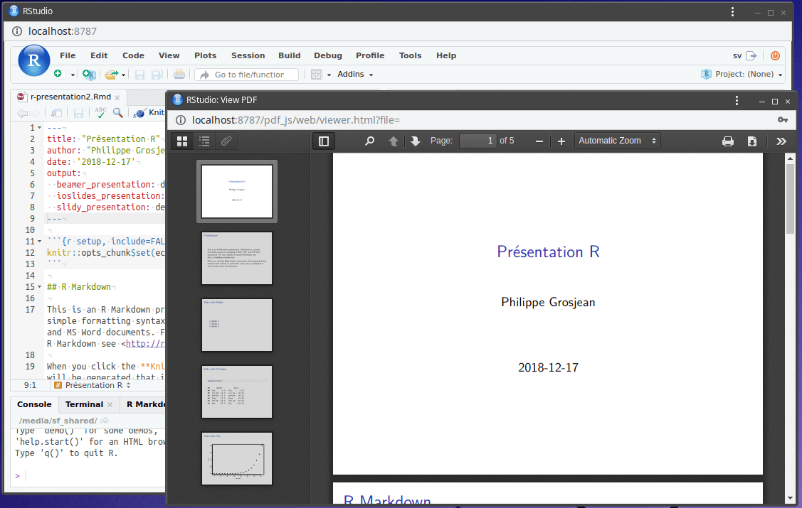

La quatrième option est de compiler un document au format **PowerPoint**. Il n'est pas possible d'avoir une prévisualisation avec ce format. Il vous faut l'ouvrir dans un lecteur de fichier **PowerPoint**. Il est possible de personnaliser ce format à l'aide d'un template comme présenter dans la section sur [les présentations PowerPoint du livre R Markdown: The definitive Guide](https://bookdown.org/yihui/rmarkdown/powerpoint-presentation.html#ppt-templates).

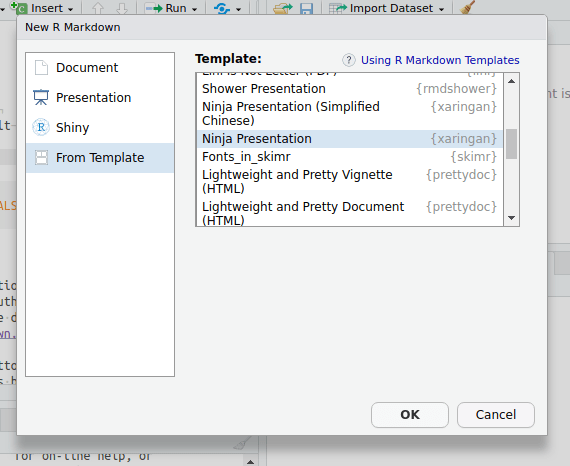

Les cinq formats **ioslides**, **Slidy**, **Reveal JS**, **Beamer** et **PowerPoint** sont parfaitement intégrés à RStudio, avec un menu contextuel dans le bouton `Knit` (`Tricoter`) ou `Render` (`Rendu`) qui permet de passer facilement de l'un à l'autre pour autant que vous n'utilisez pas des balises spécifiques à l'un de ces quatre formats.

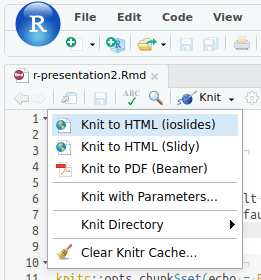

Enfin, quelques packages R additionnels proposent d'autres formats de présentation. Dans la SciViews Box, vous avez {xaringan} qui propose un moteur particulièrement sophistiqué et flexible. Ces outils sont plus spécialisés, mais aussi plus puissants pour créer des présentations au format HTML à visionner dans un explorateur Web.


```{block, type='info'}
Quel type de présentation R Markdown ou Quarto choisir au final ? Toute cette panoplie d'options ne facilite pas notre choix. En fait, c'est plus une question de goût personnel. Essayez les différentes options par vous-même. Le choix principal est, au final, entre un format HTML, PDF ou PowerPoint. Le format PDF est, par définition, plus portable. Cependant, il ne permet que du contenu statique. Si vous avez des gifs animés, des graphiques interactifs, ou des vidéos, alors orientez-vous plutôt vers un moteur HTML/Javascript.
```

```{=html}
<!-- ##### À vous de jouer ! {.unnumbered}

**Note : il est indispensable de pouvoir synthétiser un travail complexe. Dans votre carrière de chercheur, vous serez souvent confronté à devoir réaliser des présentations. Réalisez une présentation de maximum cinq diapositives dans le format de votre souhait.** -->
```

## Critique statistique

`r img("sdd1_12/cars-travolta.gif")`

Les statistiques ont mauvaise presse auprès de certaines personnes qui pensent qu'on peut leur faire dire tout et son contraire. Cela a même donné lieu à des ouvrages comme "[Attention, statistiques ! Comment en déjouer les pièges](https://www.editionsladecouverte.fr/catalogue/index-Attention_statistiques__-9782707172389.html)" ou "[How to lie with statistics](https://en.wikipedia.org/wiki/How_to_Lie_with_Statistics)". Derrière des titres provocateurs, ces ouvrages présentent, en fait, de manière sérieuse les pièges principaux et les moyens de les déjouer. Car, en réalité, ce n'est pas l'usage des statistiques qui est en cause ici, mais son **mauvais** usage. Voir aussi "[Statistical reasoning for everyday life](https://www.pearson.com/en-us/subject-catalog/p/statistical-reasoning-for-everyday-life/P200000007457/9780137561544)".

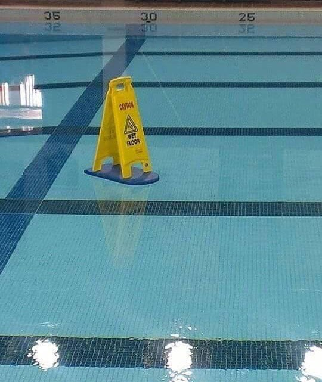

```{block, type='info'}
Dans la littérature scientifique et tout autour de nous, nous pouvons trouver des exemples de mauvais usages des statistiques (application *erronée* de méthodes statistiques). Quelquefois, il s'agit de triche manifeste, mais la plupart du temps c'est par ignorance. Développer un **esprit critique** statistique est important pour pouvoir démasquer ces diverses situations et ne pas tomber soi-même dans les pièges les plus grossiers.
```

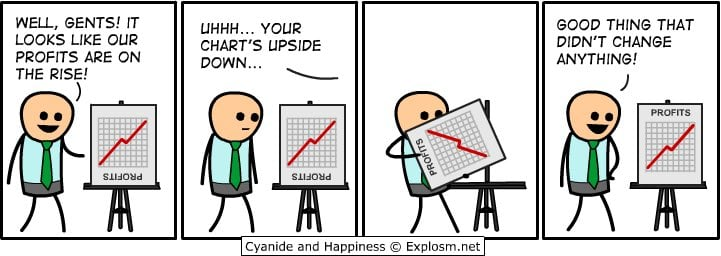

Voici quelques conseils qui vous aideront à développer votre esprit critique statistique.

-   La formulation statistique est-elle en adéquation avec la question biologique posée ?
-   Y a-t-il des biais dans les techniques d'échantillonnage et/ou de mesure ?
-   Les graphiques sont-ils adéquats par rapport à ce qui doit être montré ?
-   Les axes sont-ils placés correctement, et sont-ils bien libellés ?
-   Le graphique respecte-t-il les conventions ?
-   Les unités sont-elles correctes ?
-   Les calculs sont-ils corrects ?
-   Les variables sont-elles du type correct pour l'analyse (qualitative ordonnée ou non, ou alors, quantitative discrète ou continue) ?
-   Les conditions d'application des tests statistiques sont-elles respectées ?
-   La taille de l'échantillon est-elle suffisante ?
-   N'y a-t-il pas pseudo-réplication (plusieurs mesures issues d'un même individu considérées comme des observations indépendantes) ?
-   Les grandeurs observées sont-elles plausibles ? Vous pouvez vous rapporter à des éléments connus et comparer. Par exemple, si l'on vous dit qu'une souris adulte pèse 1g, est-ce plausible ou non ? Faites une recherche sur le Web, ou un raisonnement du genre : une souris est constituée principalement d'eau. Un gramme d'eau occupe un volume de 1 cm^3^. Le volume de la souris adulte est-il supérieur, égal ou inférieur à un cube de 1 cm de côté ?
-   Les mêmes données ne peuvent être utilisées deux fois. Si elles sont utilisées pour découvrir un effet, et en même temps pour le vérifier, c'est incorrect.
-   Une corrélation ou un effet fortuit n'est-il retiré d'une grande quantité de tests non significatifs ? Soyez attentifs aux tests multiples réalisés sans ajustement du seuil $\alpha$. Cela s'appelle du *"p hacking"*.
-   Un test d'hypothèse est-il significatif après avoir ajouté de manière itérative de nouveaux individus et mesures à l'échantillon jusqu'à obtenir le résultat désiré (autre forme de *"p hacking"*).
-   Les conclusions sont-elles en adéquation avec ce qui est observé dans les données ? Les conclusions répondent-elles à la ou les questions posées initialement ?

`r img("sdd1_12/wrong-graph.gif")`

Pour terminer ce module, nous vous proposons quelques situations (soit des problèmes, soit des graphiques) qui ont toutes en commun d'être erronées. À vous de trouver ce qui ne va pas. Pour ne pas fausser la donne, les réponses ne **sont pas** fournies dans ce document, mais seront discutées en classes tous ensemble.

------------------------------------------------------------------------

##### Graphe en rubans {.unnumbered}

***Que pensez-vous du graphique suivant ?***

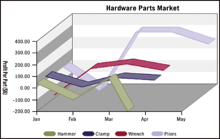

------------------------------------------------------------------------

##### Longévité {.unnumbered}

Un chercheur compile les statistiques de longévité de diverses professions. Pour ce faire, il encode les données des certificats de décès (nom, âge au moment du décès et profession). Il calcule ensuite l'âge moyen de décès par profession. Il constate que la valeur minimale est observée **chez les étudiants**, avec une valeur moyenne de seulement 20,7 ans (Wainer, Palmer & Bradlow, A selection of selection anomalies, *Chance*, vol. 11, n°2).

***La « profession » d'étudiant est-elle réellement plus dangereuse que celle de policier, chauffeur de taxi, ou cascadeur ? Expliquez...***

------------------------------------------------------------------------

##### Corrélations {.unnumbered}

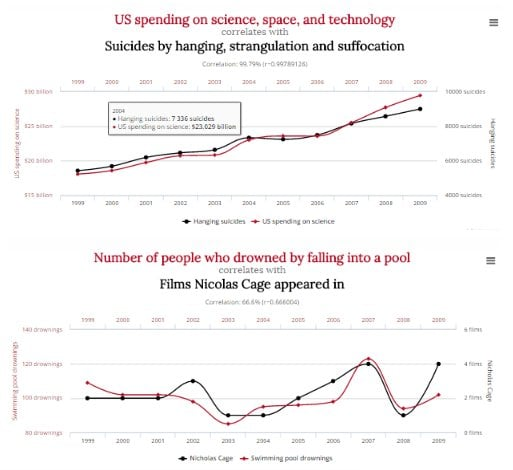

***Vous en pensez quoi ?***

------------------------------------------------------------------------

##### Prison {.unnumbered}

***Qu'est-ce qui ne va pas dans la figure suivante ?***

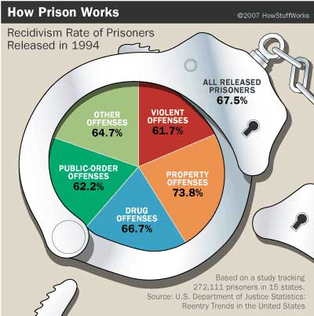

------------------------------------------------------------------------

##### Étendue des axes {.unnumbered}

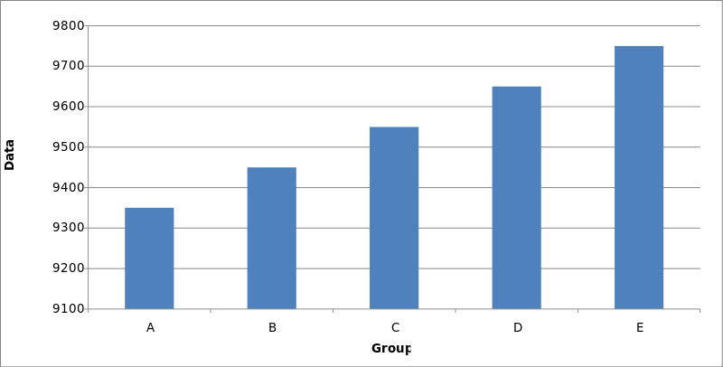

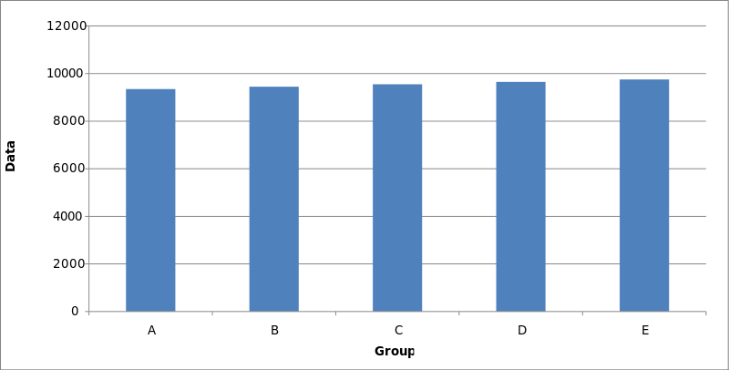

***Comparez de manière critique les deux graphiques précédents. Aidez-vous des schémas ci-dessous pour étayer votre explication.***

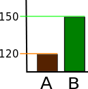

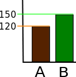

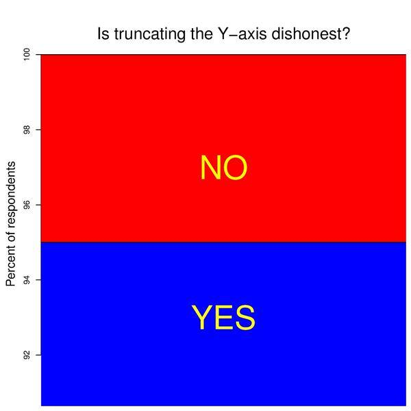

------------------------------------------------------------------------

##### Travaux d'artistes ? {.unnumbered}

***Que pensez-vous des trois figures suivantes ?***

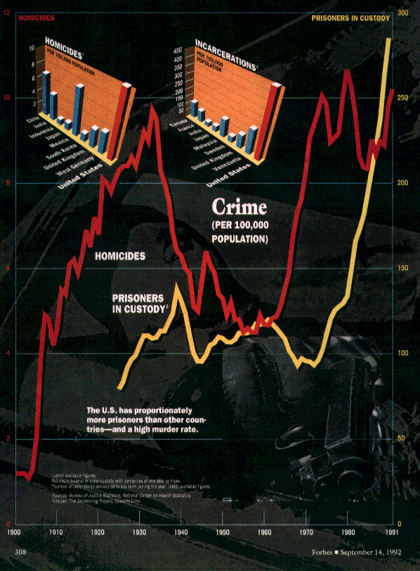

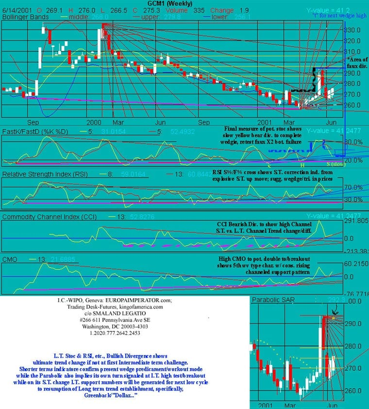

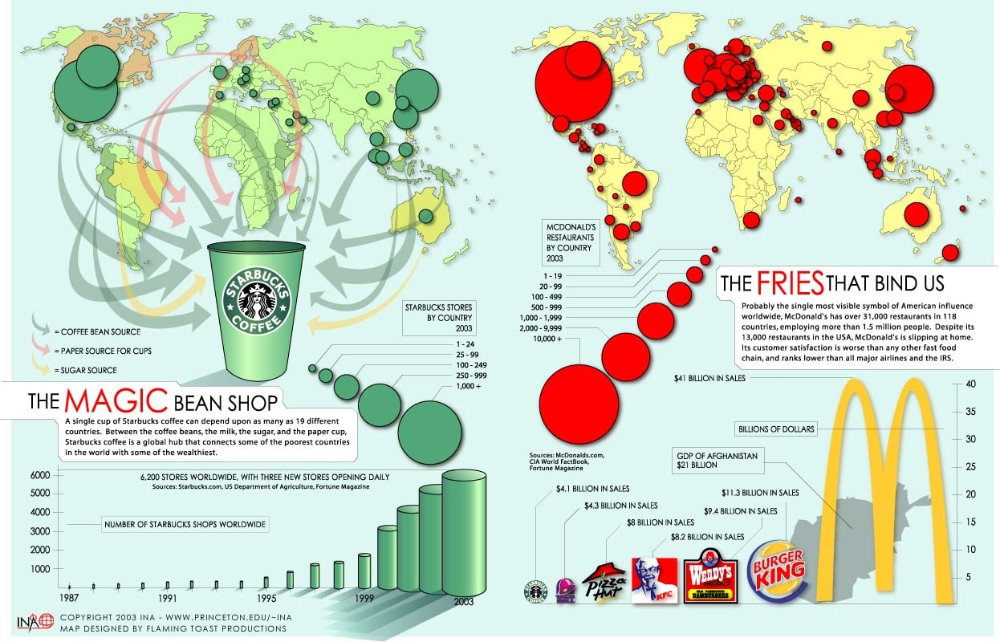

------------------------------------------------------------------------

##### Chauve-souris {.unnumbered}

Un biologiste étudie une chauve-souris insectivore naine. Il trouve dans la littérature que la biomasse totale de cette chauve-souris varie de 0,23 à 1,95 kg/ha dans les forêts recensées. Afin de calculer l'abondance de ces populations de chauve-souris, il détermine le poids moyen d'un individu comme étant (moyenne ± écart type) 55 ± 13 mg (n = 45). Il utilise ces données pour comparer les populations de chauve-souris aux autres animaux présents dans cette forêt. Il en conclut que la population de chauve-souris dans ces forêts est très nettement supérieure à celle des oiseaux et équivalente à celle des insectes. Ce résultat est inattendu et permet de considérer cette chauve-souris comme espèce clé dans la chaîne trophique, alors que son effet a toujours été négligé auparavant, tant elle est discrète et passe inaperçu la plupart du temps.

***Vous travaillez aussi sur les chaînes trophiques de ces mêmes forêts. Comment réagissez-vous à la lecture de ce rapport ? Que faites-vous ensuite ?***

------------------------------------------------------------------------

##### Patinage {.unnumbered}

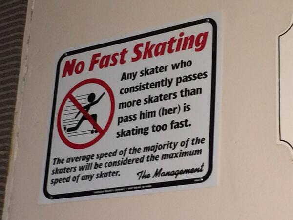

***Que se passe-t-il si tout le mode respecte cette consigne (considérant qu'il est impossible que tous les patineurs aient exactement la même vitesse) ?***

------------------------------------------------------------------------

##### Pseudo-perspective {.unnumbered}

***Que pensez-vous de ces graphiques ?***

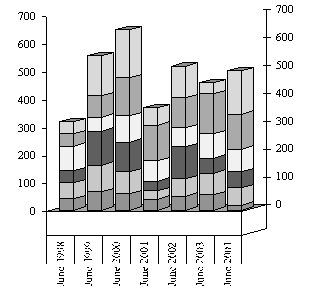

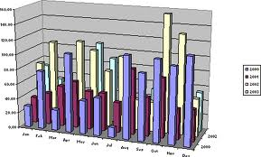

Aidez-vous du schéma suivant pour expliquer ce qui ne va pas...

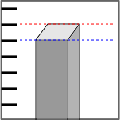

------------------------------------------------------------------------

##### Homme moyen {.unnumbered}

Le magazine "Men's Health" a publié des statistiques qui décrivent l'"homme moyen". Celui-ci a 34,4 ans, pèse 79,4kg, mesure 177,8cm, dort 6,9 heures chaque nuit, boit 3,3 tasses de café par jour et consomme 1,2 boisson alcoolique quotidiennement.

***Sachant que toutes les distributions sont unimodales, donc que les valeurs moyennes correspondent toutes à des observations effectivement mesurées en grands nombres (identiques ou très proches) sur des hommes réels, ce portrait-robot de l'"homme moyen" décrit-il effectivement un grand nombre d'individus réellement existants ? Justifiez. Qu'en serait-il de l'"homme médian" ?***

------------------------------------------------------------------------

##### Public ou privé ? {.unnumbered}

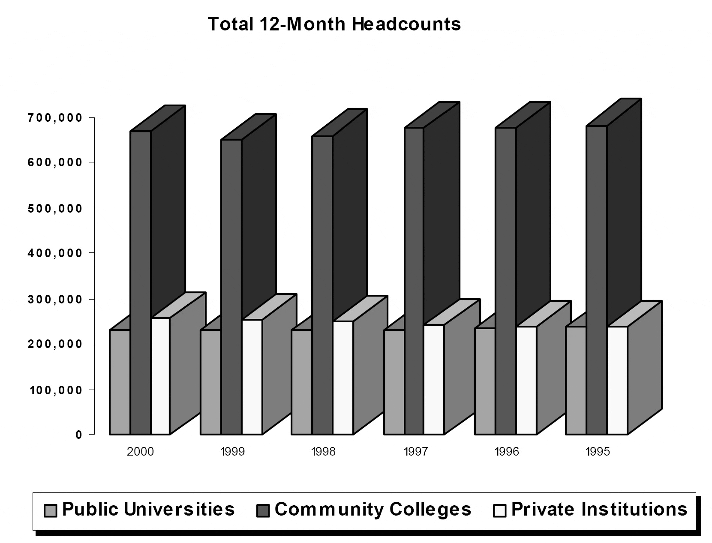

***Observez bien le graphique ci-dessus... Ensuite, regardez celui ci-dessous qui est réalisé à l'aide des mêmes données. Commentez...***

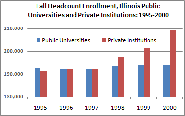

------------------------------------------------------------------------

##### Camemberts, tartes et cie {.unnumbered}

***Que pensez-vous de ces graphiques ?***

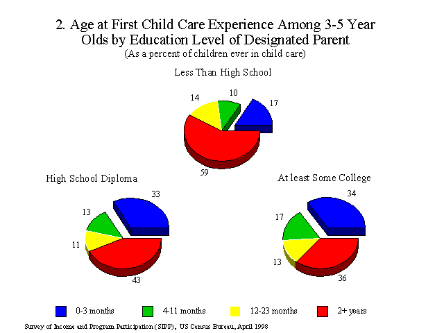

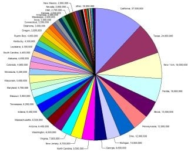

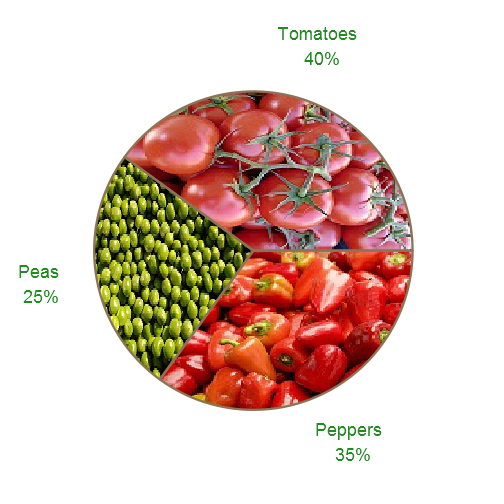

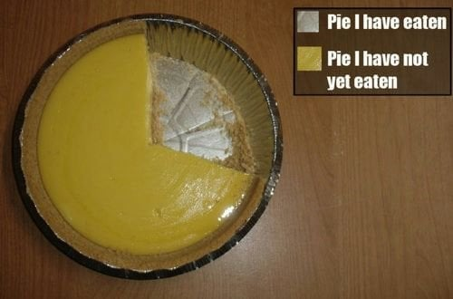

------------------------------------------------------------------------

##### Espérance de vie {.unnumbered}

L'espérance de vie est une donnée statistique qui permet de connaître la durée de vie moyenne qu'on peut espérer atteindre à un moment donné pour une nation donnée. Cette statistique est calculée et publiée par de nombreux organismes, incluant l'OMS. Les statistiques indiquent que l'espérance de vie des hommes dans nos pays est de 75,5 ans, et des femmes de 83,5 ans.

***Calculez le temps que vous pouvez espérer encore vivre en fonction de votre âge. Que pensez-vous de ce calcul ?***

------------------------------------------------------------------------

##### Femmes au travail {.unnumbered}

***Considérez les deux graphiques suivants qui sont censés représenter la même information (les mêmes données sont utilisées). Comparez-les de manière critique.***

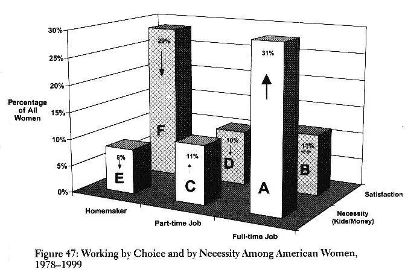

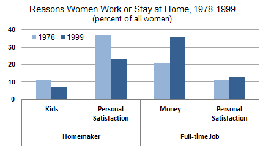

------------------------------------------------------------------------

##### Moules {.unnumbered}

Un scientifique mesure la stabilité de la membrane lysosomale (indice de stress des cellules utilisé en écotoxicologie : on sait que les polluants étudiés tendent à déstabiliser la membrane des lysosomes) chez la moule *Mytilus edulis* en Mer du Nord. Deux régions sont comparées : la pleine mer (A), et l'embouchure de l'Escaut dans sa partie considérée comme la plus polluée (B). Cinq moules sont prélevées aléatoirement sur les deux sites, et dix mesures sont réalisées sur chaque individu. Le scientifique conclut à une stabilité lysosomale significative plus faible au seuil alpha de 5% dans le site B (test *t* de Student non apparié et unilatéral à gauche, t = -6,5, ddl = 49, valeur *p* \<\< 0.001).

***Que pensez-vous de cette étude ?***

------------------------------------------------------------------------

##### République bananière ? {.unnumbered}

***Que pensez-vous du graphique suivant ?***

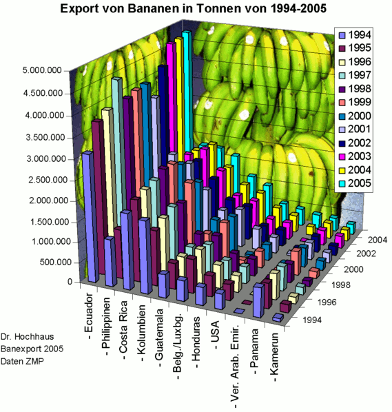

------------------------------------------------------------------------

##### Euro manquant {.unnumbered}

Trois clients dans un restaurant payent leur repas : 30€ (10€ par personne). Le serveur se rend compte qu'en fait leur repas n'a coûté que 25€ en tout. Comme il ne pourra diviser les 5€ à rendre en trois facilement, il décide de garder 2€ dans sa poche et rend 1€ à chaque client. Donc, chaque client a payé 10 -- 1 = 9€, soit un total de 27€. Avec les 2€ que le serveur a gardés dans sa poche, cela fait 29€. Alors, où est passé l'euro manquant par rapport aux 30€ payés initialement ?

***Réfléchissez et dénoncez l'erreur de raisonnement dans le récit précédent.***

------------------------------------------------------------------------

##### Stylos et vers verts ? {.unnumbered}

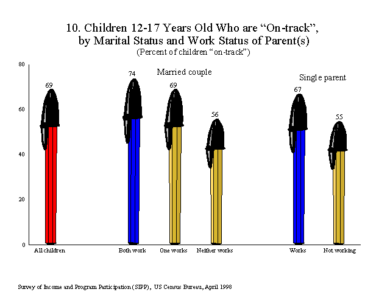

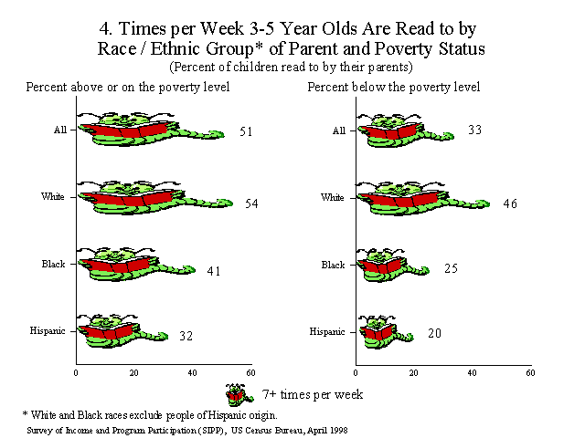

***Que pensez-vous de ces graphiques ? Vous pouvez vous aider des schémas suivants pour étayer votre réponse.***

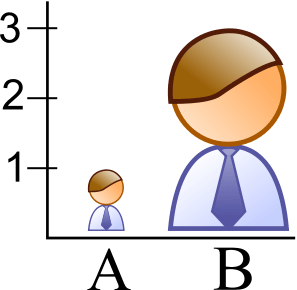

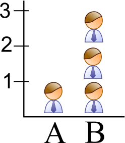

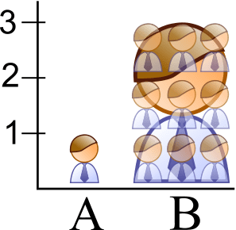

------------------------------------------------------------------------

##### Insecticides {.unnumbered}

Un chercheur dans une industrie chimique s'intéresse à l'effet d'un nouvel insecticide à effet progressif. Il teste son produit sur des drosophiles et observe une mortalité de 10% par jour, et ce, quel que soit le moment où il effectue les mesures après avoir mis les mouches en contact avec l'insecticide. Il en conclut qu'il faut 10 jours pour tuer toutes les mouches. Ce résultat est meilleur que le produit du concurrent, car ce dernier tue 80% des mouches sur la même durée de 10 jours.

***Que pensez-vous de la façon dont cette expérience a été menée et de ses conclusions ?***

------------------------------------------------------------------------

##### Virus Zika {.unnumbered}

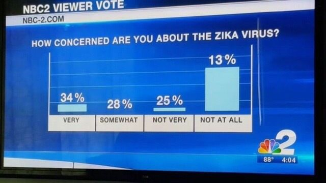

***Cela ne s'invente pas !***

------------------------------------------------------------------------

##### Lotto {.unnumbered}

Par le plus grand des hasards, le numéro 8 est sorti 6 fois en 7 tirages successifs du lotto. Sachant qu'une vérification de ce que ce numéro n'a pas plus de chances que les autres d'être tiré au sort, vous ne manquerez pas de constater en bon statisticien(ne) que le numéro 8 est très nettement surreprésenté dans les tirages.

***La prochaine fois que vous remplirez votre grille de lotto, jouerez-vous le numéro 8 ? Pourquoi ?***

***Vous est-il arrivé de jouer la suite 1, 2, 3, 4, 5, 6, 7, 8 au lotto (ou rempliriez-vous une grille avec ces nombres si vous deviez y jouer) ? Pourquoi ?***

````{=html}
<!--
------------------------------------------------------------------------

##### À vous de jouer ! {.unnumbered}

```{r assign_A12Ia_correlation_II, echo=FALSE, results='asis'}
if (exists("assignment"))
  assignment("A12Ia_correlation", part = "II",
    url = "https://github.com/BioDataScience-Course/A12Ia_correlation",
    course.ids = c(
      'S-BIOG-027' = !"A12Ia_{YY}M_correlation"),
    course.urls = c(
      'S-BIOG-027' = "https://classroom.github.com/a/..."),
    course.starts = c(
      'S-BIOG-027' = !"{W[35]+1} 13:00:00"),
    course.ends = c(
      'S-BIOG-027' = !"{W[37]+1} 23:59:59"),
    term = "Q2", level = 3,
    toc = "Critique statistique")
```

-->
````
