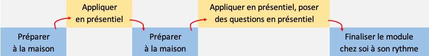
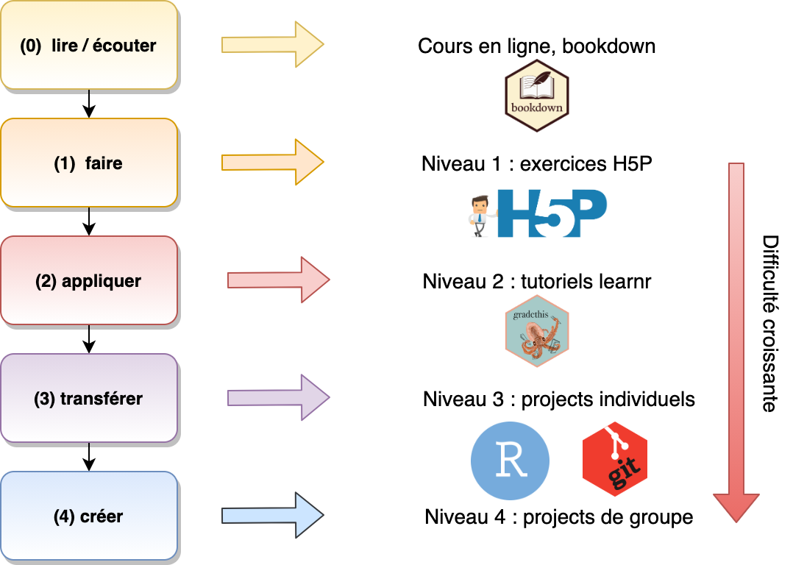
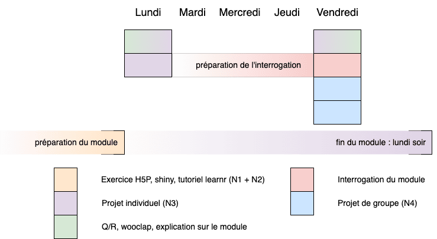

# Préambule {.unnumbered}

```{r setup, include=FALSE}
knitr::write_bib(c(.packages(), 'bookdown', 'knitr', 'rmarkdown'), 'packages.bib')
```

`r learnitdown::clean_ex_toc()` `r learnitdown::diagnose_login(lang = "fr")`

Cet ouvrage est conçu pour être utilisé de manière interactive en ligne. En effet, vous y trouverez des vidéos, des démonstrations interactives ainsi que des exercices sous forme de questionnaires interactifs. **Ces différents éléments ne sont, bien évidemment, utilisables qu'en ligne.**


------------------------------------------------------------------------

*Le matériel dans cet ouvrage est distribué sous licence [CC BY-NC-SA 4.0](https://creativecommons.org/licenses/by-nc-sa/4.0/deed.fr).*

Raphaël Conotte a contribué à des versions antérieures (il n'est plus listé comme co-auteur de cet ouvrage, car ses contributions ont disparu au fil des remaniements successifs).

------------------------------------------------------------------------

<details>

<summary>Informations système</summary>

```{r, class.source='hidden-code'}
sessioninfo::session_info()
```

</details>

## Vue générale du cours {.unnumbered}

Cet ouvrage est le premier d'une série de trois volumes traitant de la science des données biologiques. L'écriture de cette suite de livres a débuté au cours de l'année académique 2018-2019. Pour l'année académique 2024-2025, ceci est le support du cours de [Science des données I : visualisation et inférence](http://applications.umons.ac.be/web/fr/pde/2024-2025/ue/US-B2-SCBIOL-006-M.htm) au second Bachelier en Biologie en Faculté des Sciences de l'Université de Mons (UMONS), et dont le responsable est Philippe Grosjean.

La matière est divisée en dix modules représentant chacun six heures de travail en présentiel. Chaque module nécessitera environ dix heures (variable en fonction de votre rythme et de votre technique d'apprentissage, disons entre six et douze heures) de travail à domicile. **Une séance introductive de deux heures est programmée en début d'année pour installer les logiciels (SciViews Box, R, RStudio), et se familiariser avec eux, ainsi que pour expliquer la façon dont les séances vont se dérouler.**

Les cinq premiers modules au premier quadrimestre vous font découvrir les logiciels nécessaires pour effectuer les exercices de ce cours : R, RStudio, git, GitHub. Ils sont également consacrés à l'importation, le remaniement et la **visualisation** de données biologiques.

Les cinq modules suivants au second quadrimestre s'attaquent à l'**inférence** statistique, c'est-à-dire, l'art de tirer des conclusions sur l'observation d'un phénomène biologique au travers d'un échantillon, en présence d'incertitude, de variation entre individus et d'erreur de mesure qui sont impossible à éviter en biologie. Il s'agit ici d'utiliser de manière correcte les tests d'hypothèses statistiques et de réaliser des analyses de données reproductibles.

## Matériel pédagogique {.unnumbered}

Le matériel pédagogique est aussi varié que possible. Vous pourrez ainsi piocher dans l'offre en fonction de vos envies et de votre profil d'apprenant pour optimiser votre travail. Vous trouverez :

-   le présent ouvrage en ligne,

-   des [exercices H5P](http://www.h5p.org) repérables par le logo [](https://wp.sciviews.org/h5p/){target="_parent"} sur lequel vous pouvez cliquer pour avoir plus d'informations sur leur utilisation,

-   des [applications Shiny](https://shiny.posit.co/) qui sont de véritables petits programmes avec interface Web écrits en R. Ils vous démontrent "en live" certains concepts. Ces applications doivent être lancées en cliquant sur l'image contenant le logo [](https://wp.sciviews.org/shiny_app/){target="_parent"} et elles doivent être quittées avec le bouton `Quit` ou `Quit & Save` si l'enregistrement est activé. N'oubliez pas de soumettre votre réponse avec le bouton `Submit`. Si le serveur distant est trop lent ou indisponible, il est aussi possible de lancer ces applications Shiny directement dans RStudio (voir le message en italique qui apparaît en dessous de l'application),

-   des [tutoriels interactifs learnr](https://rstudio.github.io/learnr/). Vous pourrez exécuter ces tutoriels directement dans RStudio, et vous aurez alors accès à des pages Web réactives contenant des explications, des exercices et des quiz en ligne dans votre environnement de travail habituel. Ces tutoriels sont repérables par l'icône suivante [](https://wp.sciviews.org/tutorial/){target="_parent"},

-   des [dépôts GitHub Classroom](https://classroom.github.com/) dans la section [BioDataScience-Course](https://www.github.com/BioDataScience-Course) pour réaliser et documenter vos travaux personnels. Les liens vers ces dépôts sont repérables par l'icône GitHub [](https://wp.sciviews.org/github_assignment/){target="_parent"},

-   des renvois vers des documents externes en ligne, des vidéos [Youtube](https://www.youtube.com/) ou [Vimeo](https://vimeo.com/), des livres en anglais ou en français, des blogs, des tutoriels, des questions sur des sites comme [Stackoverflow](https://stackoverflow.com/) ou dans des [mailing lists R](https://www.r-project.org/mail.html), de [X (ex Twitter)](https://twitter.com/)...

-   des diapositives de présentations distribuées via le dépôt [sdd_lessons sur BioDataScience-Course](https://github.com/BioDataScience-Course/sdd_lessons/tree/2024-2025).

```{block, type='info'}
::: nocourse
Tout ce matériel est accessible à partir du [site Web du cours](https://wp.sciviews.org){target="top"}, et du présent syllabus interactif.
:::

::: {.S-BIOG-006 .S-BIOG-027}
Tout ce matériel est accessible à partir du [site Web du cours](https://wp.sciviews.org){target="top"}, du présent syllabus interactif et de Moodle pour les étudiants de l'UMONS.

Les travaux personnels seront à réaliser en utilisant une machine virtuelle préconfigurée, la **"SciViews Box"**, que nous installerons ensemble durant la séance introductive.

Vous pourrez poser vos questions par mail à l'adresse [sdd\@sciviews.org](mailto:sdd@sciviews.org) ou dans les "issues" du dépôt Github de ce cours. L'accès à ce dépôt vous sera donné au début du cours.

Un **outil d'annotation** et de surlignage est intégré dans le cours en ligne. Il vous permet :

-   de personnaliser votre cours en écrivant dedans comme vous le feriez avec un syllabus papier (annotations privées... tout ce qui vous passe par la tête).

-   d'échanger des informations complémentaires entre vous (par exemple, trucs et astuces supplémentaires, liens utiles, etc.) ou avec vos enseignants (passages moins clairs ou lacunes éventuelles). Soyez constructif dans vos commentaires publiques et réservez vos questions pour les "issues". Nous tiendrons compte de vos remarques pour améliorer le cours pour les années suivantes.

Pour annoter ou surligner, vous sélectionnez du texte et vous cliquez sur l'un des deux boutons `Annotate` ou `Highlight` qui apparaissent. Vous devez vous créer un compte (gratuit) sur [hypothes.is](https://hypothes.is) auparavant. Vos annotations publiques sont à poster dans le groupe **BioDataScience-Course**. Vous devez [vous y abonner en cliquant sur ce lien](https://hypothes.is/groups/miAKPpWy/biodatascience-course) et ensuite sélectionner ce groupe dans la barre d'outil en haut du panneau d'annotation **avant d'ajouter vos commentaires, qu'ils soient personnels ou de groupe**.
:::
```

## Comment apprendre ? {.unnumbered}

```{r}
fortunes::fortune("brain surgery")
```

Version courte : **en pratiquant et en faisant des erreurs !**

Version longue : aujourd'hui --et encore plus à l'avenir-- les données sont complexes et ne se manipulent plus simplement avec un tableur comme [Microsoft Excel](https://www.microsoft.com/fr-be/microsoft-365/excel), même si l'ajout de commandes en Python viennent considérablement l'améliorer. Vous apprendrez donc à maîtriser des outils professionnels très puissants, mais aussi relativement complexes. La méthode d'apprentissage que nous vous proposons a pour objectif prioritaire de vous faciliter la tâche, quelles que soient vos aptitudes au départ. Envisagez votre voyage en science des données comme l'apprentissage d'une nouvelle langue. **C'est en pratiquant, et en pratiquant encore sur le long terme que vous allez progresser.** Pour vous aider dans cet apprentissage progressif et sur la durée, la formation s'étale sur quatre années, et est répartie en cinq cours de difficulté croissante. De plus l'évaluation est réalisée de manière **continue** tout au long de l'année pour favoriser ce travail sur le long terme.

N'hésitez pas à expérimenter, tester ou essayer de nouvelles idées (même au-delà de ce qui vous sera demandé dans les exercices) et surtout, **n'ayez pas peur de faire des erreurs**. Vous en ferez ... beaucoup ... *nous vous le souhaitons !* La meilleure manière d'apprendre, c'est en faisant des erreurs et en mettant ensuite tout en œuvre pour les comprendre et les corriger. Donc, si un message d'erreur apparaît, ne soyez pas intimidé. Prenez une bonne respiration, lisez-le attentivement, essayez de le comprendre, et au besoin, faites-vous aider : la solution est sur Internet, 'Google[^index-1] est votre ami' ! L'idée ici n'est pas tellement éloignée de ce qui est présenté dans la vidéo suivante :

[^index-1]: Il existe tout de même des outils plus pointus pour obtenir de l'aide sur le logiciel R comme [rseek.org](https://rseek.org) ou [rdrr.io](https://rdrr.io). Rien ne sert de chercher "R" dans Google. De plus, l'émergence d'outils IA (intelligence artificielle) du style "chatGPT" sont aussi d'un grand secours. Nous proposons un **chatbot** taillé spécifiquement pour ce cours et accessible depuis votre SciViews Box, mais sinon, nous vous conseillons aussi [Phind](https://www.phind.com).

```{r, echo=FALSE}
vembedr::embed_youtube("9vJRopau0g0", width = 770, height = 433)
```

S'il vous semble que votre méthode de travail ou votre motivation n'est pas optimale, ou si vous trouvez la matière trop difficile, essayez la **méthode en échelle** qui consiste à travailler étape par étape en se concentrant d'abord sur ce qui parait facile pour vous, et ensuite, en repassant sur la matière tout en travaillant progressivement les autres aspects. Ceci est très bien expliqué dans la vidéo suivante :

```{r, echo=FALSE}
vembedr::embed_youtube("u6ks5OCQR9I", width = 770, height = 433)
```

## Approche pédagogique {.unnumbered}

Ce livre en ligne ainsi que tout le matériel pédagogique cité plus haut ont été développés pour être employés en pédagogie active en classe inversée. On peut résumer cette approche en deux phases. Vous apprenez d'abord à la maison, nous appliquons *ensuite* en présentiel.

### Classe inversée & pédagogie active {.unnumbered}

Jusqu'à présent, la plus grande partie de vos cours vous ont été donnés de manière classique. Vous avez donc suivi **passivement** un cours *ex cathedra* suivi, éventuellement, par une séance d'exercice ou de travaux pratiques.

On peut schématiser ce mode d'apprentissage comme cela


À la fin, un examen est indispensable pour valider l'acquisition des concepts.

Le cours de science des données I utilise une autre approche et se donne en **classe inversée**. Le schéma ci-dessous vous montre l'organisation d'un module du cours. Vous devrez donc préparer en distanciel la matière avant les séances en présentiel. Lors de chaque heure de travail lié à ce cours, vous serez donc **actif**.



Une présentation de l'approche pédagogique du cours vous est faite durant la séance introductive obligatoire. La présentation est disponible au format PDF [ici](https://github.com/BioDataScience-Course/sdd_lessons/raw/2024-2025/A00/presentations/A00Pa_intro.pdf).

### Quatre niveaux d'exercices {.unnumbered}

Quatre niveaux d'exercices de difficultés croissantes vous seront proposés.

-   niveau I : découverir les notions dans des exercices rapides et ciblés intégrés au sein du cours en ligne.
-   niveau II : appliquer les notions vues dans des exercices sous la forme de tutoriel cadré
-   niveau III : transférer les notions dans des projets individuels guidés sur des données biologiques
-   niveau IV : créer/réaliser des analyses dans des projets de groupe libres sur des données biologiques nouvelles grâce aux notions vues

Chaque type d'exercice est associé à un outil présenté dans le matériel pédagogique.



Toutes vos réponses sont collectées et utilisées afin de construire la note finale. Il n'est donc plus nécessaire de passer un examen classique en session d'examen. Tous ces exercices prouvent que vous avez acquis ou non les acquis d'apprentissage de ce cours. Cependant, vous aurez des **interrogations** classiques régulières sur la matière vue jusque là.

Votre progression au sein des exercices est mise à votre disposition à la fin de chaque module, ainsi que depuis Moodle.

```{block, type='warning'}
Les notes des exercices plus faciles de niveau 1, 2 et 3 sont comptabilisées séparément des exercices plus difficiles de niveau 4, des challenges et des interrogations, avec une pondération également en faveur de ces derniers. **Votre objectif est donc de bien vous préparer et de réussir vos projets de niveau 4, challenges et interrogations en présentiel.** Les exercices faciles vous aident à bien vous préparer. **Faites-les sérieusement, c'est dans votre intérêt.**

L'évaluation est **continue** tout au long de l'année. Il n'y a pas d'examen en fin d'année et il n'y a pas moyen non plus de repasser un examen en seconde session. La présence aux séances est **obligatoire** pour cette raison et toute absence injustifiée vous coûtera un zéro pour la matière concernée.
```

### Plan du cours {.unnumbered}

Le plan du cours est une forme de contrat entre les étudiants et les enseignants. Ce document structure les attentes de vos encadrants. Veuillez consulter ce document attentivement.

-   [Plan du cours de Science des données biologiques I : années 2024-2025](https://github.com/BioDataScience-Course/BioDataScience-Common/tree/2024-2025/docs/plan_de_cours/sdd1_plan_cours_2024-2025.pdf)

##### À vous de jouer ! {.unnumbered}

*Note : lorsque vous voyez le petit logo "H5P" comme ci-dessous, cela signifie que vous avez maintenant un exercice interactif. Cet exercice peut prendre différentes formes (quiz, présentation ou vidéo contenant des questions, vrai ou faux, cliquer sur une image ...).*

`r h5p(133, height = 270, toc = "Charge de travail")`

## Issues {#issues .unnumbered}

Toutes les questions relatives aux exercices sont à poser dans les **"issues" GitHub** dédiées à ce cours. Lors de la première lecture de ce préambule, vous ne connaissez pas encore les "issues". Nous allons découvrir ce que cache ce terme lorsque nous travaillerons le premier module du cours. Vous rejoindrez cet espace de discussion par la suite.

```{r assign_A00Ga_issues, echo=FALSE, results='asis'}
if (exists("assignment2"))
  assignment2("A00Ga_issues", part = NULL, clone = FALSE,
    url = "https://github.com/BioDataScience-Course/A00Qa_24M_issues-a24",
    course.ids = c(
      'S-BIOG-006' = !"A00Qa_{YY}M_issues"),
    course.urls = c(
      'S-BIOG-006' = "https://classroom.github.com/a/Lp_ldDcI"),
    course.ends = c(
      'S-BIOG-006' = !"{W[37]+5} 23:59:59"),
    term = "", level = 0,
    toc = "Poser ses questions dans une issue.", n = 100,
    texts = learnitdown::assignment2_fr(
      title = "Rejoignez le projet",
      course = "[Projet GitHub Classroom d\u00e9di\u00e9e aux issues pour les \u00e9tudiants inscrits au cours de {course_name}]({course_url}){{target=\"_blank\"}}", 
      alt = "Les issues ne sont pas accessibles aux \u00e9tudiants externes."))
```

*Note : vos enseignants sont également accessibles par mail via [sdd\@sciviews.org](mailto:sdd@sciviews.org){.email}, mais uniquement si vos questions nécessitent un échange en privé, sinon, vous devez utiliser les issues.*

Une fois que vous avez rejoint l'équipe **`r !"a{YY}"`**, il n'est plus nécessaire d'utiliser le lien GitHub Classroom vers ces issues. Vous pouvez retrouver directement les issues liées à ce dépôt via la bannière du site.


Vous pouvez aussi directement créer une issue depuis RStudio. Voyez le fichier `README.md` dans le dépôt des issues pour les explications.

*Pour terminer, encore un petit exercice rapide pour vérifier si vous avez lu suffisamment attentivement le contenu ci-dessus...*

`r h5p(134, height = 270, toc = "Adresse mail pour l'aide sur le cours")`

## Planning des séances {#temps .unnumbered}

| Module             | Préparation pour le ... | Fin N1-3         | Projet N4                  | Challenge            | Interrogation        |
|--------------------|-------------------------|------------------|----------------------------|----------------------|----------------------|
| **Quadri 1**       |                         |                  |                            |                      |                      |
| *(install party)*  | `r !"{W[2]+1}"`         |                  |                            |                      |                      |
| 1 Intro. & visu. I | `r !"{W[3]+1}"`         | `r !"{W[4]+3}"`  |                            |                      | **`r !"{W[4]+1}"`**  |
| 2 Visu. II         | `r !"{W[5]+1}"`         | `r !"{W[6]+1}"`  | **début `r !"{W[5]+5}"`**  |                      | **`r !"{W[5]+5}"`**  |
| *(remédiation)*    | `r !"{W[6]+1}"`         | `r !"{W[6]+1}"`  |                            |                      |                      |
| 3 Visu. III        | `r !"{W[10]+2}"`        | `r !"{W[11]+1}"` | **continue...**            | **`r !"{W[10]+5}"`** |                      |
| 4 Trait. I         | `r !"{W[12]+1}"`        | `r !"{W[13]+1}"` | **continue...**            |                      | **`r !"{W[12]+5}"`** |
| 5 Trait. II        | `r !"{W[14]+1}"`        | `r !"{W[15]+1}"` | **fin `r !"{W[15]+2}"`**   |                      | **`r !"{W[14]+5}"`** |
| **Quadri 2**       |                         |                  |                            |                      |                      |
| 6 Proba. & corrél. | `r !"{W[23]+1}"`        | `r !"{W[24]+1}"` |                            |                      | **`r !"{W[23]+5}"`** |
| 7 Chi^2^           | `r !"{W[25]+1}"`        | `r !"{W[26]+1}"` | **début `r !"{W[25]+5}"`** |                      | **`r !"{W[25]+5}"`** |
| 8 Moyenne          | `r !"{W[27]+1}"`        | `r !"{W[28]+1}"` | **continue...**            |                      | **`r !"{W[27]+5}"`** |
| 9  Var. I          | `r !"{W[29]+1}"`        | `r !"{W[30]+1}"` | **continue...**            |                      | **`r !"{W[29]+5}"`** |
| *(remédiation)*    | `r !"{W[33]+1}"`        |                  |                            |                      |                      |
| 10 Var. II         | `r !"{W[35]+1}"`        | `r !"{W[36]+1}"` | **fin `r !"{W[36]+2}"`**   | **`r !"{W[35]+5}"`** |                      |

: Dates importantes pour les activités de science des données biologiques I (à 23:59:59 pour les fins de projets N3 ou N4, à l'heure de la séance en présentiel pour les autres dates).

-   La colonne **préparation pour le...** indique la date pour laquelle vous devez avoir préparé[^index-2] la *totalité* du chapitre correspondant du cours en ligne, y compris les exercices de niveaux 1 et 2 (H5P, learnr, shiny).

-   Les **projets individuels** **de niveau 3** sont réalisés en présentiel. Vous ne pourrez les compléter efficacement que si vous avez bien préparé la matière. La date indiquée dans cette colonne correspond à la clôture des projets. Logiquement, vous devez avoir aussi terminé les exercices de niveaux 1 et 2 à ce moment-là.

-   Les **projets de groupe** **de niveau 4** se font sur une plus longue durée et à cheval sur plusieurs modules. Étalez et répartissez le travail entre vous. Prévoyez le temps nécessaire pour *terminer* vos rapports avant la date de fin.

-   Les **challenges** sont des exercices qui se font obligatoirement en séance sous forme de jeux, type compétition entre vous ou contre la montre. *Ils nécessitent d'être au point dans la manipulation du logiciel pour l'analyse de données biologiques en pratique.*

-   Les **interrogations** sont des contrôles classiques en présentiel sur feuille de papier ou sur ordinateur et limités à 30, 45 ou 60 minutes. *Réussir implique que vous ayez assimilé toute la matière vue jusque là.* Prévoyez entre une demi et une journée et demie pour l'étude et la révision avant cette date, selon votre rythme de travail.

[^index-2]: Préparer la matière en classe inversée signifie que vous avez **étudié** ce que vous comprenez par vous-même et que vous avez **noté** vos questions relatives à ce que vous ne comprenez pas pour les poser en séance. Il ne s'agit pas *juste* de lire de manière distraite le syllabus !

Les **séances en présentiel** sont généralement réparties sur une semaine avec **deux heures le lundi et quatre heures le vendredi**, sauf quand l'horaire impose une autre configuration.



-   La **première séance de deux heures du lundi** est consacrée aux questions/réponses sur la matière et aux courtes explications en classe. Le projet individuel de niveau 1 est débuté. *Les étudiants doivent étudier la matière pour l'interrogation ou le challenge* et préparer leur seconde série de questions pour la séance suivante.
-   Les **deux premières heures de la seconde séance du vendredi** sont consacrées à la poursuite du projet de niveau 1 qui doit normalement se terminer à ce moment-là, ou presque. Une nouvelle séance de **questions/réponses** et de discussion sur la matière est également prévue. Elle vise à vous préparer au mieux à l'interrogation ou au challenge. Ensuite, après une courte interruption, **une interrogation écrite** a lieu durant environ une demi-heure, sauf autres directives (parfois 45 minutes ou même une heure).
-   Les **deux dernières heures de la seconde séance** sont consacrées au travail sur le **projet de groupe**. *À l'issue de ces deux séances, les étudiants terminent leurs exercices de niveaux 1-3 chez eux*, généralement pour le lundi suivant.

*Notez les dates clés dans vos agendas. Les informations ci-dessus sont fournies à titre indicatif pour vous aider à planifier votre travail. Cependant, elles pourraient légèrement évoluer au cours de l’année académique en fonction de l'évolution de l'apprentissage et/ou d'imprévus.*
